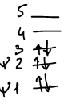
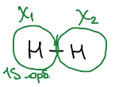
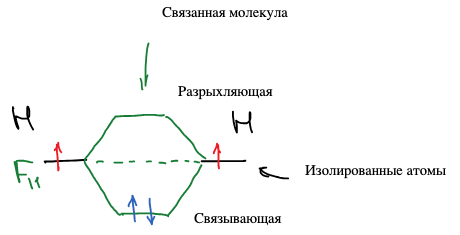
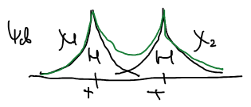
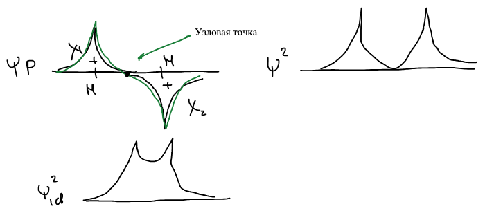
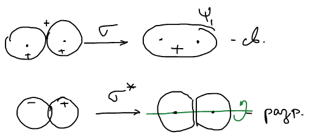

## Сопоставление методов МО и ВС

В [методе МО](../metod-molekulyarnyh-orbitalej/) из $n$ известных атомных орбиталей $\chi_\nu$ строится $n$ молекулярных орбиталей с неизвестными коэффициентами:

$$
\psi_i = \sum_\nu c_{i\nu}\,\chi_\nu \qquad (n\ \text{МО из}\ n\ \text{АО})
$$

Электроны размещаются по молекулярным орбиталям парами, начиная с самой низкой, а полная функция — детерминант Слейтера. Например, для шести электронов заняты три нижние МО:

$$
\Psi = \frac{1}{\sqrt{6!}}
\begin{vmatrix}
\psi_1(1)\alpha(1) & \psi_1(2)\alpha(2) & \dots & \psi_1(6)\alpha(6) \\
\psi_1(1)\beta(1) & \psi_1(2)\beta(2) & \dots & \psi_1(6)\beta(6) \\
\vdots & \vdots & & \vdots \\
\psi_3(1)\beta(1) & \psi_3(2)\beta(2) & \dots & \psi_3(6)\beta(6)
\end{vmatrix}
$$

| | Метод ВС | Метод МО |
|:-:|:-:|:-:|
| Уравнение | Многоэлектронное уравнение Шрёдингера | Одноэлектронное уравнение Шрёдингера |
| Способ решения | Вариационный метод | Вариационный метод |
| Базис | Многоэлектронная валентная схема | Атомная орбиталь |
| Число функций | Порядка $n!$, где $n$ — число электронов | Пропорционально $n$ |
| Самосогласование | — | Есть |
| Полная функция | — | Детерминант Слейтера |

## Молекула водорода

Два атома водорода, у каждого — одна $1s$-орбиталь: $\chi_1$ и $\chi_2$.

Одноэлектронный гамильтониан для электрона 1: кинетическая энергия, притяжение к обоим ядрам $a$ и $b$ и — в скобках — отталкивание от второго электрона, которое в методе Хартри — Фока входит в оператор $g$:

$$
\widehat{H}_1 = -\frac{\hbar^2}{2m}\nabla_1^2 - \frac{e^2}{r_{1a}} - \frac{e^2}{r_{1b}} + \left( \frac{e^2}{r_{12}} \right)
$$

Молекулярная орбиталь — линейная комбинация двух атомных:

$$
\psi = c_1\chi_1 + c_2\chi_2
$$

Уравнения Фока для двух орбиталей превращаются в вариационную систему для коэффициентов:

$$
\begin{cases}
\widehat{F}_1\psi_1 = \varepsilon_1\psi_1 \\
\widehat{F}_2\psi_2 = \varepsilon_2\psi_2
\end{cases}
\qquad \longrightarrow \qquad
\begin{cases}
c_1\left( F_{11} - \varepsilon S_{11} \right) + c_2\left( F_{12} - \varepsilon S_{12} \right) = 0 \\
c_1\left( F_{21} - \varepsilon S_{21} \right) + c_2\left( F_{22} - \varepsilon S_{22} \right) = 0
\end{cases}
$$

### Матричные элементы

Интегралы перекрывания орбитали с самой собой равны единице (нормировка), а перекрывание двух разных орбиталей обозначим $S$:

$$
S_{11} = \int \chi_1\chi_1\,d\tau = 1, \qquad
S_{22} = \int \chi_2\chi_2\,d\tau = 1, \qquad
S_{12} = \int \chi_1\chi_2\,d\tau = S_{21} = S
$$

Матричные элементы оператора Фока: атомы одинаковые, поэтому диагональные элементы равны, а недиагональные равны, так как оператор эрмитов:

$$
F_{11} = \int \chi_1\widehat{F}\chi_1\,d\tau = F_{22} = \int \chi_2\widehat{F}\chi_2\,d\tau, \qquad
F_{12} = F_{21}
$$

🙏 Если вам нравится сайт, подпишитесь на наш <a href="https://t.me/+JfpTv9CJlwQ0MThi">🔗 Телеграм-канал</a>.

### Секулярное уравнение

$$
\begin{cases}
c_1\left( F_{11} - \varepsilon \right) + c_2\left( F_{12} - \varepsilon S \right) = 0 \\
c_1\left( F_{12} - \varepsilon S \right) + c_2\left( F_{11} - \varepsilon \right) = 0
\end{cases}
$$

$$
\begin{vmatrix}
F_{11} - \varepsilon & F_{12} - \varepsilon S \\
F_{12} - \varepsilon S & F_{11} - \varepsilon
\end{vmatrix} = 0
\qquad \Rightarrow \qquad
\left( F_{11} - \varepsilon \right)^2 = \left( F_{12} - \varepsilon S \right)^2
$$

Два корня — как и в [методе валентных схем](../metod-valentnyh-shem/):

$$
1)\ F_{11} - \varepsilon = F_{12} - \varepsilon S \qquad \Rightarrow \qquad \varepsilon = \frac{F_{11} - F_{12}}{1 - S}
$$

$$
2)\ F_{11} - \varepsilon = \varepsilon S - F_{12} \qquad \Rightarrow \qquad \varepsilon = \frac{F_{11} + F_{12}}{1 + S}
$$

### Физический смысл

Выделим в обоих корнях $F_{11}$, прибавив и вычтя $F_{11}S$ в числителе:

$$
\varepsilon = \frac{F_{11} + F_{12}}{1 + S} = \frac{\left[ F_{11} + F_{11}S \right] - F_{11}S + F_{12}}{1 + S} = F_{11} + \frac{F_{12} - F_{11}S}{1 + S}
$$

$$
\varepsilon = \frac{F_{11} - F_{12}}{1 - S} = \frac{F_{11} - F_{11}S + F_{11}S - F_{12}}{1 - S} = F_{11} - \frac{F_{12} - F_{11}S}{1 - S}
$$

Физический смысл $F_{11}$:

$$
F_{11} = \int \chi_1\widehat{F}\chi_1\,d\tau
$$

— это оператор Гамильтона для первого электрона, усредненный по его атомной орбитали, то есть энергия электрона на исходной $1s$-орбитали изолированного атома. Обе энергии молекулы отличаются от $F_{11}$ на одну и ту же величину $\dfrac{F_{12} - F_{11}S}{1 \pm S}$, но с разными знаками: одна орбиталь лежит ниже атомного уровня, другая — выше.

Молекулярная орбиталь с энергией меньше, чем энергия исходных атомных орбиталей, называется **связывающей** молекулярной орбиталью. Молекулярная орбиталь с энергией больше, чем энергия исходных атомных орбиталей, называется **разрыхляющей**.

Два электрона молекулы водорода занимают связывающую орбиталь — это и есть **возникновение химической связи**: энергия связанной молекулы ниже энергии изолированных атомов.

В методе МО не важно, откуда пришел электрон. Важно общее число.

### Порядок связи

**Порядком связи** в методе МО называется число электронов на связывающих орбиталях за вычетом числа электронов на разрыхляющих, деленное на два:

$$
P = \frac{n_{св} - n_{разр}}{2} = 1 \qquad \text{для } \text{H}_2
$$

## Вид молекулярных орбиталей

Найдем коэффициенты. Нижний корень $\varepsilon_1 = \dfrac{F_{11} + F_{12}}{1 + S}$ подставим в вариационную систему:

$$
\begin{cases}
c_1\left( F_{11} - \dfrac{F_{11} + F_{12}}{1 + S} \right) + c_2\left( F_{12} - \dfrac{F_{11} + F_{12}}{1 + S}\,S \right) = 0 \\[3ex]
c_1\left( F_{12} - \dfrac{F_{11} + F_{12}}{1 + S}\,S \right) + c_2\left( F_{11} - \dfrac{F_{11} + F_{12}}{1 + S} \right) = 0
\end{cases}
$$

Приводим скобки первого уравнения к общему знаменателю:

$$
\begin{aligned}
&c_1\left( \frac{F_{11} + F_{11}S - F_{11} - F_{12}}{1 + S} \right) + c_2\left( \frac{F_{12} + F_{12}S - F_{11}S - F_{12}S}{1 + S} \right) = \\
&= c_1\left( F_{11}S - F_{12} \right) + c_2\left( F_{12} - F_{11}S \right) = 0
\end{aligned}
$$

$$
c_1\left( F_{11}S - F_{12} \right) = c_2\left( F_{11}S - F_{12} \right) \qquad \Rightarrow \qquad c_1 = c_2
$$

Подстановка не даст коэффициентов, а даст только соотношения. Сами коэффициенты — из нормировки:

$$
\int \psi^2\,d\tau = 1
$$

$$
\psi_1 = c_1\chi_1 + c_2\chi_2 = c_1\left( \chi_1 + \chi_2 \right)
$$

$$
\int \psi_1^2\,d\tau = c_1^2\int \Big( \underbrace{\chi_1^2}_{1} + 2\underbrace{\chi_1\chi_2}_{S} + \underbrace{\chi_2^2}_{1} \Big)\,d\tau = c_1^2\left( 2 + 2S \right) = 1
\qquad \Rightarrow \qquad
c_1 = \frac{1}{\sqrt{2 + 2S}}
$$

$$
\psi_1 = \frac{1}{\sqrt{2 + 2S}}\left( \chi_1 + \chi_2 \right) \qquad \text{— связывающая}
$$

Для второго корня точно так же получается $c_1 = -c_2$, и разрыхляющая орбиталь $\psi_2^*$:

$$
\psi_2^* = \frac{1}{\sqrt{2 - 2S}}\left( \chi_1 - \chi_2 \right)
$$

Посмотрим, как они выглядят вдоль оси молекулы. Связывающая орбиталь — сумма двух $1s$-функций:

Два ядра положительно заряженных. В пространстве между ядрами идет увеличение электронной плотности. И ядра связываются.

В разрыхляющей орбитали функции вычитаются: посередине между ядрами $\chi_1 = \chi_2$, и $\psi_p$ обращается в нуль — это **узловая точка**. Плотность $\psi_p^2$ между ядрами равна нулю, а у связывающей $\psi_{св}^2$ между ядрами — повышена:

В объемном виде: две $1s$-орбитали одного знака сливаются в одну связывающую **σ-орбиталь**; орбитали разных знаков дают разрыхляющую **σ\*-орбиталь** с узловой плоскостью посередине:

Если орбиталь симметрична относительно линии оси связи, то она называется σ-орбиталью.
