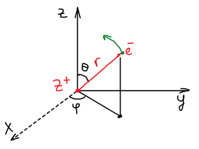
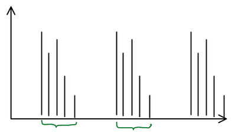
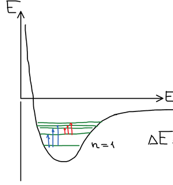

Задачу о строении атома водорода Шрёдингер решил и опубликовал в 1926 г.

**Водородоподобный атом** — ядро с зарядом $+Ze$ и один электрон, который вращается вокруг ядра.

Надо решить уравнение Шрёдингера. Здесь две частицы, и, казалось бы, решать надо отдельно для каждой. Но можно перейти к модели, в которой уравнение решается относительно одной частицы: масса ядра намного больше массы электрона ($m_я \gg m_e$), поэтому можно считать, что ядро закреплено в центре, а движется только электрон.

## Гамильтониан

$$
\widehat{H} = \widehat{T}_e + \widehat{U}_{e\text{-}я} = -\frac{\hbar^2}{2m_e}\nabla^2 - \frac{Ze^2}{r}
$$

$$
\widehat{T}_e = -\frac{\hbar^2}{2m_e}\nabla^2
$$

Потенциальная энергия — кулоновское взаимодействие двух зарядов $\dfrac{q_1 q_2}{r}$; знак «минус» указывает на **притяжение** электрона к ядру:

$$
U = -\frac{Ze^2}{r}
$$

Уравнение Шрёдингера $\widehat{H}\psi = E\psi$:

$$
\left[ -\frac{\hbar^2}{2m_e}\nabla^2 - \frac{Ze^2}{r} \right]\psi = E\psi
$$

Поскольку электрон вращается вокруг ядра, декартовы координаты не подходят для разделения переменных. Будем решать в сферических координатах — как и для [жесткого ротатора](../zhestkij-rotator/): частица может двигаться по одному параметру при постоянстве других.

Умножим уравнение на $-\dfrac{2m_e}{\hbar^2}$:

$$
\nabla^2\psi + \frac{2m_e}{\hbar^2}\left( E + \frac{Ze^2}{r} \right)\psi = 0
$$

Оператор Лапласа в сферических координатах (есть в справочнике):

$$
\frac{1}{r^2}\frac{\partial}{\partial r}\left( r^2\frac{\partial\psi}{\partial r} \right) + \frac{1}{r^2\sin\theta}\frac{\partial}{\partial\theta}\left( \sin\theta\frac{\partial\psi}{\partial\theta} \right) + \frac{1}{r^2\sin^2\theta}\frac{\partial^2\psi}{\partial\varphi^2} + \frac{2m_e}{\hbar^2}\left( E + \frac{Ze^2}{r} \right)\psi = 0
$$

## Разделение переменных

Волновую функцию ищем в виде произведения трех функций, каждая из которых зависит от одной координаты:

$$
\psi(r, \theta, \varphi) = R(r)\,T(\theta)\,\Phi(\varphi)
$$

Подставляем в уравнение. При дифференцировании по одной координате два других множителя — константы, их можно вынести из-под производной:

$$
\frac{T\Phi}{r^2}\frac{d}{dr}\left( r^2\frac{dR}{dr} \right) + \frac{R\Phi}{r^2\sin\theta}\frac{d}{d\theta}\left( \sin\theta\frac{dT}{d\theta} \right) + \frac{RT}{r^2\sin^2\theta}\frac{d^2\Phi}{d\varphi^2} + \frac{2m_e}{\hbar^2}\left( E + \frac{Ze^2}{r} \right)RT\Phi = 0
$$

Умножим обе части уравнения на $\dfrac{r^2\sin^2\theta}{RT\Phi}$, чтобы сократить:

$$
\frac{\sin^2\theta}{R}\frac{d}{dr}\left( r^2\frac{dR}{dr} \right) + \frac{\sin\theta}{T}\frac{d}{d\theta}\left( \sin\theta\frac{dT}{d\theta} \right) + \frac{1}{\Phi}\frac{d^2\Phi}{d\varphi^2} + r^2\sin^2\theta\,\frac{2m_e}{\hbar^2}\left( E + \frac{Ze^2}{r} \right) = 0
$$

### Φ-уравнение

Слагаемое с $\Phi$ зависит только от $\varphi$, все остальные — от $r$ и $\theta$. Переменные независимы, значит, обе части равны константе:

$$
\frac{\sin^2\theta}{R}\frac{d}{dr}\left( r^2\frac{dR}{dr} \right) + \frac{\sin\theta}{T}\frac{d}{d\theta}\left( \sin\theta\frac{dT}{d\theta} \right) + r^2\sin^2\theta\,\frac{2m_e}{\hbar^2}\left( E + \frac{Ze^2}{r} \right) = -\frac{1}{\Phi}\frac{d^2\Phi}{d\varphi^2} = \text{const} = m^2
$$

$$
-\frac{1}{\Phi}\frac{d^2\Phi}{d\varphi^2} = m^2 \qquad \Rightarrow \qquad \Phi(\varphi) = \frac{1}{\sqrt{2\pi}}e^{im\varphi}, \quad m = 0, \pm 1, \pm 2, \dots
$$

Это уравнение уже решено для модели жесткого ротатора!

### θ-уравнение

Оставшуюся часть делим на $\sin^2\theta$:

$$
\frac{\sin^2\theta}{R}\frac{d}{dr}\left( r^2\frac{dR}{dr} \right) + \frac{\sin\theta}{T}\frac{d}{d\theta}\left( \sin\theta\frac{dT}{d\theta} \right) + r^2\sin^2\theta\,\frac{2m_e}{\hbar^2}\left( E + \frac{Ze^2}{r} \right) = m^2
$$

$$
\frac{1}{R}\frac{d}{dr}\left( r^2\frac{dR}{dr} \right) + r^2\,\frac{2m_e}{\hbar^2}\left( E + \frac{Ze^2}{r} \right) = \frac{m^2}{\sin^2\theta} - \frac{1}{T}\frac{1}{\sin\theta}\frac{d}{d\theta}\left( \sin\theta\frac{dT}{d\theta} \right) = \text{const} = l(l + 1)
$$

Слева все зависит от $r$, справа — от $\theta$. Они независимы, значит, равны константе; обозначим ее $l(l+1)$.

$$
\frac{1}{T}\frac{1}{\sin\theta}\frac{d}{d\theta}\left( \sin\theta\frac{dT}{d\theta} \right) + l(l + 1) - \frac{m^2}{\sin^2\theta} = 0
$$

Умножаем на $T$:

$$
\frac{1}{\sin\theta}\frac{d}{d\theta}\left( \sin\theta\frac{dT}{d\theta} \right) + \left( l(l + 1) - \frac{m^2}{\sin^2\theta} \right)T = 0
$$

Решение этого уравнения встречалось в задаче о жестком ротаторе — это полином Лежандра:

$$
T(\theta) = P_l^{|m|}(\cos\theta)
$$

Произведение угловых частей — сферическая гармоника $Y_{l,m}(\theta, \varphi)$:

$$
\psi(r, \theta, \varphi) = R(r)\,\underbrace{T(\theta)\,\Phi(\varphi)}_{Y_{l,m}(\theta,\varphi)} \equiv R(r)\,Y_{l,m}(\theta, \varphi)
$$

🙏 Если вам нравится сайт, подпишитесь на наш <a href="https://t.me/+JfpTv9CJlwQ0MThi">🔗 Телеграм-канал</a>.

## Радиальное уравнение

$$
\frac{1}{R}\frac{d}{dr}\left( r^2\frac{dR}{dr} \right) + r^2\,\frac{2m_e}{\hbar^2}\left( E + \frac{Ze^2}{r} \right) - l(l + 1) = 0
$$

Умножаем на $\dfrac{R}{r^2}$:

$$
\frac{1}{r^2}\frac{d}{dr}\left( r^2\frac{dR}{dr} \right) + \left[ \frac{2m_e}{\hbar^2}\left( E + \frac{Ze^2}{r} \right) - \frac{l(l + 1)}{r^2} \right]R = 0
$$

Это единственное уравнение, в котором остались энергия $E$ и заряд ядра $Z$, — именно из него получится энергия атома.

### Замена переменных

Введем обозначения (для связанного состояния $E < 0$, поэтому $-\alpha^2$):

$$
\frac{2m_e E}{\hbar^2} = -\alpha^2, \qquad \frac{2m_e Ze^2}{\hbar^2} = 2\alpha\lambda, \qquad \rho = 2\alpha r
$$

Уравнение принимает вид:

$$
\frac{1}{\rho^2}\frac{d}{d\rho}\left( \rho^2\frac{dR}{d\rho} \right) + \left[ -\frac{l(l + 1)}{\rho^2} - \frac{1}{4} + \frac{\lambda}{\rho} \right]R = 0
$$

Это уравнение также не решается в лоб, поэтому оно преобразуется дальше. Какая область определения у радиуса?

$$
r \in [0, +\infty)
$$

Посмотрим, как ведет себя решение на границах этой области.

### Асимптотика при ρ → ∞

Если $\rho \to \infty$, то все слагаемые, где $\rho$ стоит в знаменателе, обращаются в нуль. Раскроем производную:

$$
\frac{d}{d\rho}\left( \rho^2\frac{dR}{d\rho} \right) = 2\rho\frac{dR}{d\rho} + \rho^2\frac{d^2R}{d\rho^2}
$$

$$
\underbrace{\frac{2}{\rho}\frac{dR}{d\rho}}_{\to 0} + \frac{d^2R}{d\rho^2} + \Bigg[ \underbrace{-\frac{l(l + 1)}{\rho^2}}_{\to 0} - \frac{1}{4} + \underbrace{\frac{\lambda}{\rho}}_{\to 0} \Bigg]R = 0 \qquad \Rightarrow \qquad \frac{d^2R}{d\rho^2} - \frac{1}{4}R = 0
$$

$$
R = e^{\pm k\rho}, \qquad k^2 - \frac{1}{4} = 0 \quad \Rightarrow \quad k = \frac{1}{2}
$$

Растущую экспоненту отбрасываем (функция должна быть конечна). Частным решением на бесконечности является:

$$
R(\rho) = e^{-\rho/2}
$$

### Асимптотика при ρ → 0

Если $\rho \to 0$, то, наоборот, главными становятся слагаемые с $\rho$ в знаменателе, а $-\dfrac{1}{4}$ и $\dfrac{\lambda}{\rho}$ малы по сравнению с $\dfrac{l(l+1)}{\rho^2}$:

$$
\frac{1}{\rho^2}\frac{d}{d\rho}\left( \rho^2\frac{dR}{d\rho} \right) - \frac{l(l + 1)}{\rho^2}R = 0 \qquad \Rightarrow \qquad R = \rho^{\,l}
$$

### Общее решение. Полином Лагерра

Общее решение полного уравнения можно представить как произведение известных частных решений и неизвестной функции $f(\rho)$:

$$
R(\rho) = \rho^{\,l}\,e^{-\rho/2} \cdot f(\rho)
$$

Подставляем в радиальное уравнение; для $f$ получается уравнение:

$$
\rho\frac{d^2f}{d\rho^2} + \big( 2(l + 1) - \rho \big)\frac{df}{d\rho} + \big( \lambda - (l + 1) \big)f = 0
$$

Это **уравнение Лагерра**. Как и раньше, ищем решение в виде ряда:

$$
f = \sum_i a_i\rho^{\,i}
$$

Бесконечный ряд не может входить в состав волновой функции, поэтому ряд должен оборваться. Условие разрешимости уравнения Лагерра — $\lambda$ должно быть целым числом, не меньшим $l + 1$:

$$
\lambda = 1, 2, 3, \dots \equiv n, \qquad \lambda \ge l + 1
$$

Тогда $f$ — конечный полином, **присоединенный полином Лагерра** $L_{n+l}^{2l+1}(\rho)$:

$$
R(r) = C\rho^{\,l}\,e^{-\rho/2}\,L_{n+l}^{2l+1}(\rho)
$$

Полная волновая функция водородоподобного атома:

$$
\psi(r, \theta, \varphi) = C\rho^{\,l}\,e^{-\rho/2}\,L_{n+l}^{2l+1}(\rho)\,Y_{l,m}(\theta, \varphi)
$$

## Энергия

Функцию нашли, надо найти энергию. Возвращаемся к обозначениям:

$$
\alpha^2 = -\frac{2m_e E}{\hbar^2}, \qquad \frac{2m_e Ze^2}{\hbar^2} = 2\alpha\lambda \quad \Rightarrow \quad \alpha = \frac{m_e Ze^2}{\hbar^2\lambda}
$$

$$
\frac{m_e^2 Z^2 e^4}{\hbar^4\lambda^2} = -\frac{2m_e E}{\hbar^2} \qquad \Rightarrow \qquad E = -\frac{m_e Z^2 e^4}{2\hbar^2\lambda^2}
$$

С учетом $\lambda = n$:

$$
E_n = -\frac{m_e Z^2 e^4}{2\hbar^2 n^2}
$$

Энергия отрицательна (электрон связан с ядром) и зависит только от главного квантового числа $n$.

## Квантовые числа

В порядке появления в процессе решения:

| Число | Название | Значения | Откуда |
|:-:|---|---|---|
| $n$ | главное квантовое число | $1, 2, 3, \dots$ | условие разрешимости уравнения Лагерра |
| $l$ | орбитальное квантовое число | $0, 1, 2, \dots, (n - 1)$ | условие $\lambda \ge l + 1$ для уравнения Лагерра |
| $m$ | магнитное квантовое число | $0, \pm 1, \pm 2, \dots, \pm l$ | условие $\lvert m \rvert \le l$ для уравнения Лежандра |

## Спектр атома водорода

Сначала изучали спектры Солнца. Линии в них группируются в серии:

| Серия | Нижний уровень $n$ | Верхний уровень $m$ |
|---|:-:|:-:|
| Лайман | 1 | 2, 3, 4, … |
| Бальмер | 2 | 3, 4, 5, … |
| Пашен | 3 | 4, 5, 6, … |

Частоты линий описываются формулой Ридберга, где $n$ и $m$ — целые:

$$
\nu = R\left( \frac{1}{n^2} - \frac{1}{m^2} \right)
$$

Она прямо следует из формулы для энергии уровней: частота линии определяется разностью энергий уровня, с которого электрон уходит, и уровня $n = 1$, на который он переходит:

$$
\Delta E = -\left( \frac{k}{m^2} - \frac{k}{1^2} \right), \qquad k = \frac{m_e Z^2 e^4}{2\hbar^2}
$$

