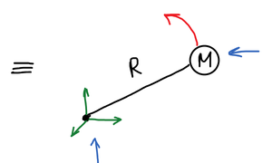
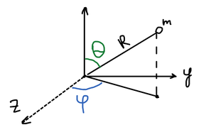
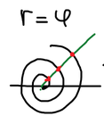
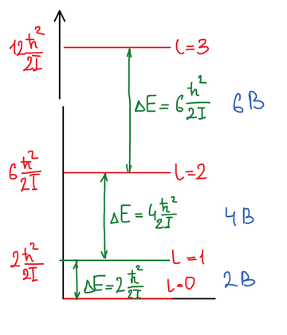
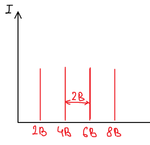

**Модель жесткого ротатора**: материальная точка массы $m$ вращается на неизменном расстоянии $R$ от неподвижного центра масс. Жесткий — потому что $R$ фиксировано:

$$
R = \text{const}
$$

Задача — описать это вращательное движение: найти волновую функцию и определить энергию.

## Гамильтониан

$$
\widehat{H} = \widehat{T} + \widehat{U}
$$

$$
\widehat{T} = -\frac{\hbar^2}{2m}\nabla^2, \qquad \widehat{U} = 0
$$

$$
\widehat{H} = -\frac{\hbar^2}{2m}\nabla^2
$$

Уравнение Шрёдингера $\widehat{H}\psi = E\psi$:

$$
-\frac{\hbar^2}{2m}\nabla^2\psi = E\psi
$$

$$
-\frac{\hbar^2}{2m}\left( \frac{\partial^2\psi}{\partial x^2} + \frac{\partial^2\psi}{\partial y^2} + \frac{\partial^2\psi}{\partial z^2} \right) = E\psi
$$

Такое же уравнение, как для [частицы в ящике](../chastica-v-potencialnom-yashchike/). Но там мы разделяли переменные:

$$
\psi(x, y, z) \neq X(x)\,Y(y)\,Z(z)
$$

Так можно записать, только когда движения по $x$, $y$, $z$ не зависят друг от друга. При движении жесткого ротатора $x$, $y$, $z$ изменяются одновременно и являются связанными: уравнение может быть записано, но решено быть не может, т. к. переменные не разделяются.

## Сферические координаты

Представим шарик в сферических координатах: здесь три параметра $r$, $\theta$, $\varphi$ изменяются независимо.

$$
\begin{cases}
x = r\sin\theta\cos\varphi \\
y = r\sin\theta\sin\varphi \\
z = r\cos\theta
\end{cases}
$$

Волновую функцию ищем в виде произведения:

$$
\psi(r, \theta, \varphi) = R(r)\,T(\theta)\,\Phi(\varphi)
$$

Оператор Лапласа в сферических координатах:

$$
\nabla^2 = \frac{1}{r^2}\frac{\partial}{\partial r}\left( r^2\frac{\partial}{\partial r} \right) + \frac{1}{r^2\sin\theta}\frac{\partial}{\partial\theta}\left( \sin\theta\frac{\partial}{\partial\theta} \right) + \frac{1}{r^2\sin^2\theta}\frac{\partial^2}{\partial\varphi^2}
$$

Для жесткого ротатора $r = \text{const}$, поэтому производная по $r$ равна нулю, а радиальная часть волновой функции — постоянная:

$$
\psi = T(\theta)\,\Phi(\varphi)
$$

$$
\nabla^2 = \frac{1}{r^2\sin\theta}\frac{\partial}{\partial\theta}\left( \sin\theta\frac{\partial}{\partial\theta} \right) + \frac{1}{r^2\sin^2\theta}\frac{\partial^2}{\partial\varphi^2}
$$

Перепишем уравнение Шрёдингера в новых координатах:

$$
-\frac{\hbar^2}{2mr^2}\left( \frac{1}{\sin\theta}\frac{\partial}{\partial\theta}\left( \sin\theta\frac{\partial\, T\Phi}{\partial\theta} \right) + \frac{1}{\sin^2\theta}\frac{\partial^2\, T\Phi}{\partial\varphi^2} \right) = E\,T\Phi
$$

## Разделение переменных

Делим на коэффициент перед старшей производной и выносим из-под производных то, что от переменной дифференцирования не зависит:

$$
\frac{\Phi}{\sin\theta}\frac{d}{d\theta}\left( \sin\theta\frac{dT}{d\theta} \right) + \frac{T}{\sin^2\theta}\frac{d^2\Phi}{d\varphi^2} + \frac{2mr^2}{\hbar^2}E\,T\Phi = 0
$$

Величина $mr^2 = I$ — **момент инерции**. Умножаем уравнение на $\dfrac{\sin^2\theta}{T\Phi}$:

$$
\frac{\sin\theta}{T}\frac{d}{d\theta}\left( \sin\theta\frac{dT}{d\theta} \right) + \frac{1}{\Phi}\frac{d^2\Phi}{d\varphi^2} + \frac{2IE}{\hbar^2}\sin^2\theta = 0
$$

Слева оказались слагаемые, зависящие только от $\theta$, и одно слагаемое, зависящее только от $\varphi$. Их сумма равна нулю при любых $\theta$ и $\varphi$ — это возможно, только если каждая часть равна константе. Обозначим ее $m^2$:

$$
\frac{\sin\theta}{T}\frac{d}{d\theta}\left( \sin\theta\frac{dT}{d\theta} \right) + \frac{2IE}{\hbar^2}\sin^2\theta = -\frac{1}{\Phi}\frac{d^2\Phi}{d\varphi^2} = \text{const} = m^2
$$

🙏 Если вам нравится сайт, подпишитесь на наш <a href="https://t.me/+JfpTv9CJlwQ0MThi">🔗 Телеграм-канал</a>.

## Φ-уравнение

$$
-\frac{1}{\Phi}\frac{d^2\Phi}{d\varphi^2} = m^2
$$

$$
\frac{d^2\Phi}{d\varphi^2} + m^2\Phi = 0
$$

Линейное дифференциальное уравнение второго порядка с постоянными коэффициентами:

$$
\Phi = C \cdot e^{\pm k\varphi} = C \cdot e^{\pm im\varphi}
$$

$$
k^2 + m^2 = 0 \quad \Rightarrow \quad k = \pm im
$$

### Нормировочный множитель

$$
\int\limits_0^{2\pi} \Phi^*\Phi \, d\varphi = 1
$$

$$
\int\limits_0^{2\pi} C e^{-im\varphi} \cdot C e^{im\varphi} \, d\varphi = C^2 \int\limits_0^{2\pi} e^{-im\varphi + im\varphi} \, d\varphi = C^2 \int\limits_0^{2\pi} d\varphi = 2\pi C^2 = 1
$$

$$
C^2 = \frac{1}{2\pi}, \qquad C = \sqrt{\frac{1}{2\pi}}
$$

$$
\Phi = \sqrt{\frac{1}{2\pi}}\, e^{\pm im\varphi}
$$

### Однозначность и квантование m

Кроме нормировки, эта функция должна быть конечна, непрерывна и однозначна.

- **Конечность** выполняется, если $m$ — действительное число (тогда $|e^{im\varphi}| = 1$).
- **Непрерывность** — есть производная, значит непрерывна.
- **Однозначность?** Угол может быть сколь угодно большим, но физически, совершив полный оборот, точка возвращается в то же положение. Значит, после полного оборота функция должна принимать то же значение. Пример неоднозначной функции — спираль $r = \varphi$: одному направлению отвечает много значений $r$.

Условие однозначности:

$$
\Phi(\varphi) = \Phi(\varphi + 2\pi)
$$

$$
\frac{1}{\sqrt{2\pi}}e^{im\varphi} = \frac{1}{\sqrt{2\pi}}e^{im(\varphi + 2\pi)}
$$

$$
e^{im\varphi} = e^{im\varphi} \cdot e^{im \cdot 2\pi} \quad \Rightarrow \quad e^{im \cdot 2\pi} = 1
$$

$$
\cos 2\pi m + i\sin 2\pi m = 1
$$

Косинус должен быть равен единице, а синус — нулю. Это выполняется только при целых $m$:

$$
\Phi = \frac{1}{\sqrt{2\pi}}e^{im\varphi}, \qquad m = 0, \pm 1, \pm 2, \pm 3, \dots
$$

Функция $\Phi$ **квантуется**.

## θ-уравнение

$$
\frac{\sin\theta}{T}\frac{d}{d\theta}\left( \sin\theta\frac{dT}{d\theta} \right) + \frac{2IE}{\hbar^2}\sin^2\theta = m^2, \qquad m = 0, \pm 1, \pm 2, \dots
$$

Перенесем все в левую часть и умножим на $\dfrac{T}{\sin^2\theta}$:

$$
\frac{1}{\sin\theta}\frac{d}{d\theta}\left( \sin\theta\frac{dT}{d\theta} \right) + \left( \frac{2IE}{\hbar^2} - \frac{m^2}{\sin^2\theta} \right)T = 0
$$

Линейное уравнение с переменными коэффициентами. Замена переменных:

$$
y = \cos\theta, \qquad dy = -\sin\theta \, d\theta
$$

$$
(1 - y^2)\frac{d^2T}{dy^2} - 2y\frac{dT}{dy} + \left( \frac{2IE}{\hbar^2} - \frac{m^2}{1 - y^2} \right)T = 0
$$

Это **уравнение Лежандра**. Решение этого уравнения — разложить в ряд:

$$
T(y) = \sum_{i=0}^{\infty} b_i y^i
$$

Снова возникает бесконечный ряд, а он не может входить в состав волновой функции: бесконечный ряд не может быть решением для жесткого ротатора. Выход в том, что среди всех уравнений этого вида есть подкласс, для которого ряд обрывается:

$$
(1 - y^2)\frac{d^2T}{dy^2} - 2y\frac{dT}{dy} + \left( l(l + 1) - \frac{m^2}{1 - y^2} \right)T = 0, \qquad l = 0, 1, 2, \dots, \quad |m| \le l
$$

Ряд обрывается на члене $l$, и решение — конечный полином, **полином Лежандра**. Этот полином и является $\theta$-частью волновой функции:

$$
T(\theta) = C\sum_{i=0}^{l} b_i(\cos\theta)^i = C \cdot P_l^{|m|}(\cos\theta), \qquad l = 0, 1, 2, \dots
$$

## Волновая функция и энергия

Волновая функция найдена и состоит из двух частей:

$$
\Phi(\varphi) = \frac{1}{\sqrt{2\pi}}e^{im\varphi}, \qquad m = 0, \pm 1, \pm 2, \dots
$$

$$
T(\theta) = C \cdot P_l^{|m|}(\cos\theta), \qquad l = 0, 1, 2, \dots
$$

Условие обрыва ряда дает энергию:

$$
\frac{2IE}{\hbar^2} = l(l + 1) \quad \Rightarrow \quad E = \frac{\hbar^2}{2I}\,l(l + 1)
$$

### Сферические гармоники

Волновые функции жесткого ротатора играют важную роль: волновая функция, зависящая от квантовых чисел $l$ и $m$, называется **сферической гармоникой**:

$$
Y_{l,m}(\theta, \varphi) = C \cdot P_l^{|m|}(\cos\theta)\, e^{im\varphi}
$$

| $l$ | $m$ | $T(\theta)$ | $\Phi(\varphi)$ |
|:-:|:-:|:-:|:-:|
| 0 | 0 | $\dfrac{\sqrt{2}}{2}$ | $\dfrac{1}{\sqrt{2\pi}}$ |
| 1 | 0 | $\dfrac{\sqrt{6}}{2}\cos\theta$ | $\dfrac{1}{\sqrt{2\pi}}$ |
| 1 | $\pm 1$ | $\dfrac{\sqrt{3}}{2}\sin\theta$ | $\dfrac{1}{\sqrt{2\pi}}e^{\pm i\varphi}$ |
| 2 | 0 | $\dfrac{\sqrt{10}}{4}\left( 3\cos^2\theta - 1 \right)$ | $\dfrac{1}{\sqrt{2\pi}}$ |
| 2 | $\pm 1$ | $\dfrac{\sqrt{15}}{2}\sin\theta\cos\theta$ | $\dfrac{1}{\sqrt{2\pi}}e^{\pm i\varphi}$ |
| 2 | $\pm 2$ | $\dfrac{\sqrt{15}}{4}\sin^2\theta$ | $\dfrac{1}{\sqrt{2\pi}}e^{\pm 2i\varphi}$ |

## Энергетический спектр

$$
E = \frac{\hbar^2}{2I}\,l(l + 1)
$$

Обозначим $B = \dfrac{\hbar^2}{2I}$ — **вращательная постоянная**. Тогда:

$$
E = B\,l(l + 1)
$$

| $l$ | $E$ | $\Delta E$ с предыдущим уровнем |
|:-:|:-:|:-:|
| 0 | $0$ | — |
| 1 | $2B$ | $2B$ |
| 2 | $6B$ | $4B$ |
| 3 | $12B$ | $6B$ |

Разности между соседними уровнями образуют арифметическую прогрессию: $2B, 4B, 6B, \dots$

**Особенность!** У жесткого ротатора есть уровень с нулевой энергией: при $l = 0$ $E = 0$ (в отличие от [гармонического осциллятора](../garmonicheskij-oscillyator/), у которого нижний уровень лежит на высоте $\frac{1}{2}h\nu_0$).

### Вращательный спектр

Электромагнитное излучение поглощается, когда его энергия равна разности энергий уровней:

$$
\Delta E = h\nu
$$

Для перехода с нижнего уровня $2B = h\nu$, откуда:

$$
\nu = \frac{2B}{h} = 2B'
$$

Вращательная постоянная $B$ имеет размерность энергии, но часто удобно выражать ее как частоту, т. к. переходы характерны для определенной частоты:

$$
B' = \frac{B}{h} = \frac{\hbar^2}{2I \cdot h} = \frac{h^2}{4\pi^2 \cdot 2I \cdot h} = \frac{h}{8\pi^2 I}
$$

С волновым числом $\bar{\nu} = \dfrac{\nu}{c}$ получаем еще одну форму:

$$
B'' = \frac{h}{8\pi^2 c I}
$$

| Единицы | $B$ |
|---|:-:|
| Дж | $\dfrac{\hbar^2}{2I}$ |
| Гц | $\dfrac{h}{8\pi^2 I}$ |
| см$^{-1}$ | $\dfrac{h}{8\pi^2 c I}$ |

Линии вращательного спектра отстоят друг от друга на одинаковую величину $2B$. Вращательные переходы наблюдаются раньше ИК — в радиочастотном (микроволновом) диапазоне.

В параметр $B$ включен **структурный параметр** — момент инерции. Для двухатомной молекулы с приведенной массой $\mu$:

$$
I = \mu R^2, \qquad \mu = \frac{m_1 m_2}{m_1 + m_2}
$$

Зная момент инерции, можно экспериментально определить межатомное расстояние двухатомных молекул.

## Физический смысл квантовых чисел l и m

Смысл квантового числа чаще всего связывают с тем, какую величину оно квантует.

### Орбитальное квантовое число l

Какую энергию имеет вращающийся жесткий ротатор? Потенциальная энергия равна нулю, значит, полная энергия равна кинетической:

$$
T = E = \frac{\hbar^2}{2I}\,l(l + 1)
$$

С другой стороны, кинетическая энергия вращения выражается через момент количества движения $M = I\omega$:

$$
T = \frac{I\omega^2}{2} = \frac{M^2}{2I}
$$

$$
\frac{M^2}{2I} = \frac{\hbar^2}{2I}\,l(l + 1) \quad \Rightarrow \quad M^2 = \hbar^2\,l(l + 1)
$$

Квантовое число $l$ квантует **квадрат момента количества движения** — это квантовое число квадрата орбитального момента (**орбитальное квантовое число**).

### Магнитное квантовое число m

$$
\Phi(\varphi) = \frac{1}{\sqrt{2\pi}}e^{im\varphi}, \qquad m = 0, \pm 1, \pm 2, \dots
$$

Все три проекции момента $M$ одновременно определить нельзя. Оператор проекции момента на ось $z$:

$$
\widehat{M}_z = -i\hbar\left( x\frac{\partial}{\partial y} - y\frac{\partial}{\partial x} \right)
$$

В сферических координатах он принимает простой вид:

$$
\widehat{M}_z = -i\hbar\frac{\partial}{\partial\varphi}
$$

Подействуем им на $\Phi$:

$$
\widehat{M}_z\Phi(\varphi) = -i\hbar\frac{\partial}{\partial\varphi}\left( \frac{1}{\sqrt{2\pi}}e^{im\varphi} \right) = -i\hbar\frac{1}{\sqrt{2\pi}}\, im\, e^{im\varphi} = -i^2\hbar m \cdot \frac{1}{\sqrt{2\pi}}e^{im\varphi}
$$

$$
\widehat{M}_z\Phi(\varphi) = \hbar m\,\Phi(\varphi) \qquad \Rightarrow \qquad M_z = \hbar m
$$

$\Phi(\varphi)$ — собственная функция оператора $\widehat{M}_z$, а $\hbar m$ — его собственное значение. Квантовое число $m$ квантует **проекцию момента количества движения на ось $z$**. В физике ось $z$ обычно связывают с направлением внешнего поля, поэтому $m$ называется **магнитным квантовым числом**.
