**Ароматические амины** бывают первичными, вторичными и третичными — в зависимости от того, сколько атомов водорода аммиака замещено:

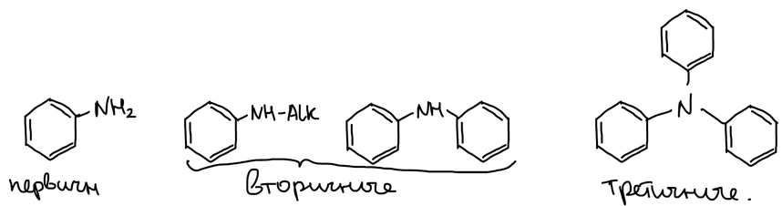

## Реакция Зинина

Н. Н. Зинин получил анилин восстановлением нитробензола. Восстановление идёт ступенчато: нитробензол → нитрозобензол → фенилгидроксиламин → анилин. В щелочной среде промежуточные продукты конденсируются, и получаются азоксибензол, азобензол и гидразобензол, которые тоже восстанавливаются до анилина:

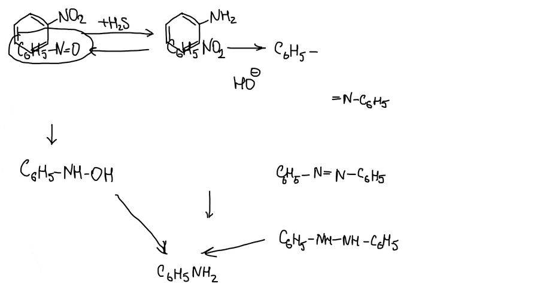

Фенилгидроксиламин в кислой среде выделить невозможно. Его образование доказывают так: дихромат калия в серной кислоте окисляет его в нитрозобензол (выход 70 %). Нитрозобензол при стоянии димеризуется:

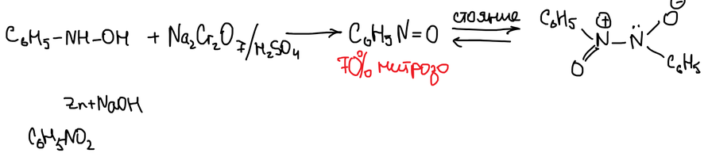

В кислой среде фенилгидроксиламин перегруппировывается в п-аминофенол — механизм разобран в статье [«Сульфирование и сульфокислоты»](../sulfokisloty/#перегруппировка-фенилгидроксиламина).

### Восстановление в щелочной среде

Метилат натрия в метаноле восстанавливает нитробензол до **азоксибензола**. Цинк в щёлочи восстанавливает его до **азобензола**, а затем до **гидразобензола**. В кислоте гидразобензол перегруппировывается:

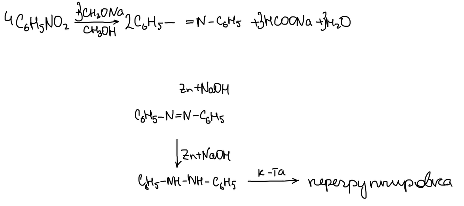

> **К схеме.** В формуле азоксибензола на схеме пропущен фрагмент N→O. Полностью: 4C₆H₅NO₂ + 3CH₃ONa → 2C₆H₅N(O)=NC₆H₅ + 3HCOONa + 3H₂O — уравнение сбалансировано.

### Бензидиновая перегруппировка

В кислой среде гидразобензол перегруппировывается в **бензидин** (4,4′-диаминодифенил) — перегруппировка тоже открыта Зининым. Если пара-положение одного из колец занято, получается **семидин**:

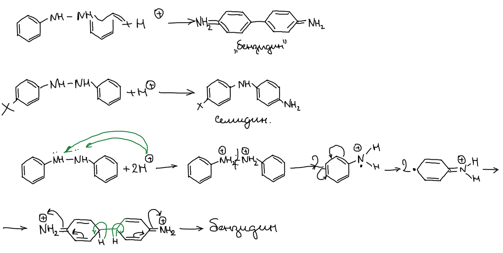

На схеме механизм радикальный: дважды протонированный гидразобензол распадается по связи N–N на два катион-радикала, которые соединяются пара-положениями колец.

## Получение аминов

1. Восстановление нитрогруппы (реакция Зинина).
2. Нуклеофильное замещение галогена в ароматическом ядре — см. [галогенпроизводные](../galogenproizvodnye/#арилгалогениды).
3. **Вторичные амины** — например, из анилина и метанола на Al₂O₃ получается метилфениламин (метиламинобензол). Так же получают диметилфениламин:

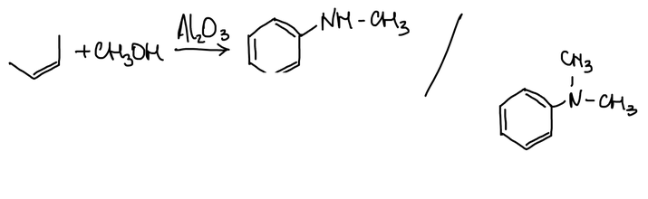

**Чисто ароматические амины** (дифениламин, трифениламин) получают из гидрохлорида анилина. При нагревании он частично диссоциирует на анилин и HCl; анилин атакует катион анилиния и вытесняет аммиак. Дифениламин с метилнатрием даёт натриевую соль, а с иодбензолом — третичный, но чисто ароматический амин — трифениламин:

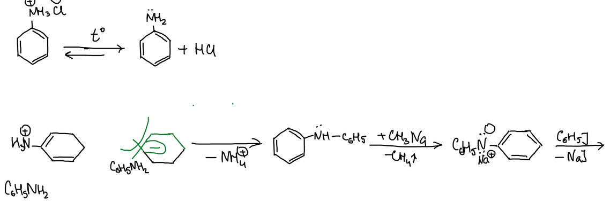

## Свойства аминов

### Основность

Анилин способен присоединять протон:

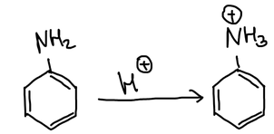

Алкиламины — более сильные основания: алкильная группа своим индуктивным эффектом облегчает отдачу электронов. Два орто-заместителя нарушают компланарность аминогруппы с кольцом, и основность должна немного подрасти. Нитроанилины — более слабые основания; в мета-положении нитрогруппа почти не влияет. Ряд основности:

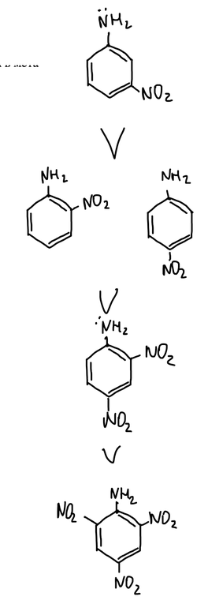

У 2,4,6-тринитроанилина (амида пикриновой кислоты) основных свойств нет.

> **К тексту.** В конспекте о м-нитроанилине: «основность с анилином практически одинакова». На самом деле м-нитроанилин тоже заметно слабее анилина, но сильнее о- и п-изомеров.

### Ацилирование по аминогруппе

Ацетилхлорид или уксусный ангидрид ацилируют аминогруппу:

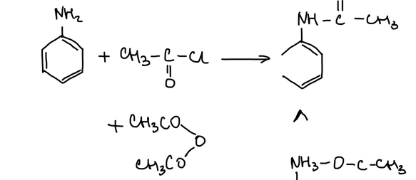

Анилин — жаропонижающее средство, но он разрушает эритроциты, поэтому от него отказались. Его заменил менее вредный **фенацетин** — п-этоксиацетанилид.

### Реакция с азотистой кислотой

**Первичные амины** с азотистой кислотой в кислой среде образуют соли диазония — например, хлористый фенилдиазоний (см. статью о диазосоединениях). **Вторичные** дают N-нитрозамины: метиламинобензол превращается в N-нитрозо-N-метиланилин, который в кислоте при нагревании перегруппировывается — нитрозогруппа переходит в пара-положение:

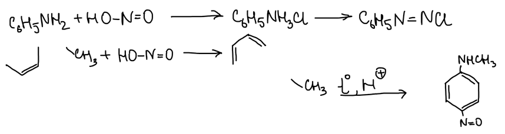

Восстановление нитрозамина цинком в соляной кислоте расщепляет связь N–N и возвращает вторичный амин, а цинк в уксусной кислоте даёт гидразин:

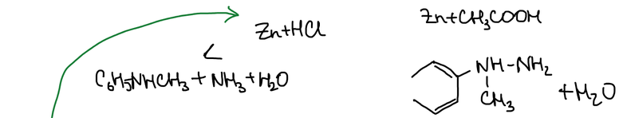

**Третичные** амины нитрозируются в кольцо: диметиланилин даёт п-нитрозодиметиланилин. Щёлочь расщепляет его на диметиламин и п-нитрозофенол; восстановление даёт аминопроизводное, а перманганат окисляет нитрозогруппу в нитрогруппу:

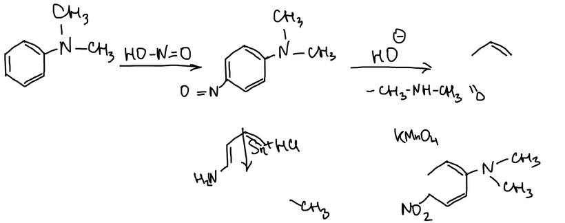

Реакция с азотистой кислотой — наиболее важное свойство первичной аминогруппы.

## Реакции по бензольному кольцу

**Нитрование.** Анилин сначала защищают ацетилированием, затем нитруют и снимают защиту; о- и п-нитроанилины разделяют перегонкой с паром:

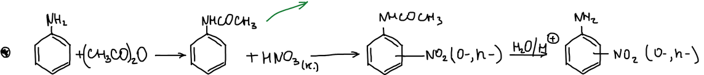

м-Нитроанилин получают **частичным восстановлением** м-динитробензола сульфидом натрия: из двух нитрогрупп восстанавливается одна:

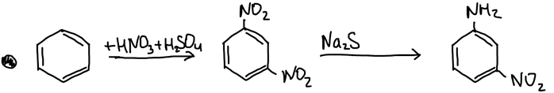

Тринитроанилин получают замещением хлора в пикрилхлориде амид-ионом:

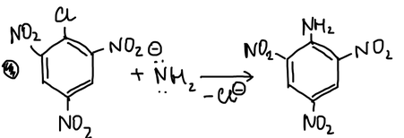

**Сульфирование.** Непосредственно сульфировать анилин тоже нельзя: серная кислота — окислитель и окисляет аминогруппу. Аминогруппу защищают ацетилированием, затем действуют хлорсульфоновой кислотой и получают сульфохлорид. Аммиак превращает его в сульфамид, а гидролиз снимает защиту. Получается сульфаниламид (стрептоцид, R = H). Если R — пиридильный остаток, получается **сульфидин** (1941 г.):

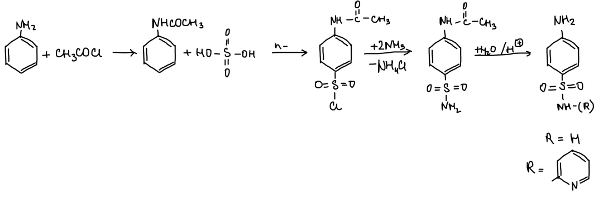

> **К схеме.** Над стрелкой сульфирования написано «HO–SO₂–OH», хотя продукт — сульфохлорид; реагент — хлорсульфоновая кислота ClSO₃H.
