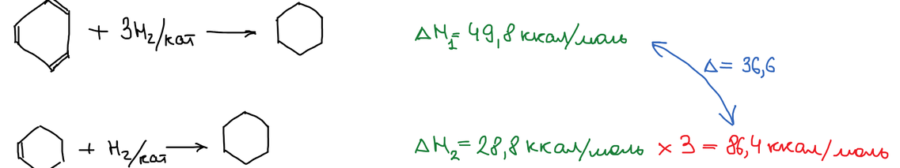
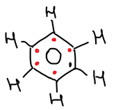
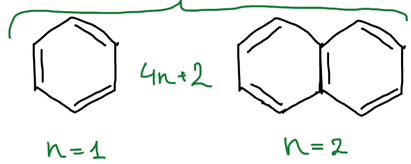
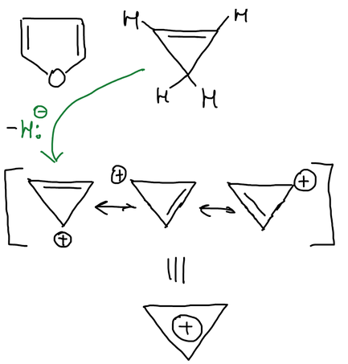
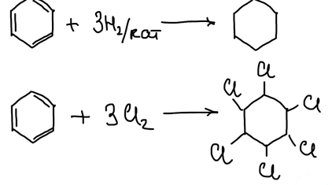
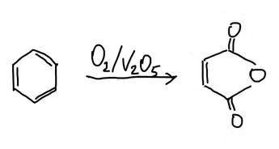

В XIX веке **ароматическими** стали называть соединения, которые при высокой ненасыщенности более склонны к реакциям замещения, чем к реакциям присоединения.

## Строение бензола

В 1865 году Август Кекуле предложил для бензола циклическую структуру циклогексатриена-1,3,5 — шестичленного цикла с тремя чередующимися двойными связями.

Проверить эту структуру можно по теплоте гидрирования. При гидрировании циклогексена, где одна двойная связь, выделяется 28,8 ккал/моль. Если бы в бензоле было три независимые двойные связи, при присоединении трёх молекул водорода выделилось бы в три раза больше — 86,4 ккал/моль. На самом деле выделяется только 49,8 ккал/моль, на 36,6 ккал/моль меньше. Значит, бензол имеет другую структуру:

Энергия молекулы снижается за счёт делокализации π-электронов между всеми атомами углерода кольца. Шесть π-электронов образуют единое электронное облако:

## Правило Хюккеля

**Ароматические системы** — плоские циклические системы с замкнутой цепью сопряжения, содержащие (4n + 2) π-электронов, где n — целое число: 0, 1, 2 и т. д.

> **К правилу.** В конспекте написано «n — простое число». Правильно — «целое число». Для катиона циклопропенилия n = 0, а 0 не простое число.

**Бензоидные** системы содержат бензольное кольцо. Для бензола n = 1 (шесть π-электронов), для нафталина n = 2 (десять):

**Небензоидные** системы не содержат бензольного кольца — например, [фуран](../../geterocikly/furan/). Циклопропен неароматичен: цепь сопряжения в нём не замкнута. Если отнять от него гидрид-ион, получается катион **циклопропенилия**. Положительный заряд в нём распределён по всем трём атомам углерода, а два π-электрона (n = 0) образуют замкнутую систему. Это типичная ароматическая система, по свойствам сходная с бензольным кольцом:

## Свойства бензола

Реакции присоединения для бензола характерны в меньшей степени. Бензол присоединяет водород на катализаторе и хлор, а кислород на V₂O₅ окисляет его до малеинового ангидрида:

Наиболее характерны для бензола реакции [электрофильного](../elektrofilnoe-zameshchenie/) и нуклеофильного замещения. Самые интересные из них — нитрование, сульфирование и галогенирование.
