В **диазосоединениях** группа из двух атомов азота связана с углеродом одним концом, в **азосоединениях** — двумя концами соединяет два атома углерода:

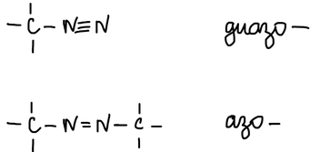

## Диазотирование

Анилин с нитритом натрия в соляной кислоте даёт **хлористый фенилдиазоний**. Положительный заряд катиона делокализован по двум атомам азота:

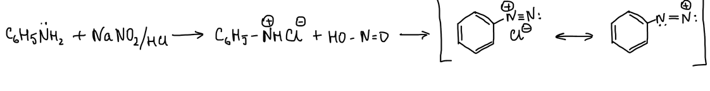

**Механизм.** Азотистая кислота протонируется. Протонированная азотистая кислота отщепляет воду и превращается в ангидрид азотистой кислоты N₂O₃, а с хлорид-ионом — в хлорангидрид NOCl. Все три частицы нитрозируют амин. Получается N-нитрозамин, который таутомеризуется в **диазогидрат** Ar–N=N–OH. Протонирование и отщепление воды дают катион **арилдиазония**:

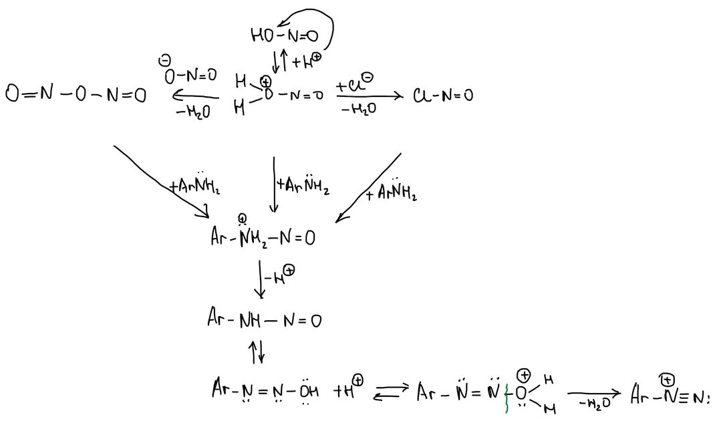

Скорость диазотирования зависит от концентрации свободного амина: чем меньше основность ароматического амина, тем медленнее идёт диазотирование.

## Устойчивость солей диазония

Устойчивость зависит от аниона. Если анион не нуклеофил, диазосоединение очень устойчиво — например, двойная соль хлористого арилдиазония с хлоридом ртути:

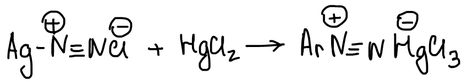

Если анион — сильный нуклеофил, соль диазония неустойчива. Гидроксид-ион присоединяется к азоту: гидроокись арилдиазония превращается в соль диазогидрата. Соляная кислота возвращает соль диазония:

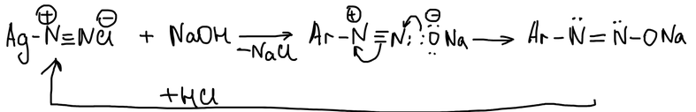

> **К схемам.** В формулах солей диазония на схемах написано «Ag–N≡N Cl». Должно быть Ar — арильный радикал.

## Свойства солей арилдиазония

1. Взаимодействие со щелочами и обратно — образование диазогидратов (выше).
2. Реакция азосочетания.
3. Реакции с выделением азота.

### Азосочетание

Катион арилдиазония — слабый электрофил: заряд делокализован по двум атомам азота:

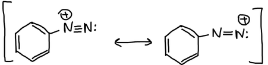

Поэтому он реагирует только с сильно активированными кольцами — фенолят-ионами и аминами. Азосочетание — реакция диазосоединений **без выделения азота**. С фенолом при pH 9 фенолят-ион атакует диазоний в пара-положение, через σ-комплекс хиноидного строения получается **4-гидроксиазобензол**:

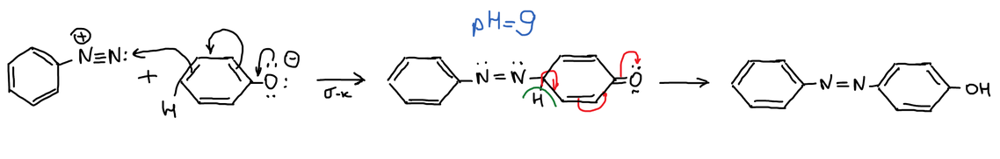

С третичными (и вторичными) аминами азосочетание проводят при pH 5. Получается яркий, но неустойчивый краситель:

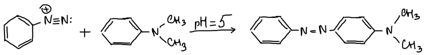

С реакции Зинина мир расцвёл: из анилина через диазотирование и азосочетание стали получать синтетические красители.

### Реакции с выделением азота

Эти реакции основаны на разложении диазосоединений. Разложение может идти по гетеролитическому или по гомолитическому типу.

**Гетеролитическое расщепление** — уходит молекула азота, и остаётся фенил-катион:

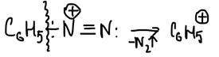

**Гомолитическое расщепление** — анион отдаёт электрон, получаются фенильный радикал и радикал хлора, которые соединяются в хлорбензол:

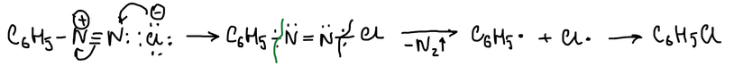

В основном реакции идут по гомолитическому механизму, и всё зависит от того, как анион отдаёт электроны. Через диазосоединения водород кольца можно заменить на любую группу X: нитрование, восстановление, диазотирование, замещение:

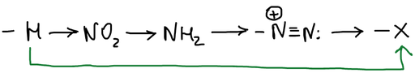

В присутствии солей меди(I) медь передаёт электрон катиону диазония, уходит азот, и арильный радикал соединяется с X:

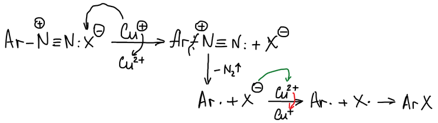

**Замена диазогруппы на водород** — нагревание со спиртом; этанол окисляется в ацетальдегид:

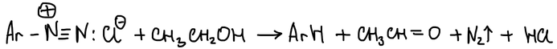

Это позволяет решить задачи, которые иначе не решить, — например, получить **1,3,5-трибромбензол**. Анилин бромируют в 2,4,6-триброманилин, диазотируют и заменяют диазогруппу на водород. Три атома брома остаются в мета-положениях друг к другу — прямым бромированием бензола так не получить:

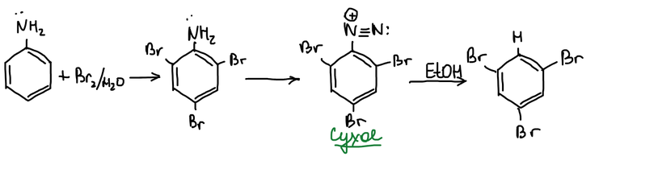

**Иод** вводят действием иодид-иона:

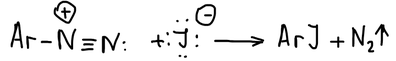

**Реакция Зандмейера** — замена на Cl, Br или CN в присутствии соли меди(I):

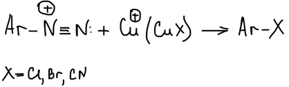

**Реакция Бальца — Шимана** — замена на фтор по гетеролитическому типу. Соль диазония с тетрафторборатом натрия даёт тетрафторборат диазония, который при нагревании разлагается с выделением азота и BF₃:

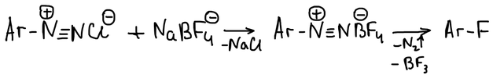

С водой при нагревании диазогруппа заменяется на гидроксил, и получается фенол:

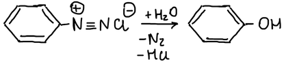
