Для бензола наиболее характерны реакции замещения. Разберём общий механизм электрофильного замещения водорода и то, как на него влияют заместители в кольце.

## Механизм

Замещение идёт в три стадии:

1. Электрофил E⁺ подходит к π-электронному облаку кольца, и образуется **π-комплекс**.
2. Пара электронов бензольного кольца переходит к электрофилу, и образуется **σ-комплекс** — карбкатион, в котором положительный заряд делокализован по пяти атомам углерода кольца.
3. Пара электронов связи C–H возвращается в кольцо, протон H⁺ уходит, и ароматическая система восстанавливается.

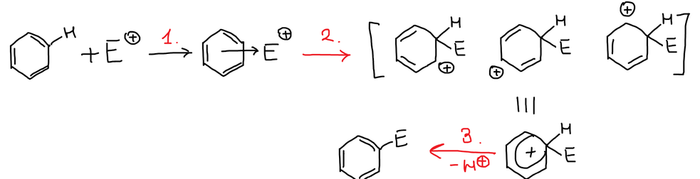

## Заместители I рода

К **заместителям I рода** относятся:

- заместители с положительным индуктивным эффектом (+I) — метильная и другие алкильные группы;
- заместители с положительным мезомерным эффектом (+M) — –OH, –NH₂;
- заместители с сильным отрицательным индуктивным и слабым положительным мезомерным эффектом — галогены.

Заместители I рода направляют новый заместитель в **орто**- и **пара**-положения относительно себя и ускоряют реакцию по сравнению с незамещённым бензолом. Исключение — галогены: они тоже ориентируют в орто- и пара-положения, но замедляют реакцию.

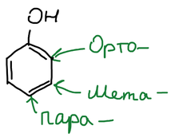

Почему так, видно из σ-комплексов толуола. При атаке в положения 2 и 4 в одной из граничных структур положительный заряд оказывается на атоме углерода, связанном с метильной группой. Её положительный индуктивный эффект гасит этот заряд, и σ-комплекс получается более устойчивым. При атаке в положение 3 такой структуры нет:

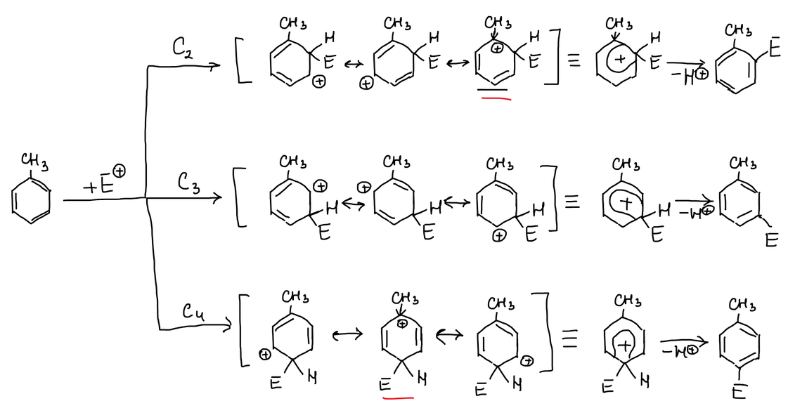

## Заместители II рода

**Заместители II рода** (мета-ориентанты) обладают отрицательным индуктивным и отрицательным мезомерным эффектом — они оттягивают электроны от кольца. По силе этого действия их можно расположить в ряд:

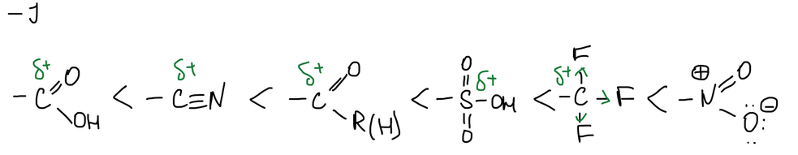

В нитробензоле при атаке в положения 2 и 4 одна из граничных структур σ-комплекса несёт положительный заряд на атоме углерода рядом с положительно заряженным атомом азота нитрогруппы. Соседние положительные заряды дестабилизируют молекулу. При атаке в положение 3 такой структуры нет, поэтому замещение идёт в мета-положение:

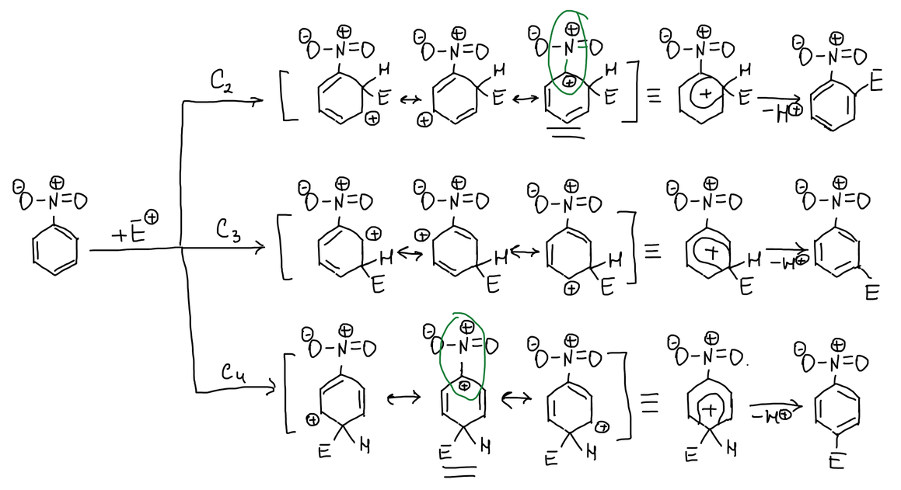

## Правила замещения

Если в кольце уже два заместителя, каждый направляет новый в свои положения. На схемах эти положения отмечены крестиком и кружком. Если метки совпадают, ориентация **согласованная** — оба заместителя направляют в одно и то же место, и число возможных продуктов минимально.

Заместители разного рода, стоящие в орто- или пара-положении друг к другу, ориентируют согласованно. Пример — нитрофенолы:

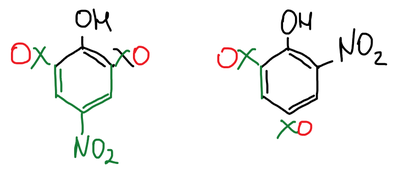

Заместители одного рода ориентируют согласованно, если стоят в мета-положении друг к другу. Пример — диметилбензолы (ксилолы):

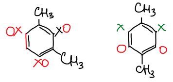

## Аренониевые соли

Реакции электрофильного замещения различают по типу образующейся связи. Первый тип — образование связи углерод ароматического кольца — электрофил. Промежуточный σ-комплекс в некоторых случаях настолько устойчив, что его можно выделить в виде соли. Толуол с фтороводородом даёт такую соль — фторид протонированного толуола:

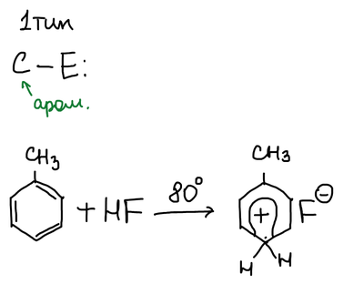

Чем больше метильных групп в кольце, тем быстрее идёт реакция. Отношение скоростей для толуола, мезитилена (1,3,5-триметилбензола) и гексаметилбензола:

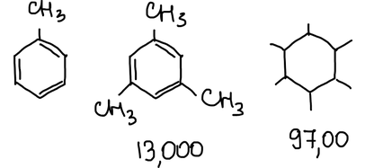

Мезитилен протонируется по атому C-2, а не C-1: при атаке в это положение индуктивный эффект метильных групп гасит положительный заряд во всех граничных структурах, поэтому реакция идёт быстрее всего:

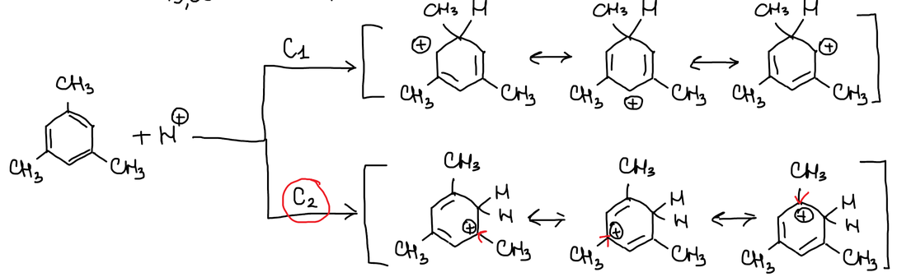

С фторэтаном в присутствии BF₃ мезитилен даёт устойчивую соль — тетрафторборат этилмезитилениевого катиона:

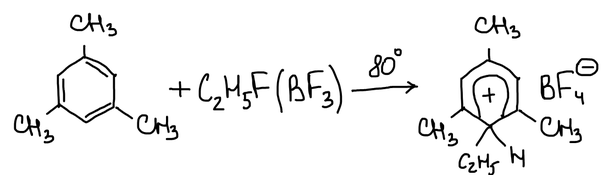

> **К схемам.** Над стрелками в реакциях с HF и с C₂H₅F/BF₃ написано «80°». Соли σ-комплексов устойчивы только на холоду; вероятно, имеется в виду −80 °C. Число «97,00» под гексаметилбензолом неразборчиво — возможно, 97 000.
