**Фенол** (оксибензол, гидроксибензол) — важнейшее сырьё химической промышленности.

## Получение

**1. Сплавление солей сульфокислот со щёлочью.** Бензолсульфокислоту переводят в натриевую соль водным раствором щёлочи, а затем сплавляют с твёрдым NaOH. Гидроксид-ион атакует атом углерода, связанный с сульфогруппой, и через σ-комплекс получается фенолят, а сульфогруппа уходит в виде сульфита:

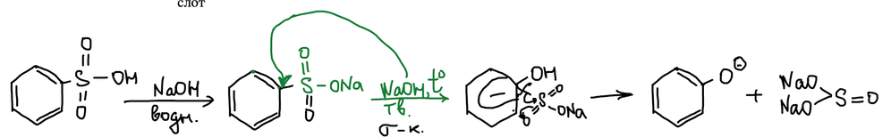

**2. Кумольный метод** (реакция Сергеева — Удриса). Изопропилбензол (кумол) окисляется кислородом воздуха по радикальному механизму. Кумильный радикал присоединяет кислород, получившийся пероксидный радикал отрывает водород от следующей молекулы кумола — идёт цепная реакция:

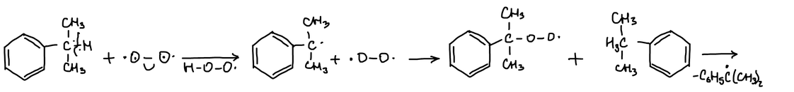

Получается **гидропероксид кумола**. В кислоте он протонируется и отщепляет воду; при этом фенильная группа переходит от углерода к кислороду:

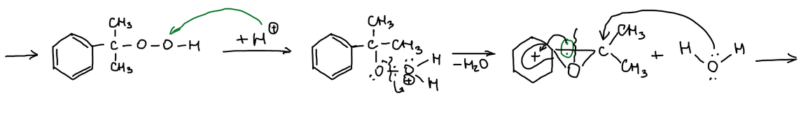

Карбкатион присоединяет воду, и полуацеталь распадается на **фенол** и **ацетон**:

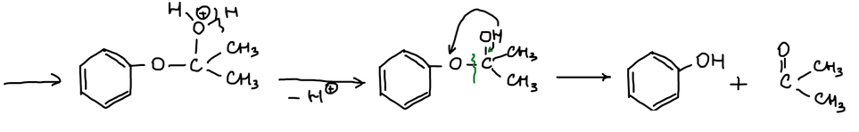

**3. Гидролиз галогенпроизводных** — например, о-хлорнитробензола; нитрогруппа облегчает замещение (см. [галогенпроизводные](../galogenproizvodnye/)).

**4. Гидролиз солей диазония в воде** (см. [диазосоединения](../diazosoedineniya/)).

## Свойства по гидроксильной группе

### Кислотность

Фенол — кислота, этим он отличается от спиртов. Отрицательный заряд фенолят-аниона делокализован по кольцу — в орто- и пара-положения. У циклогексанола такой делокализации нет, и он кислотой не является:

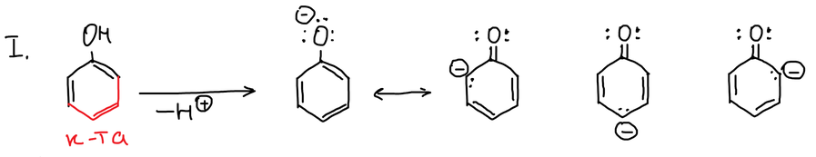

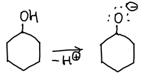

Введение акцепторной группы в ядро повышает кислотность — см. нитрофенолы ниже.

### Алкилирование

Фенолят-анион — нуклеофил. С иодистым метилом он даёт **анизол** (метоксибензол, метилфениловый эфир):

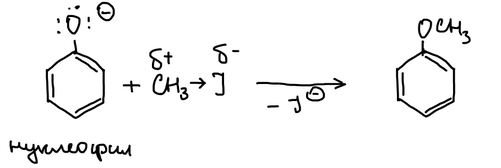

### Сложные эфиры

Фенол не вступает в реакцию этерификации с кислотами: пара электронов кислорода втянута в ароматическое ядро, и он плохой нуклеофил по сравнению со спиртом:

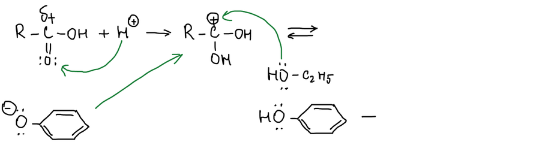

Сложные эфиры фенола получают из фенолята натрия и хлорангидрида кислоты:

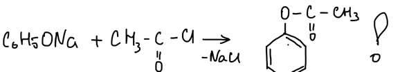

**Качественная реакция:** если вещество даёт окрашивание с хлоридом железа(III), в нём есть фенольная гидроксильная группа.

## Свойства по ароматическому ядру

Электрофильное замещение. В щелочной среде ядро очень активировано: фенолят-анион быстро присоединяет электрофил, и через σ-комплекс хиноидного строения получается замещённый фенолят. Так идут галогенирование, сульфирование, нитрование:

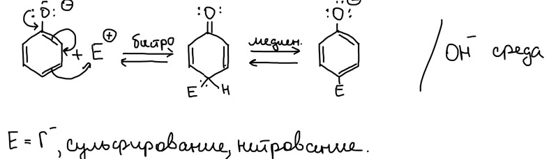

### Ацилирование

Непосредственно ацилировать фенол в кольцо нельзя: ацилируется гидроксил. Используют **перегруппировку Фриса**: фенилацетат с AlCl₃ в нитробензоле при нагревании перегруппировывается в метил-п-гидроксифенилкетон. Это электрофильное замещение в присутствии кислоты Льюиса:

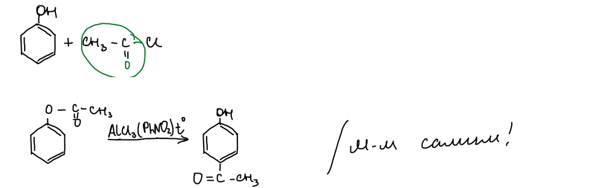

### Карбоксилирование

Сам фенол с CO₂ не реагирует — его надо активировать, превратив в фенолят. Фенолят натрия присоединяет CO₂ в орто-положение через структуру хиноидного строения, и получается **салициловая кислота**. Её ацетилирование даёт **ацетилсалициловую кислоту** (аспирин):

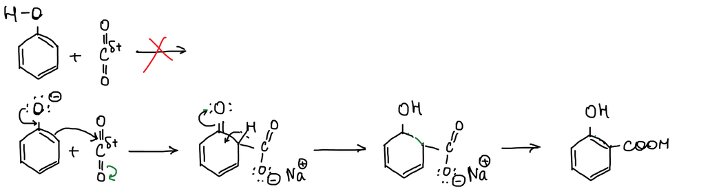

### Формилирование

Формилирование по Гаттерману [разбирали раньше](../friedel-crafts/#формилирование). **Реакция Реймера — Тимана:** хлороформ со щёлочью даёт дихлоркарбен (α-отщепление). Он атакует фенолят в орто-положение, дихлорметильная группа гидролизуется, и в кислой среде получается **салициловый альдегид**:

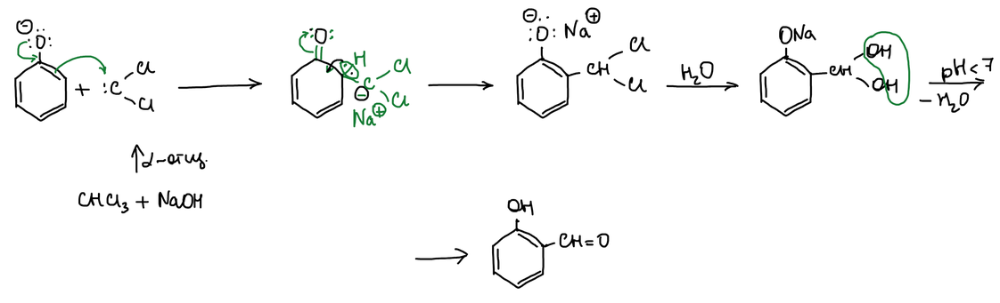

### Взаимодействие с карбонильными соединениями

С формальдегидом в **кислой среде** (pH < 7) протонированный формальдегид атакует фенол в орто-положение. Гидроксиметилфенол протонируется, отщепляет воду, и карбкатион алкилирует следующую молекулу фенола. Получается линейная смола — **новолак**:

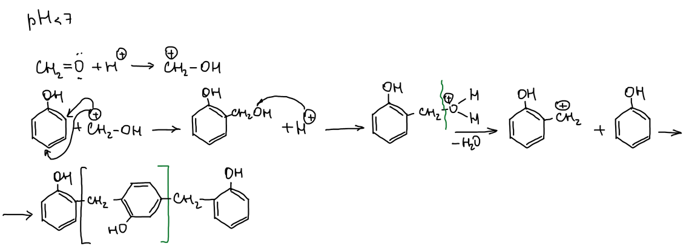

В **щелочной среде** фенолят присоединяет формальдегид в пара-положение. Отщепление гидроксид-иона даёт **метиленхинон**, который присоединяет следующий фенолят. Получается **резол**:

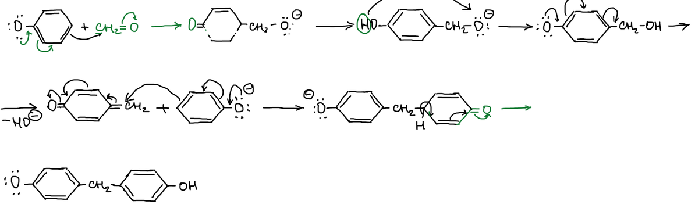

С **ацетоном** в кислой среде (пропускают хлороводород) две молекулы фенола дают **диан** — 2,2-ди(п-гидроксифенил)пропан, открытый Александром Дианиным. С фосгеном диан образует **поликарбонат**:

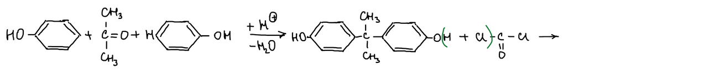

## Нитрофенолы

Нитрогруппа — акцептор, поэтому нитрофенолы более сильные кислоты, чем фенол. Нитрогруппа в мета-положении мало влияет на кислотность — она не может оттягивать электроны от атома кислорода по сопряжению:

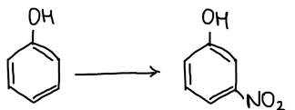

Кислотность растёт в ряду: м-нитрофенол < о- и п-нитрофенолы < 2,4-динитрофенол < 2,4,6-тринитрофенол:

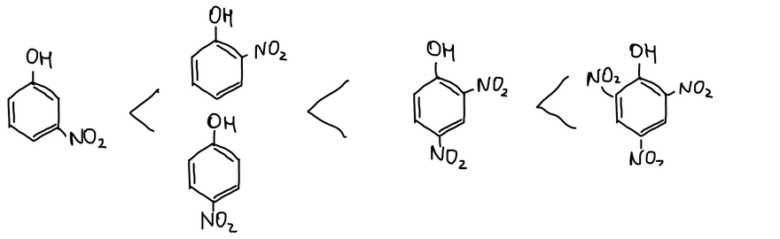

2,4,6-Тринитрофенол — **пикриновая кислота** (от греческого «горький»), взрывчатое вещество. Рабочих, которые с ней работали, быстро вычисляли: белки глаз окрашивались в жёлтый цвет.

**Азосочетание.** п-Нитрофенол вступает в азосочетание в орто-положение к гидроксилу:

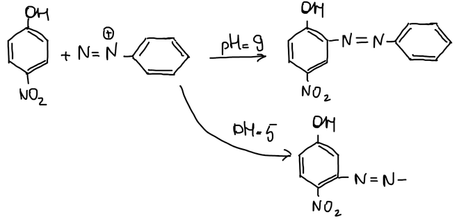
