Реакции этой группы образуют связь углерод — углерод между бензольным кольцом и заместителем.

## Алкилирование

**Алкилирование** — введение в бензольное кольцо алкильной группы, например метильной. Бензол с галогеналкилом в присутствии AlCl₃ даёт толуол. Катализаторы — кислоты Льюиса; по активности они располагаются в ряд AlCl₃ > FeCl₃ > SnCl₄ > BF₃ > ZnCl₂ > HF > H₂SO₄:

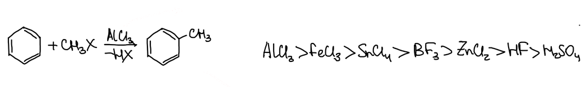

Хлорид алюминия отнимает у галогеналкила галогенид-ион, и образуется карбкатион — электрофил:

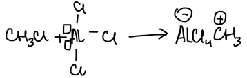

Алкилирующим агентом могут быть и алкены в присутствии кислоты — протон присоединяется по двойной связи:

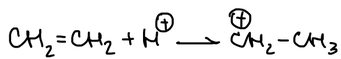

— и спирты: протонированный спирт отщепляет воду:

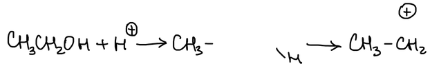

> **К схеме.** Схема для спирта в конспекте не дописана: CH₃CH₂OH + H⁺ → CH₃CH₂OH₂⁺ → CH₃CH₂⁺ + H₂O.

### Недостатки алкилирования

1. При избытке галогеналкила реакция продолжается: метильная группа активирует кольцо, реакция ускоряется, и получаются продукты полиалкилирования.
2. Так можно ввести метильную и этильную группы, а с пропильной ничего не получится. Карбкатионы склонны к перегруппировкам: пропил-катион перегруппировывается в более устойчивый изопропил-катион, и вместо пропилбензола получается изопропилбензол:

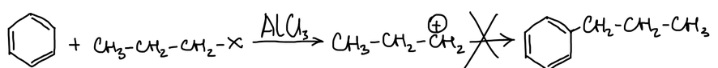

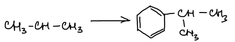

## Ацилирование

Чтобы получить пропилбензол, пользуются другой реакцией — **ацилированием**, введением ацильной группы R–C(=O)–. Её частный случай с R = H — формильная группа H–C(=O)–.

Бензол с ацетилхлоридом в присутствии AlCl₃ даёт **ацетофенон**:

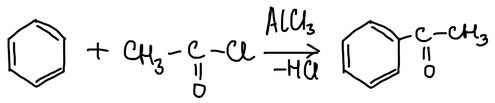

Электрофил — ацилий-катион, который AlCl₃ образует из хлорангидрида:

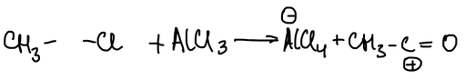

Ацилирующими агентами могут быть и ангидриды кислот, а также CO₂, фосген и дихлорангидриды дикарбоновых кислот:

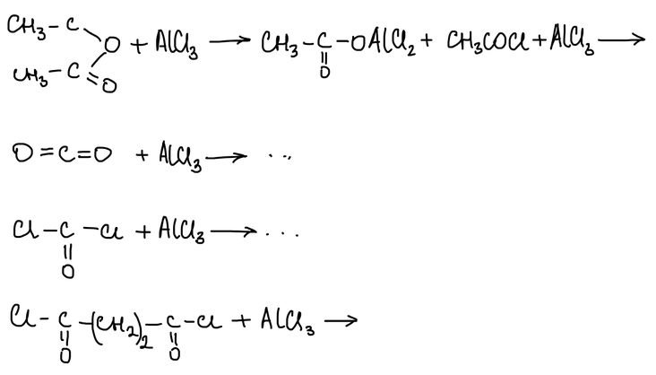

> **К схемам.** Реакции с CO₂, фосгеном и дихлорангидридом в конспекте не дописаны.

**Достоинства ацилирования:**

- реакцию можно остановить на стадии моноацилирования: ацильная группа дезактивирует кольцо, и вторую группу уже не ввести;
- можно обойти недостатки алкилирования — например, получить пропилбензол.

Бензол ацилируют хлорангидридом пропионовой кислоты, а получившийся кетон восстанавливают до пропилбензола. Восстанавливают амальгамированным цинком в кислоте (**по Клемменсену**) или гидразином со щёлочью (**по Кижнеру — Вольфу**):

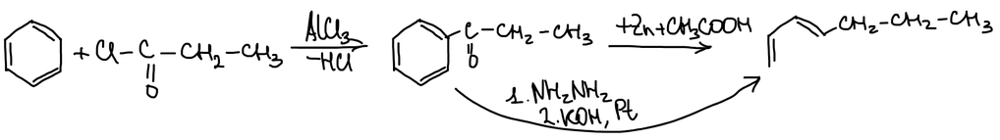

> **К схеме.** В конспекте написано «Окисление по Клеменсену». Реакция Клемменсена — **восстановление** карбонильной группы до CH₂. На схеме стоит Zn + CH₃COOH; обычно берут амальгаму цинка и соляную кислоту.

## Формилирование

**Реакция Гаттермана — Коха** — формилирование бензола оксидом углерода(II) и хлороводородом в присутствии AlCl₃. Получается бензальдегид:

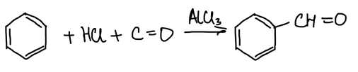

**Реакция Гаттермана** — вместо CO берут циановодород. Так формилируют фенолы и анилины:

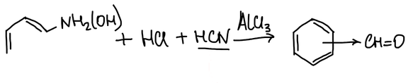

> **К схеме.** Над HCN в конспекте надпись «курить!» — видимо, напоминание о токсичности; из вырезки убрана.

**Реакция Губена — Хёша** — ацилирование нитрилом RCN и хлороводородом; получается кетон:

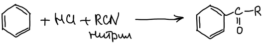

**Реакция Вильсмейера** — формилирование диметилформамидом HC(O)N(CH₃)₂ в присутствии POCl₃. Схема в конспекте не дописана.

> **К тексту.** «Реакция полимилирования» в конспекте — по смыслу «формилирования».
