Галогенпроизводные аренов делят на два типа. В **арилгалогенидах** галоген связан с атомом углерода кольца — они похожи на винилгалогениды. В **аралкилгалогенидах** (бензилгалогенидах) галоген стоит в боковой цепи — они похожи на аллилгалогениды:

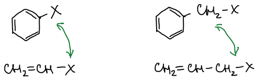

## Галогенирование кольца

Бромирующие реагенты располагаются по активности в ряд: от комплекса брома с диоксаном до брома с перхлоратом серебра. Катализаторы — кислоты Льюиса — по активности: ZnBr₂ < AlBr₃ < FeBr₃:

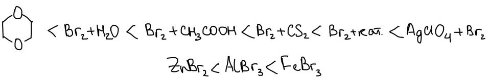

Кислота Льюиса принимает пару электронов брома на свободную орбиталь железа, и образуется катион брома Br⁺:

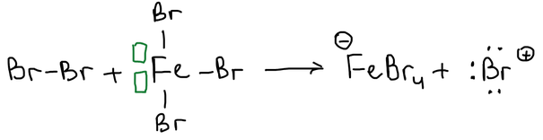

Бром в воде образует бромноватистую кислоту HBrO, которая в кислой среде отщепляет воду и тоже даёт Br⁺. Катион брома получается и из бромида иода, и из брома с перхлоратом серебра:

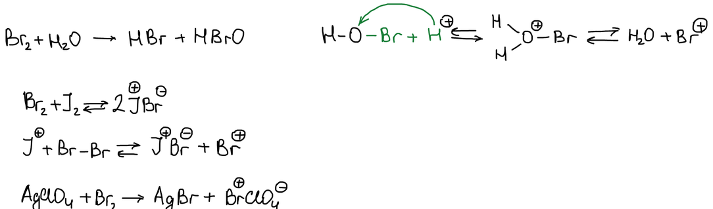

Самый слабый реагент — комплекс брома с диоксаном: бром координируется по атому кислорода:

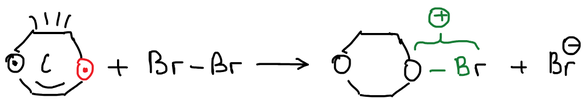

**Чем слабее реагент, тем сильнее должен быть заместитель в бензольном кольце.** Лучше всего активируют кольцо заместители с сильным положительным индуктивным и мезомерным эффектом. Ряд заместителей по активирующему действию:

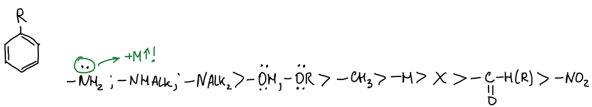

Относительная скорость бромирования алкилбензолов (iPr — изопропил, tBu — трет-бутил):

| R | H | CH₃ | C₂H₅ | iPr | tBu |
|---|---|---|---|---|---|
| о/с | 1 | 605 | 406 | 260 | 140 |

Для заместителей с атомом кислорода или азота:

| R | H | OH | OC₂H₅ | NHCOCH₃ |
|---|---|---|---|---|
| о/с | 10⁻¹⁰ | 60 | 0,2 | 0,02 |

Для заместителей II рода:

| R | H | –COOH | –NO₂ |
|---|---|---|---|
| о/с | 1 | 0,75·10⁻² | 0,1·10⁻⁴ |

> **К таблицам.** «о/с» — относительная скорость. Во второй таблице значения, видимо, отнесены не к бензолу: для H стоит 10⁻¹⁰, а не 1. Числа перенесены как в конспекте.

### Бромирование фенола и анилина

Фенол с бромной водой сразу даёт осадок 2,4,6-трибромфенола — это **качественная реакция на фенол**. Чтобы получить только о-бромфенол, фенол сначала сульфируют: сульфогруппы занимают положения 2 и 4. Бром вступает в оставшееся орто-положение, а затем сульфогруппы снимают перегретым паром при 210 °C:

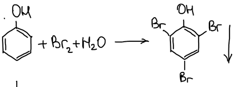

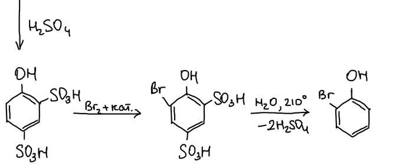

Анилин с бромной водой тоже сразу даёт 2,4,6-триброманилин. Чтобы получить п-броманилин, аминогруппу защищают ацетилированием уксусным ангидридом. Ацетамидная группа активирует кольцо слабее, и бром вступает только в пара-положение. Кислотный гидролиз снимает защиту:

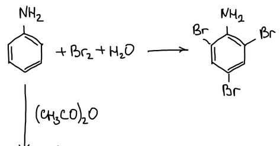

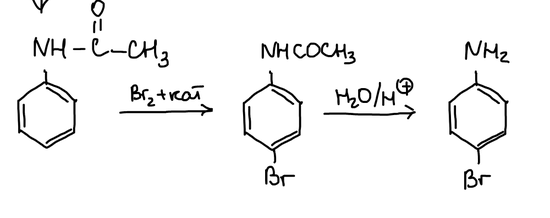

## Арилгалогениды

Бромбензол с магнием в эфире даёт реактив Гриньяра — фенилмагнийбромид:

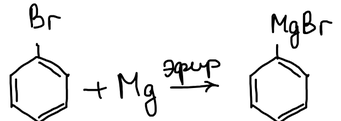

Хлор в хлорбензоле замещается на аминогруппу или гидроксил только при нагревании:

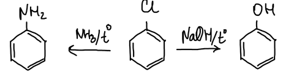

Галоген в арилгалогенидах малоподвижен: неподелённая пара галогена сопряжена с кольцом, и связь C–Hal приобретает частично двойной характер:

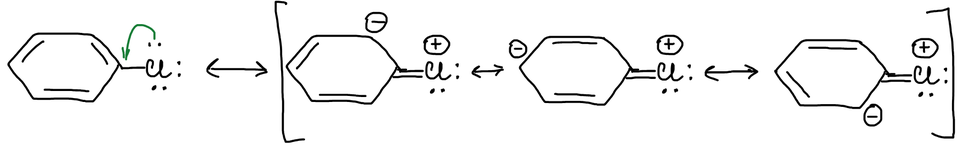

### Присоединение — отщепление

Нуклеофил Y⁻ присоединяется к атому углерода, связанному с галогеном X, и образуется анионный σ-комплекс — **комплекс Мейзенхеймера**. Затем галогенид-ион уходит:

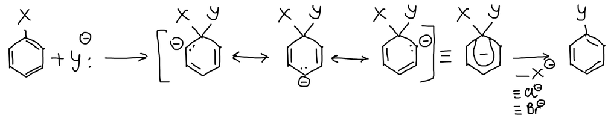

Комплекс Мейзенхеймера устойчив, если в кольце есть нитрогруппы. 2,4,6-Тринитроанизол с этилат-ионом даёт такой комплекс, который может отщепить метилат-ион и дать 2,4,6-тринитрофенетол:

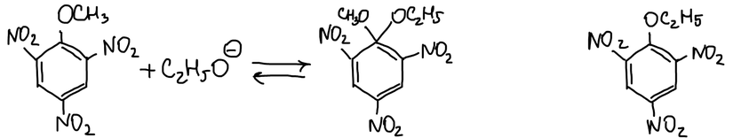

Нитрогруппа в орто- или пара-положении принимает на себя отрицательный заряд комплекса и облегчает замещение:

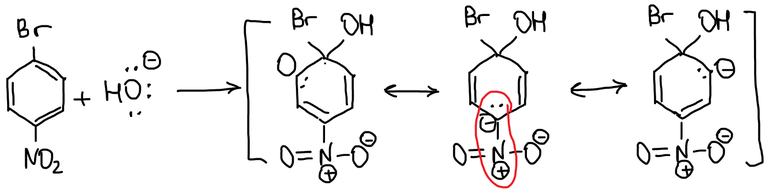

### Отщепление — присоединение

Амид натрия превращает п-хлортолуол в смесь п- и м-толуидинов по 50 %. Аминогруппа встаёт не только на место хлора, потому что амид-ион — сильное основание, но слабый нуклеофил. Реакция идёт по типу **отщепление — присоединение**. Если реагент — сильный нуклеофил, но слабое основание, реакция идёт по типу **присоединение — отщепление**, как выше:

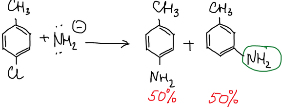

**Механизм.** Амид-ион отрывает протон из орто-положения, и бромид-ион уходит. Получается **дегидробензол** с формальной тройной связью в кольце. Аммиак присоединяется к любому из двух её атомов углерода, поэтому получаются два изомера:

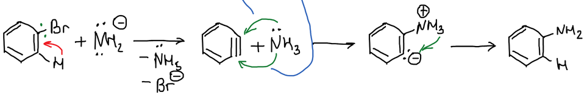

## Галоген в боковой цепи

При действии хлора на свету толуол последовательно превращается в хлористый бензил, хлористый бензилиден и бензотрихлорид. Реакция идёт по свободнорадикальному механизму. В условиях ионной реакции (с катализатором, в темноте) хлор замещал бы водород в бензольном кольце:

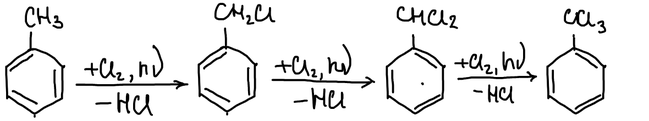

Если боковая цепь длиннее одного атома углерода, замещение идёт в **α-положение**. α-Радикал стабилизирован сопряжением с кольцом, а у β-радикала неспаренный электрон находится далеко от кольца:

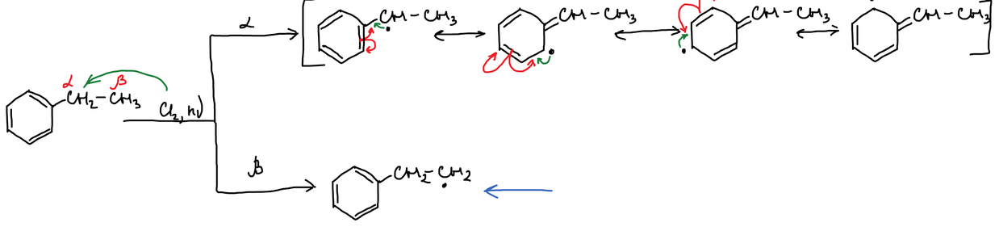

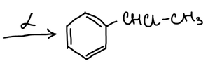

Когда все α-атомы водорода замещены, в реакцию вступает β-атом углерода, но в более жёстких условиях.

**Реакция Блана** — хлорметилирование: бензол с формальдегидом и хлороводородом в присутствии ZnCl₂ даёт хлористый бензил:

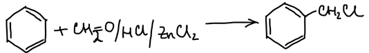

### Подвижность галогена в бензилхлориде

Бензилхлорид реагирует по механизму SN1. Хлорид-ион уходит, и образуется карбкатион. Положительный заряд в α-положении делокализуется по π-электронам кольца:

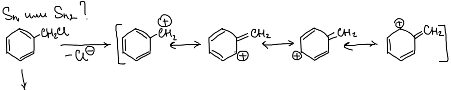

Карбкатион устойчив, поэтому галоген очень подвижен: бензилхлорид гидролизуется гидроксид-ионом и даже водой:

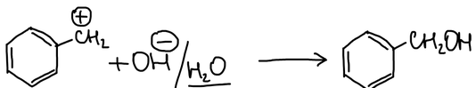

Если галоген стоит дальше от кольца, свойства такие же, как у галогенпроизводных алифатического ряда:

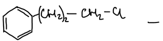

Сравнение реакционной способности: аллилхлорид > пропилхлорид > винилхлорид, и так же бензилхлорид > хлорбензол:

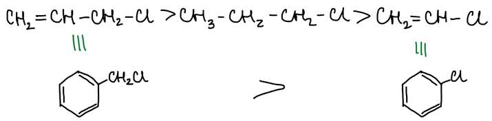
