Ароматические карбоновые кислоты — например, **бензойная** C₆H₅COOH — получают так же, как алифатические. Свойства по карбоксильной группе у них те же, что у алифатических кислот, а по бензольному кольцу карбоксильная группа — ориентант II рода.

## Дикарбоновые кислоты

Ароматические дикарбоновые кислоты отличаются от соответствующих кислот алифатического ряда. Изомеры — **фталевая** (орто), **изофталевая** (мета) и **терефталевая** (пара) кислоты:

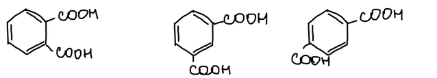

Получают их окислением о-, м- и п-ксилолов, например дихроматом калия в серной кислоте:

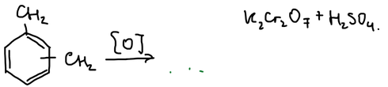

> **К схеме.** У ксилола на схеме нарисованы группы CH₂; должны быть метильные группы CH₃.

### Лавсан

Диметиловый эфир терефталевой кислоты (его получают этерификацией метанолом) при переэтерификации этиленгликолем даёт полиэфир **лавсан** — название от Лаборатории высокомолекулярных соединений Академии наук. В ГДР такое же волокно называли **дедерон**:

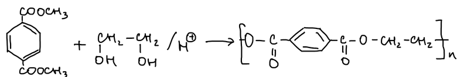

> **К тексту.** Под диметилтерефталатом в конспекте подписано «Репилент» — смысл подписи неясен. Реакцию Перкина в конспекте называют «по Перкину младшему»; её открыл Уильям Генри Перкин-старший.

### Фталевый ангидрид

Фталевая кислота при нагревании отщепляет воду и даёт **фталевый ангидрид**. С метанолом он образует моно-, а затем диметилфталат:

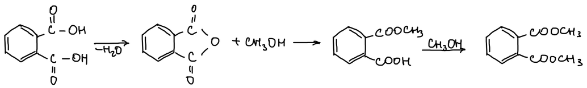

С водным аммиаком ангидрид даёт аммониевую соль фталаминовой кислоты. Бром в щёлочи превращает амидную группу в аминогруппу (перегруппировка Гофмана), и получается **антраниловая кислота** — она может давать азосоединения по аминогруппе. С безводным аммиаком получается **фталимид**:

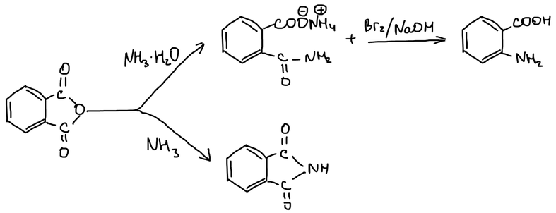

Фталевый ангидрид **ацилирует бензольное кольцо** в присутствии кислоты Льюиса. Получается о-бензоилбензойная кислота, которая отщепляет воду и даёт **антрахинон** (R может быть и OH — тогда исходное вещество фенол):

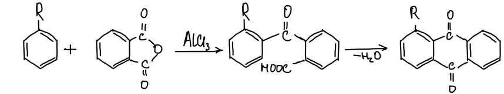

Две молекулы фенола с фталевым ангидридом в присутствии ZnCl₂ дают **фенолфталеин**. Сам он бесцветен. В щелочной среде лактонный цикл раскрывается, получается хиноидная структура — окрашенный анион. В сильнощелочной среде гидроксид-ион присоединяется к центральному атому углерода, и индикатор снова обесцвечивается:

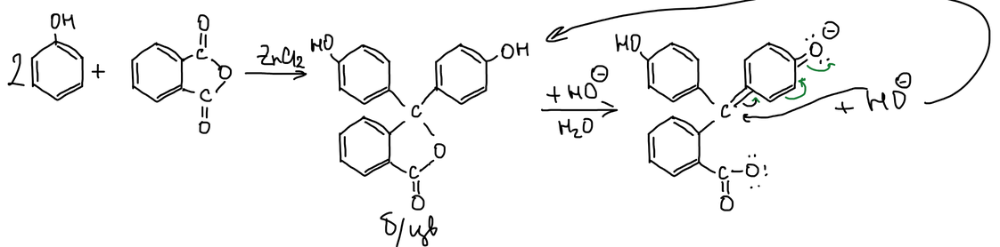

Фенолфталеин — родоначальник второй группы красителей: **фталеинов**.

## Коричная кислота

**Коричная кислота** C₆H₅CH=CH–COOH содержится в корице:

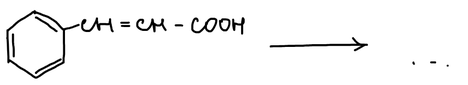

Её получают **конденсацией Перкина** из бензальдегида, уксусного ангидрида и ацетата натрия. Ацетат-ион отрывает протон от уксусного ангидрида, и получается енолят-анион:

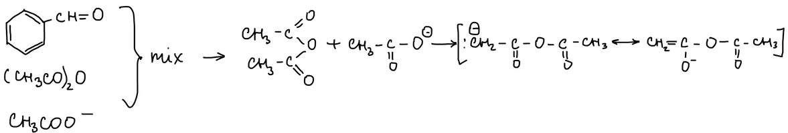

Карбанион присоединяется к карбонильной группе бензальдегида:

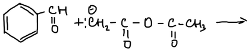

Алкоголят отрывает протон от следующей молекулы ангидрида, получается гидроксипроизводное. Оно отщепляет воду, и гидролиз смешанного ангидрида даёт коричную кислоту:

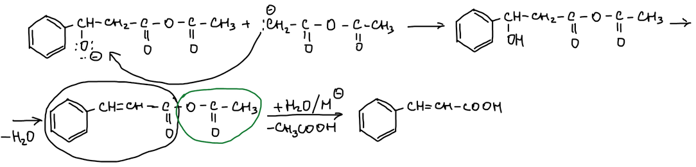
