**Нитрование** — введение нитрогруппы –NO₂. В ароматическое кольцо её вводит электрофил — катион нитрония NO₂⁺.

## Нитрующие агенты

**1. Нитрующая смесь** — азотная кислота с концентрированной серной:

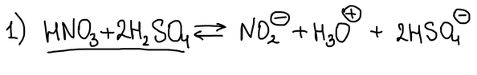

> **К схеме.** Из нитрующей смеси образуется катион нитрония **NO₂⁺**, а не анион NO₂⁻, как написано в уравнении. Ниже в механизме он нарисован правильно.

Азотная кислота выступает здесь основанием: она принимает протон от серной кислоты, и получается протонированная форма азотной кислоты. Та отщепляет воду и даёт катион нитрония. Серная кислота связывает воду и смещает равновесие:

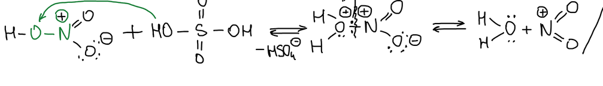

**2. Концентрированная азотная кислота** — нитрующий агент слабее. Одна молекула азотной кислоты протонирует другую:

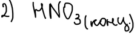

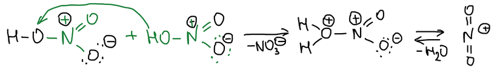

**3. Смесь уксусного ангидрида и азотной кислоты.** Образуется **ацетилнитрат** — смешанный ангидрид уксусной и азотной кислот. В кислой среде он протонируется и отщепляет уксусную кислоту, давая NO₂⁺:

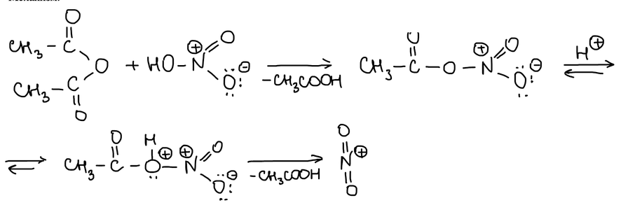

**4. Смесь пентаоксида азота и серной кислоты.** Протонированный N₂O₅ распадается на азотную кислоту и NO₂⁺:

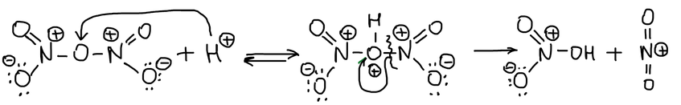

Нитрующие агенты в порядке усиления нитрующего действия:

1. Тетранитрометан C(NO₂)₄.
2. Ацетилнитрат CH₃COONO₂.
3. Разбавленная азотная кислота.
4. Смесь азотной и уксусной кислот.
5. Концентрированная азотная кислота.
6. Нитрующая смесь.
7. Смесь нитрата калия и серной кислоты.
8. Смесь пентаоксида азота и серной кислоты.

## Распределение изомеров

Алкилбензолы нитруются в орто- и пара-положения. С ростом объёма заместителя доля орто-изомера падает, а пара-изомера растёт:

| R | о- | п- | м- |
|---|---|---|---|
| –CH₃ | 58 % | 37 % | 4 % |
| –C₂H₅ | 45 % | 48 % | 6 % |
| –iPr | 30 % | 62 % | 7 % |
| –tBu | 15 % | 72 % | 11 % |

Относительные скорости нитрования (о/с):

| R | H | –CH₃ | –tBu |
|---|---|---|---|
| о/с | 1 | 245 | 150 |

Заместители II рода направляют нитрогруппу в мета-положение и сильно замедляют реакцию:

| R | м- | о- | п- |
|---|---|---|---|
| –NO₂ | 93 % | 6 % | 0,3 % |
| –COOH | 81 % | 18 % | 1 % |
| –CH=O | 79 % | 11 % | 9 % |
| –COCH₃ | 69 % | 30 % | 1 % |

| R | H | –NO₂ |
|---|---|---|
| о/с | 1 | 1·10⁻⁷ |

## Нитрование фенола

Фенол нитруется уже 30 %-й азотной кислотой при 20 °C и даёт смесь о- и п-нитрофенолов. Смесь можно разделить: в о-нитрофеноле образуется внутримолекулярная водородная связь, поэтому он летуч и уходит с водяным паром в дистиллят:

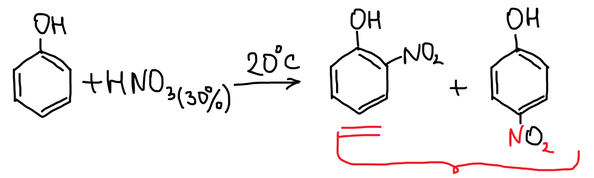

С оксидом азота(V) фенол даёт 2,4-динитрофенол. Если пытаться нитровать его дальше до тринитрофенола, выход получается маленьким:

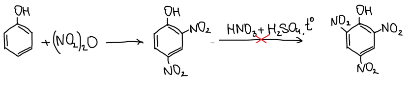

Поэтому тринитрофенол (**пикриновую кислоту**) получают из фенол-2,4-дисульфокислоты: азотная кислота замещает сульфогруппы и нитрует третье положение:

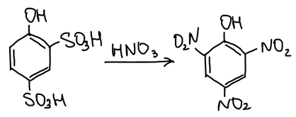

## Нитрование анилина

Если нитровать анилин непосредственно, аминогруппа окисляется и разрушается. Сначала её надо защитить.

**Серной кислотой.** Анилин превращается в гидросульфат анилиния. Группа –NH₃⁺ — мета-ориентант, и азотная кислота при 60 °C даёт м-нитропроизводное. Щёлочь снимает протон, и получается **м-нитроанилин**:

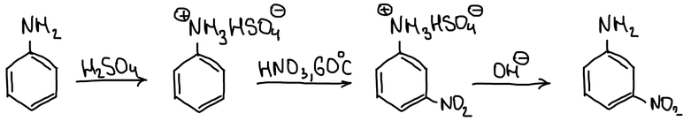

**Уксусным ангидридом.** Анилин ацетилируют в ацетанилид, который нитруется при 0 °C в смесь о- и п-нитроацетанилидов. Раствор соды гидролизует пара-изомер до п-нитроанилина, а о-нитроацетанилид гидролизуют водной щёлочью:

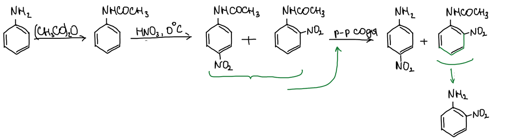

## Динитробензолы

Динитробензолы бывают трёх изомеров — орто, мета и пара:

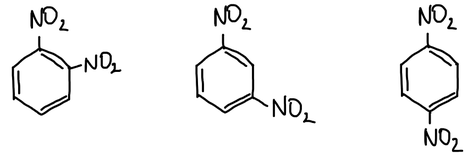

Для динитробензолов характерны реакции электрофильного и нуклеофильного замещения.

### Нуклеофильное замещение нитрогруппы

К нуклеофильному замещению нитрогруппы склонны орто- и пара-динитробензолы. Гидроксид натрия, метилат натрия и аммиак в спирте замещают одну из нитрогрупп:

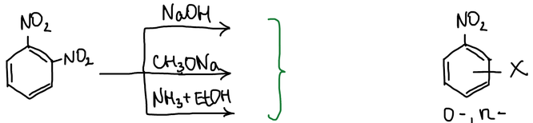

Отрицательный заряд σ-комплекса переходит на вторую нитрогруппу, стоящую в орто- или пара-положении, и комплекс стабилизируется. Затем нитрит-ион уходит:

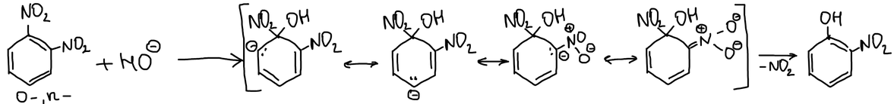

В м-динитробензоле нитрогруппа не замещается: отрицательный заряд σ-комплекса не попадает на атом углерода, связанный со второй нитрогруппой:

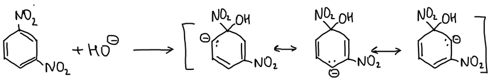

### Замещение водорода в м-динитробензоле

Нитрогруппы в м-динитробензоле ориентируют согласованно. Гидроксид-ион присоединяется к кольцу в положение, где заряд σ-комплекса стабилизируют обе нитрогруппы. Затем окислитель — гексацианоферрат(III) калия — отнимает гидрид-ион (он окисляется до протона). Получаются два изомера динитрофенола, 2,6-изомера мало:

![м-Динитробензол и K₃[Fe(CN)₆]: 2,4- и 2,6-динитрофенол](images/nitrovanie/meta-okisl.png)

Нитрогруппа не уходит: это плохая уходящая группа. σ-Комплексы, в которых отрицательный заряд находится на атоме азота нитрогруппы, устойчивы:

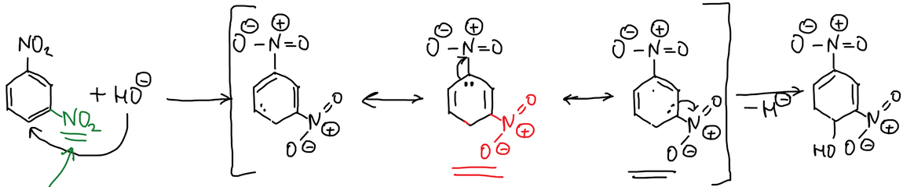

### Восстановление нитрогрупп

Нитрогруппа восстанавливается до аминогруппы:

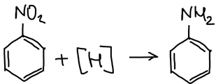

## Нитрогруппа в боковой цепи

Толуол при нагревании до 150 °C с разбавленной (15 %-й) азотной кислотой нитруется не в кольцо, а в боковую цепь, и получается **фенилнитрометан**:

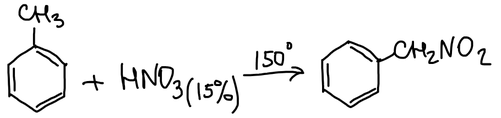

Реакция идёт по радикальному механизму. Нитрогруппа вступает в α-положение, потому что там образуется наиболее устойчивый свободный радикал:

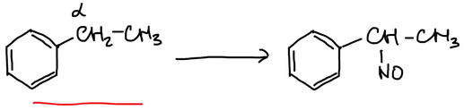

> **К схемам.** У продуктов написано –NO вместо –NO₂: в боковую цепь вступает нитрогруппа, а не нитрозогруппа.

### Свойства фенилнитрометана

Группа CH₂NO₂ — заместитель I рода: нитрогруппа стоит далеко от кольца, и это производное метильной группы:

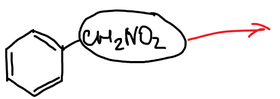

1. Нитрогруппа восстанавливается.
2. Фенилнитрометан прекрасно растворяется в водной щёлочи. Это объясняется таутомерией — нитро-ацинитро-таутомерией, аналогом кето-енольной. Атом водорода α-углерода переходит к кислороду нитрогруппы, и получается ацинитро-форма — кислота, которая со щёлочью образует соль. Соляная кислота возвращает соль в исходную форму:

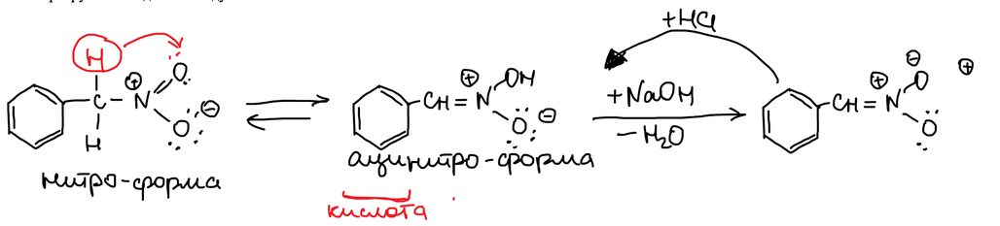

3. Фенилнитрометан вступает в реакции нитрования и сульфирования кольца.
