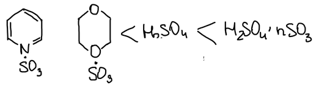
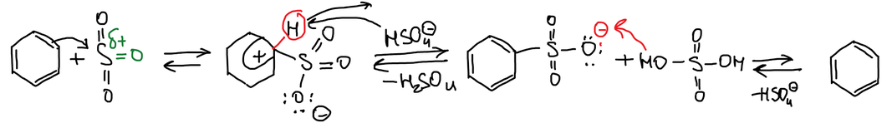
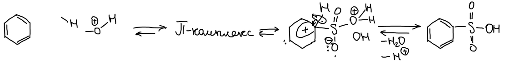
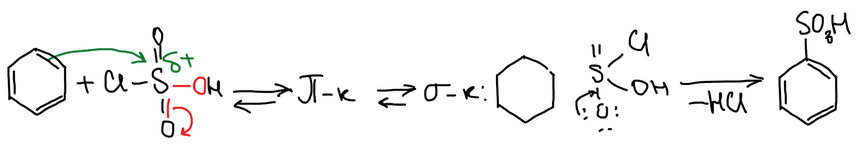
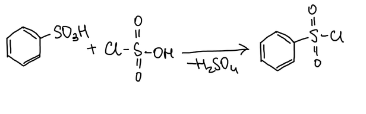
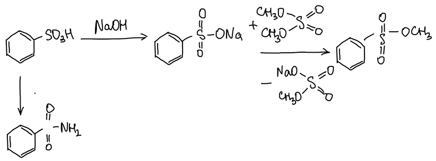
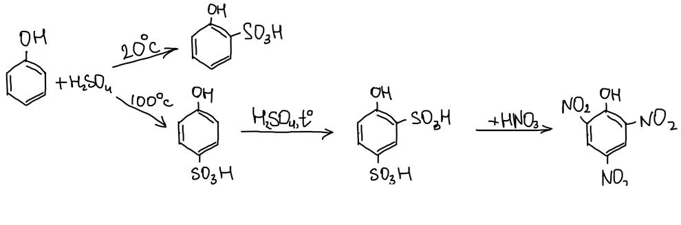
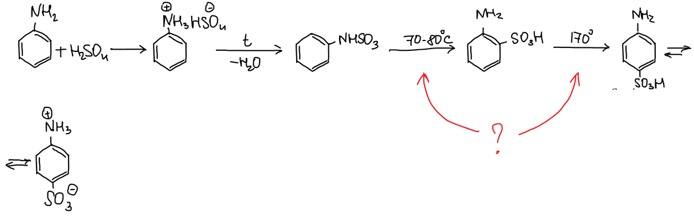
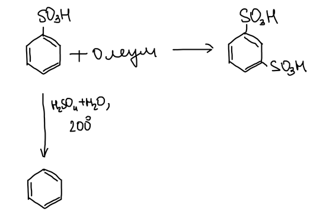
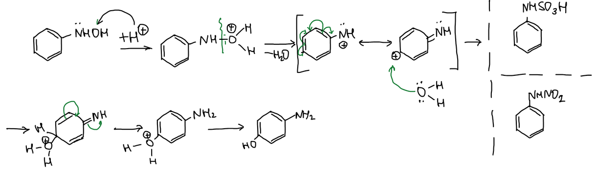

**Сульфирование** — введение сульфогруппы –SO₃H. Электрофил в этой реакции — триоксид серы SO₃ или частицы, которые его отдают.

## Сульфирующие агенты

По силе сульфирующего действия агенты располагаются в ряд: комплексы SO₃ с пиридином и с диоксаном < серная кислота различной концентрации < олеум (H₂SO₄ · nSO₃):

## Механизмы

**1. Олеум.** SO₃ атакует кольцо, и образуется σ-комплекс. Протон сам по себе не уходит — нужно основание, его роль играет гидросульфат-ион. Получается бензолсульфонат-анион, который протонируется серной кислотой:

**2. Протонированная серная кислота.** Главная особенность — равновесие. Через π-комплекс и σ-комплекс образуется бензолсульфокислота, а обратная реакция отщепляет сульфогруппу:

**3. Хлорсульфоновая кислота** (неполный хлорангидрид серной кислоты). Через π- и σ-комплексы отщепляется хлороводород:

## Выделение сульфокислот

Сульфокислоты отделяют от серной кислоты через соли кальция, бария и т. п.: сульфаты этих металлов нерастворимы, а соли сульфокислот растворимы.

Серная кислота гидрофильна, но в жир не проникает. Арилсульфокислоты ещё и липофильны: они способны впитываться в кожу и вызывать глубокие ожоги.

> **К тексту.** В конспекте: «Серная кислота — гидрофобна. А аррилсульфокислоты — гипофильны». Серная кислота гидрофильна; по смыслу («впитываются в кожу») сульфокислоты — липофильны.

## Свойства бензолсульфокислот

### Реакции сульфогруппы

Хлорсульфоновая кислота превращает сульфокислоту в **хлорангидрид бензолсульфокислоты** — первое производное, из которого получают остальные:

Гидроксил сульфогруппы можно заменить. Сложные эфиры трудно получить непосредственно, поэтому натриевую соль сульфокислоты алкилируют диметилсульфатом. Из хлорангидрида с аммиаком получается амид — бензолсульфамид:

### Электрофильное замещение

Сульфогруппа — ориентант II рода и направляет в мета-положение.

## Сульфирование производных бензола

**Фенол.** Серная кислота при 20 °C даёт о-фенолсульфокислоту, при 100 °C — п-изомер: при нагревании сульфогруппа перескакивает в пара-положение. Дальнейшее сульфирование даёт 2,4-фенолдисульфокислоту, а её нитрование — **пикриновую кислоту** (от греческого «пикрос» — горький):

**Толуол** сульфируется просто.

**Анилин** с серной кислотой даёт гидросульфат анилиния. При нагревании соль теряет воду и превращается в фенилсульфаминовую кислоту C₆H₅NHSO₃H. При 70–80 °C она перегруппировывается в ортаниловую (о-аминобензолсульфоновую) кислоту, а при 170 °C — в **сульфаниловую** (п-аминобензолсульфоновую). Сульфаниловая кислота существует в виде внутренней соли (биполярного иона):

> **К схеме.** Под продуктом с группой –NHSO₃ подписано «фенилсульфаниловая кислота». Это фенилсульфаминовая кислота C₆H₅NHSO₃H.

Как происходит эта перегруппировка — в конспекте вопрос без ответа. Похожая перегруппировка разобрана ниже на примере фенилгидроксиламина.

### Обратимость сульфирования

Олеум сульфирует бензолсульфокислоту до м-бензолдисульфокислоты. При нагревании до 200 °C с разбавленной серной кислотой сульфогруппы замещаются на водород, потому что сульфирование — обратимая реакция:

## Перегруппировка фенилгидроксиламина

В кислой среде фенилгидроксиламин (ФГА) протонируется по гидроксилу и отщепляет воду. Образуется катион, положительный заряд которого делокализован в пара-положение кольца. Вода присоединяется в пара-положение, и после отщепления протона получается п-аминофенол. Справа для сравнения — фенилсульфаминовая кислота и фенилнитрамин:

