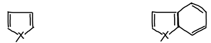
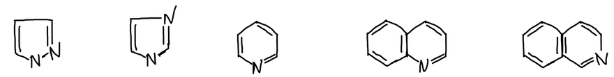

**Гетероциклические соединения** — циклические соединения, в образовании циклов которых кроме атомов углерода участвуют **гетероатомы**: азот, кислород, фосфор, сера и другие.

Простейшие пятичленные гетероциклы содержат один гетероатом X. Если к такому кольцу сконденсировано бензольное, получаются бензопроизводные:

| X | Пятичленный цикл | Бензопроизводное |
|---|---|---|
| O | фуран | бензфуран |
| S | тиофен | бензтиофен |
| NH | пиррол | бензпиррол |

В пиразоле и имидазоле пятичленное кольцо содержит два атома азота. Шестичленный цикл с одним атомом азота — пиридин; конденсированный с бензольным кольцом, он даёт хинолин и изохинолин:

## Статьи раздела


