**Фуран** — пятичленный гетероцикл с одним атомом кислорода. Атомы нумеруют от кислорода; положения 2 и 5 обозначают α, 3 и 4 — β. Метилфуран называют **сильваном**, 2-формилфуран (альдегид фурана) — **фурфуролом**:

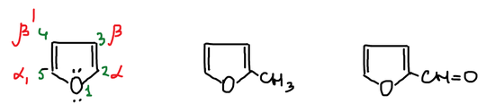

## Получение

Фурфурол получают из пентоз: в кислой среде пентоза теряет воду и замыкается в фурановый цикл. У фурфурола запах свежего хлеба.

Щёлочь превращает фурфурол в смесь фурфурилового спирта и пирослизевой (фуран-2-карбоновой) кислоты. При нагревании пирослизевая кислота отщепляет CO₂ и даёт фуран:

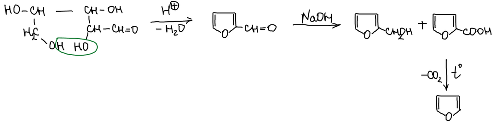

> **К схеме.** Пентоза при образовании фурфурола теряет три молекулы воды, а не одну. Под фуран-2-карбоновой кислотой в конспекте подписано «слизевая кислота». Правильное название — пирослизевая: слизевая кислота — это дикарбоновая кислота, из которой пирослизевую получают нагреванием.

Замещённые фураны получают из 1,4-дикетонов. Дикетон переходит в диенольную форму, и две гидроксильные группы отщепляют молекулу воды, замыкая цикл:

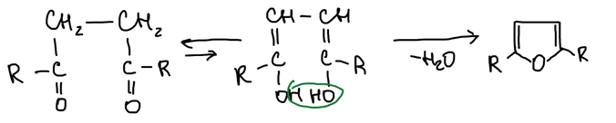

## Свойства

У фурана два типа свойств: он одновременно **непредельное** и **ароматическое** соединение. Кислород неохотно отдаёт в кольцо свою электронную пару, поэтому фуран в большей степени непредельное соединение и в меньшей — ароматическое. Он склонен к реакциям присоединения и менее ароматичен, чем бензол.

### Фуран как непредельное соединение

Фуран **ацидофобен**: реакции фурана в кислой среде проводить нельзя. Протон присоединяется к атому кислорода, и ароматическая система разрушается. Остаётся типичная диеновая система:

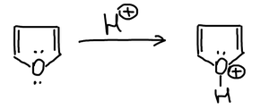

Протонированный фуран атакует следующую молекулу фурана. Реакция продолжается, и фуран в кислоте осмоляется:

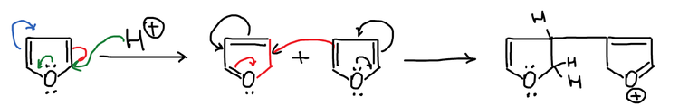

Как диен, фуран вступает в диеновый синтез с малеиновым ангидридом:

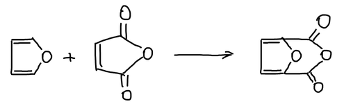

### Фуран как ароматическое соединение

Электрофильное замещение возможно, если реагент не создаёт кислой среды. Сульфируют фуран комплексом пиридина с SO₃, бромируют — диоксандибромидом. Заместитель вступает в положение 2:

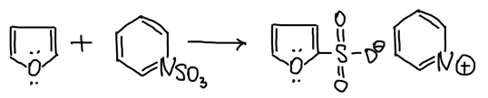

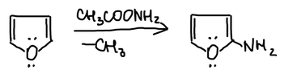

> **К схеме.** Нитруют фуран ацетилнитратом CH₃COONO₂, а не «CH₃COONH₂». Отщепляется уксусная кислота CH₃COOH, и получается 2-нитрофуран — на схеме у продукта должна быть группа NO₂, а не NH₂.

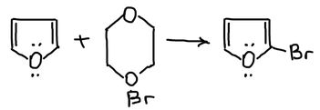

**Механизм.** При атаке электрофила в положение β положительный заряд σ-комплекса распределяется по одному атому углерода и атому кислорода: две граничные структуры. При атаке в положение α граничных структур три: заряд делокализован по двум атомам углерода и атому кислорода. Положительный заряд на кислороде невыгоден, поэтому σ-комплекс с двумя «углеродными» структурами устойчивее, и замещение идёт в положение α:

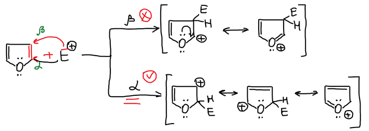

## Производные фурфурола

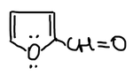

Как и бензальдегид, фурфурол вступает в бензоиновую конденсацию. Две его молекулы в присутствии цианида соединяются в **фуроин** — аналог бензоина:

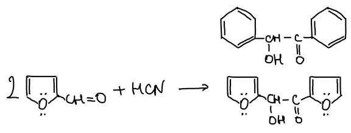

Ещё одно производное фурфурола — фурилакриловая кислота:

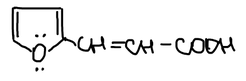
