**Хинолин** — бензпиридин: бензольное кольцо, сконденсированное с пиридиновым. Атомы нумеруют от азота. В пиридиновом кольце, как у [пиридина](../piridin/), положение 2 обозначают α, 3 — β, 4 — γ. Положения 8, 7, 6 и 5 бензольного кольца обозначают приставками орто-, мета-, пара- и ана-.

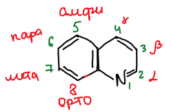

## Синтез Скраупа

Зденко Скрауп получал хинолин в одной колбе. В неё загружают глицерин, серную кислоту, нитробензол и анилин, нагревают пару часов, а хинолин отгоняют с водяным паром.

Серная кислота отщепляет от глицерина две молекулы воды, и образуется **акролеин**. Протон присоединяется к гидроксильной группе при среднем атоме углерода, уходит вода, получается енол. Енол переходит в 3-гидроксипропаналь, который снова теряет воду:

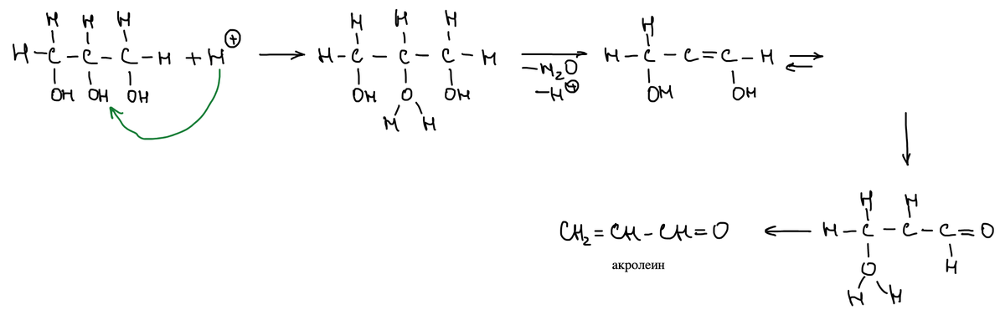

Протонированный акролеин — сильный электрофил:

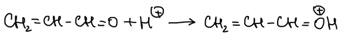

Анилин присоединяется к нему по двойной связи C=C атомом азота. Затем протонированная карбонильная группа атакует бензольное кольцо (электрофильное замещение, «Э/ср.» на схеме), и цикл замыкается. Отщепление воды даёт 1,2-дигидрохинолин:

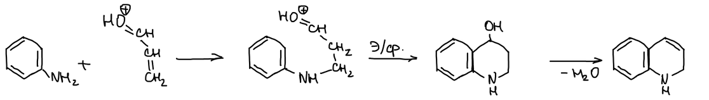

Нитробензол окисляет дигидрохинолин до хинолина:

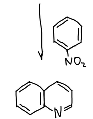

### Производные хинолина

Если вместо акролеина взять другие непредельные карбонильные соединения, получаются замещённые хинолины. С кротоновым альдегидом образуется 2-метилхинолин, с метилвинилкетоном — 4-метилхинолин:

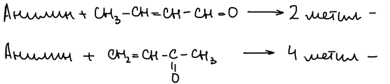

Заместитель в анилине определяет положение заместителя в хинолине. Из о-хлоранилина получается 8-хлорхинолин, из п-хлоранилина — 6-хлорхинолин. м-Хлоранилин может замкнуть цикл по двум положениям, поэтому даёт смесь 5- и 7-хлорхинолинов:

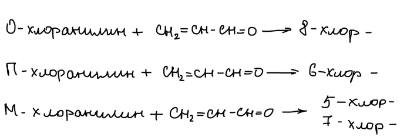

Синтез Скраупа можно провести и на аминохинолинах. Тогда к хинолину достраивается ещё одно пиридиновое кольцо, и получаются **фенантролины** — аналоги фенантрена с двумя атомами азота:

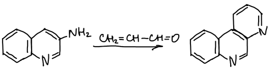

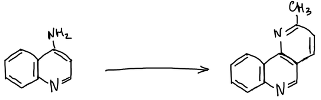

> **К схемам.** Под продуктом из 3-аминохинолина в конспекте подписано «1-азофенантрен». В продукте два атома азота, поэтому это диазафенантрен (фенантролин); приставка для атома азота в кольце — «аза», а не «азо». Для 4-аминохинолина реагент не указан. Метильная группа в новом кольце получается, если взять кротоновый альдегид.

Фенилендиамин вступает в синтез обеими аминогруппами и даёт диазафенантрен (в конспекте — «1,8-диазофенантрен»). Каждая аминогруппа расходует свою молекулу акролеина:

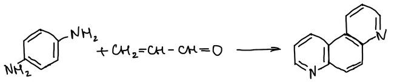

Так же из производного бифенила получают **дихинолил**:

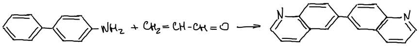

> **К схеме.** Чтобы получить дихинолил, пиридиновое кольцо нужно достроить к обоим бензольным кольцам бифенила. Для этого исходное вещество должно иметь две аминогруппы — это бензидин (4,4′-диаминобифенил), и нужны две молекулы акролеина. На схеме аминогруппа одна.

## Изохинолин

В **изохинолине** атом азота стоит в положении 2:

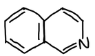

1-Метилизохинолин получают из β-фенилэтиламина. Ацетилхлорид ацилирует аминогруппу, и амид замыкается в цикл с отщеплением воды. Получается 1-метил-3,4-дигидроизохинолин, который дегидрируют нагреванием с палладием или с серой:

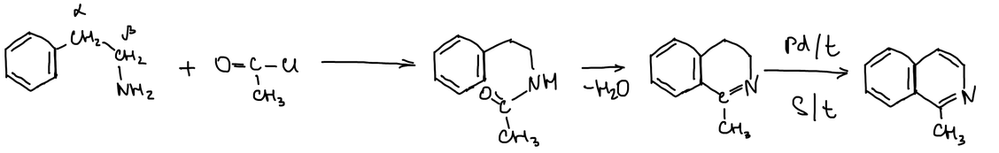
