В пятичленных гетероциклах может быть два атома азота. Если атомы азота соседние, это **пиразол**, если они разделены атомом углерода — **имидазол**. Нумерацию начинают с атома азота, связанного с водородом:

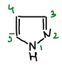

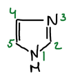

Имидазол в курсе не разбирается; дальше речь идёт о пиразоле и его производных.

## Получение пиразола

Пиразол получают из гидразина и непредельного альдегида. Гидразин конденсируется с карбонильной группой, и отщепляется вода. Затем свободная аминогруппа гидразона присоединяется по кратной связи, и цикл замыкается. Если в альдегиде тройная связь, получается пиразол:

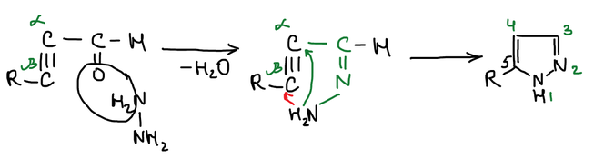

Если связь двойная, получается **пиразолин** (дигидропиразол):

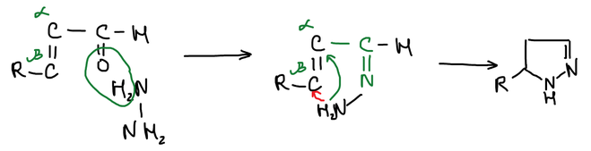

### Синтез Кнорра

Людвиг Кнорр получал замещённые пиразолы из 1,3-дикетонов. Ацетилацетон с гидразином даёт гидразон, который в енольной форме замыкается в цикл с отщеплением воды. Получается 3,5-диметилпиразол:

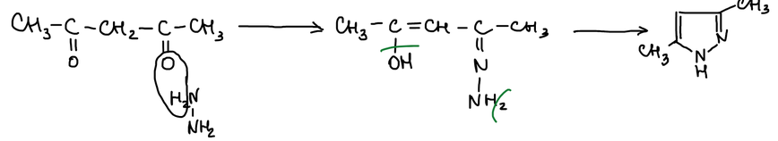

## Свойства пиразола

Пиразол проявляет свойства и кислоты, и основания. Кислотные свойства ему придаёт атом водорода при азоте, основные — неподелённая пара электронов второго атома азота:

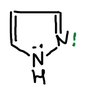

### Ароматические свойства

Пиразол вступает в реакции электрофильного замещения — нитрования, сульфирования олеумом и бромирования. Заместитель вступает в положение 4:

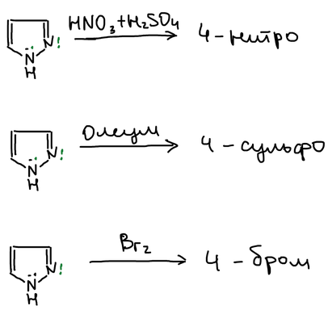

### Непредельные свойства

Натрий в этаноле восстанавливает пиразол до пиразолина. Окисление пиразолина даёт пиразолон. При избытке восстановителя получается пиразолидин:

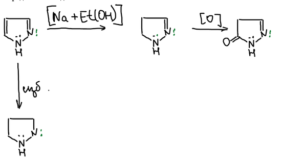

## Пиразолон

**Пиразолон** — производное пиразола с карбонильной группой в кольце:

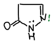

Замещённые пиразолоны получают из ацетоуксусного эфира и фенилгидразина. Фенилгидразин образует гидразон по кетонной группе. Затем аминогруппа атакует сложноэфирную группу, отщепляется этанол, и получается **1-фенил-3-метилпиразолон-5**:

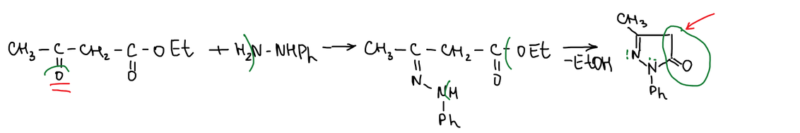

У пиразолона много реакционных центров. Самый активный — группа CH₂ в положении 4 (на схеме обведена): её атомы водорода подвижны. С азотистой кислотой получается 4-нитрозопроизводное:

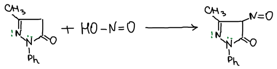

Две молекулы пиразолона соединяются по положению 4 в краситель **пиразолоновый синий**:

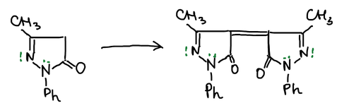

С бензальдегидом пиразолон конденсируется по той же группе CH₂:

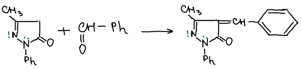

### Лекарства на основе пиразолона

Метилирование пиразолона иодистым метилом по атому азота даёт **антипирин** — жаропонижающее лекарственное вещество. Антипирин нитрозируют азотистой кислотой в нитрозоантипирин. Цинк в соляной кислоте восстанавливает его в 4-аминоантипирин, а две молекулы иодистого метила метилируют аминогруппу:

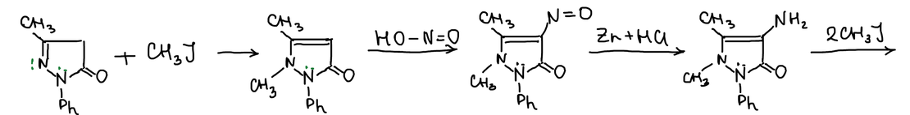

Получается 4-диметиламиноантипирин — **пирамидон**:

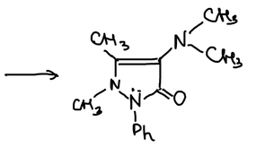

Если 4-аминоантипирин обработать гидроксиметансульфонатом натрия HOCH₂SO₃Na, в молекулу вводится группа CH₂SO₃Na. Она делает вещество хорошо растворимым в воде. Метилирование атома азота иодистым метилом даёт **анальгин**:

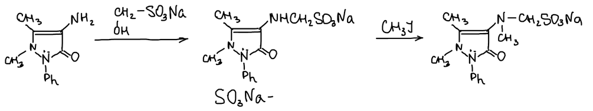
