**Пиридин** C₅H₅N — шестичленный ароматический гетероцикл с одним атомом азота. Атомы кольца нумеруют от азота; положения 2 и 6 обозначают буквой α, 3 и 5 — β, положение 4 — γ.

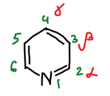

## Гомологи

Метилпроизводные пиридина имеют тривиальные названия:

| Число групп CH₃ | Название | Число изомеров |
|---|---|---|
| 1 | пиколины | 3 |
| 2 | лутидины | 6 |
| 3 | коллидины | 6 |

## Получение

### Синтез Рамзая

Пиридин образуется из двух молекул ацетилена и одной молекулы циановодорода при пропускании их через раскалённую трубку. Синтез доказывает строение пиридина: кольцо собирается из пяти атомов углерода и одного атома азота.

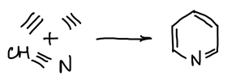

### Синтез Ганча

Кольцо пиридина собирают из двух молекул ацетоуксусного эфира (АУЭ), альдегида и аммиака. С формальдегидом синтез идёт так. Одна молекула АУЭ с аммиаком даёт β-аминокротоновый эфир **1**, другая с формальдегидом — метиленацетоуксусный эфир **2**; в обоих случаях отщепляется вода:

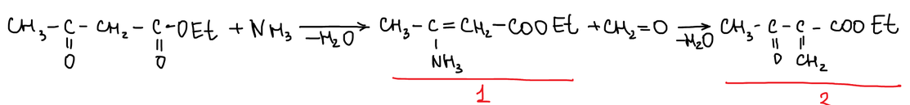

> **К схеме.** Аминокротоновый эфир **1** — CH₃–C(NH₂)=CH–COOEt: у атома углерода стоит группа NH₂, а не NH₃. Метиленовое производное **2** получается из второй молекулы АУЭ, а не из эфира **1**.

Эфир **1** присоединяется по двойной связи C=CH₂ соединения **2**. Затем аминогруппа атакует карбонильный атом углерода, кольцо замыкается, и отщепляется вода. Получается 1,4-дигидропиридин:

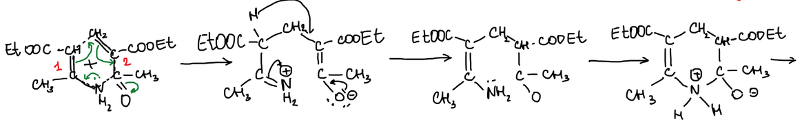

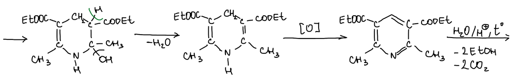

Окисление дигидропиридина даёт диэфир пиридиндикарбоновой кислоты. При нагревании с кислотой сложноэфирные группы гидролизуются, отщепляются две молекулы этанола и две молекулы CO₂, и остаётся 2,6-диметилпиридин (2,6-лутидин):

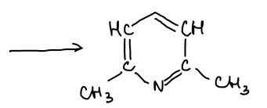

### Синтезы из альдегидов и аммиака

Меняя исходные вещества, получают разные пиридины:

| Исходные вещества | Продукт |
|---|---|
| аммиак, 2 АУЭ, альдегид RCHO | 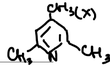   2,6-диметилпиридин с заместителем R в положении 4 (с ацетальдегидом — 2,4,6-коллидин) |
| аммиак, 2 АУЭ, формальдегид | 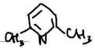   2,6-лутидин |
| аммиак, 2 АУЭ, 2 молекулы уксусного альдегида | 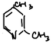   2,4-лутидин |
| аммиак, пропионовый альдегид, уксусный альдегид | 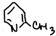   2-пиколин |
| аммиак, акролеин, уксусный альдегид |    пиридин |

## Основные свойства

У атома азота пиридина есть неподелённая электронная пара, которая не входит в ароматическую систему. Поэтому пиридин — основание. С кислотами он образует соли **пиридиния**:

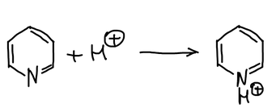

С иодистым метилом получается иодид N-метилпиридиния:

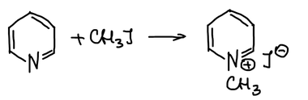

Пероксид водорода в уксусной кислоте окисляет азот, и образуется **N-оксид пиридина**:

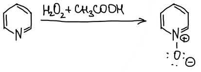

## Электрофильное замещение

Бром при 200–300 °C замещает водород в положении 3, при 300–500 °C — в положении 2:

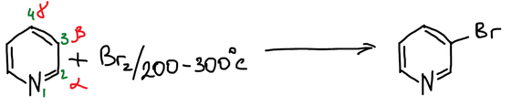

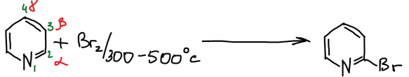

В серной кислоте пиридин протонируется, и нитрованию подвергается уже катион пиридиния; нитрогруппа вступает в положение 3. Сульфирование олеумом также даёт 3-замещённый продукт — пиридин-3-сульфокислоту:

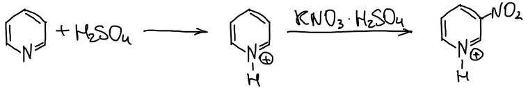

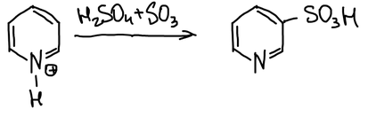

**Выводы.** Реакции электрофильного замещения идут **с большим трудом** и направляются в положение 3. По способности к электрофильным атакам пиридиновое кольцо похоже на нитробензол:

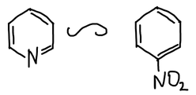

Преимущество положения 3 видно из строения σ-комплексов. При атаке в положение 3 положительный заряд распределяется по трём атомам углерода. При атаке в положения 2 и 4 одна из граничных структур несла бы положительный заряд на электроотрицательном атоме азота с секстетом электронов. Поэтому на схеме для них показаны только две структуры, и такие σ-комплексы менее устойчивы:

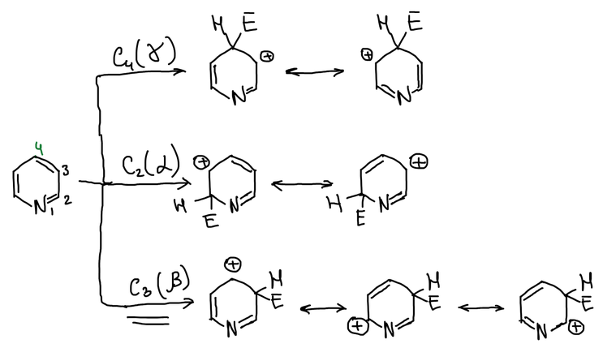

🙏 Если вам нравится сайт, подпишитесь на наш <a href="https://t.me/+JfpTv9CJlwQ0MThi">🔗 Телеграм-канал</a>.

## Замещение через N-оксид

В N-оксиде атом кислорода отдаёт электронную пару в кольцо. На атомах 2 и 4 появляется отрицательный заряд, и эти положения становятся доступны электрофилам:

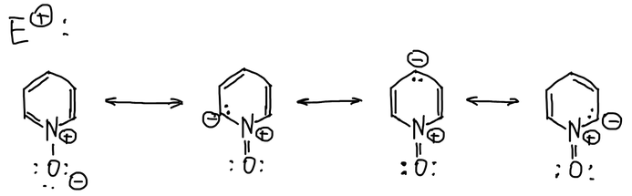

Одновременно положительно заряженный азот оттягивает электроны, и в других граничных структурах положительный заряд оказывается на тех же атомах 2 и 4. Поэтому эти положения доступны и нуклеофилам:

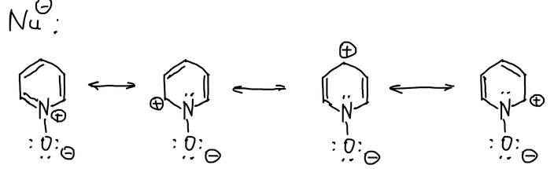

N-Оксид нитруется в положение 4. Из 4-нитропиридин-N-оксида получают разные 4-замещённые пиридины:

- водород на никеле восстанавливает нитрогруппу и снимает кислород с азота — получается 4-аминопиридин;
- трихлорид фосфора отнимает кислород (переходит в POCl₃) — получается 4-нитропиридин;
- соляная кислота замещает нитрогруппу на хлор, а железо в соляной кислоте затем снимает кислород — получается 4-хлорпиридин.

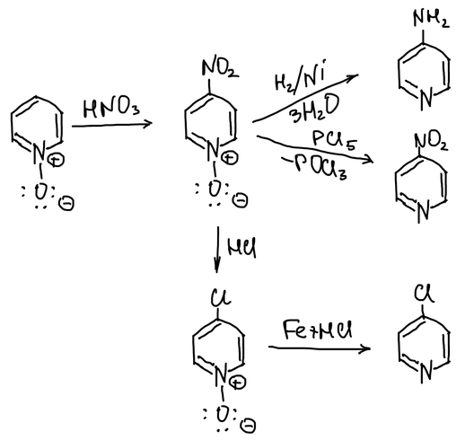

> **К схеме.** Над стрелкой к 4-нитропиридину написано PCl₅. Кислород N-оксида отнимают трихлоридом фосфора: PCl₃ + O → POCl₃.

Так обходят низкую реакционную способность пиридина к электрофилам: замещение идёт через N-оксид, и заместитель вступает в положение 4.

## Нуклеофильное замещение

Электроны кольца оттянуты к атому азота, поэтому пиридин легче вступает в реакции с нуклеофилами — в положения 2 и 4.

**Реакция Чичибабина** — амид натрия при 100 °C замещает водород в положении 2:

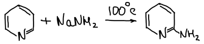

Гидроксид калия при 320 °C даёт 2-гидроксипиридин, который находится в равновесии с таутомерной формой — **пиридоном**:

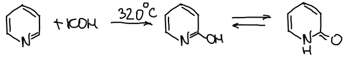

Механизм реакции Чичибабина. При атаке амид-иона в положение 2 одна из граничных структур анионного σ-комплекса несёт отрицательный заряд на электроотрицательном атоме азота (отмечена галочкой). Такой комплекс устойчивее, чем при атаке в положение 3, где заряд распределяется только по атомам углерода:

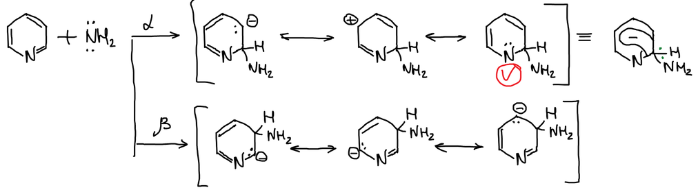

σ-Комплекс отщепляет гидрид-ион и превращается в 2-аминопиридин. Гидрид-ион отрывает протон от аминогруппы, выделяется водород, и образуется натриевая соль 2-аминопиридина. При подкислении из неё получают 2-аминопиридин:

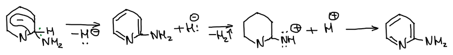

## Реакции по боковым цепям

Метильная группа в положении 2 подвижна, и 2-пиколин конденсируется с альдегидами. С формальдегидом получается 2-винилпиридин:

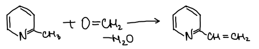

С уксусным альдегидом получается 2-пропенилпиридин. Натрий в этаноле восстанавливает и двойную связь боковой цепи, и кольцо, и образуется 2-пропилпиперидин — **кониин**:

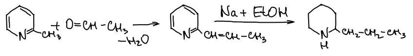

Кониин — яд болиголова пятнистого (в русской традиции его часто называют цикутой). Чашу с настоем этого растения выпил Сократ.

Окислители превращают метильную группу 2-пиколина в карбоксильную, и получается пиридин-2-карбоновая (пиколиновая) кислота:

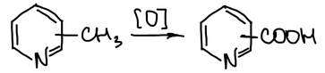

## Гидрирование и раскрытие кольца

Цинк в соляной кислоте восстанавливает пиридин до **пиперидина**:

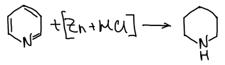

Гомологи пиридина восстанавливаются так же. Из пиколинов получаются пипеколины, из лутидинов — лупетидины, из коллидинов — копеллидины.

Иодоводород при 300 °C раскрывает кольцо. Атом азота уходит в виде аммиака, и остаётся н‑пентан:

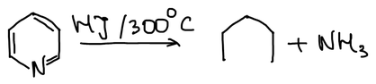

Реакция служит для определения строения пиридина: пять атомов углерода кольца образуют неразветвлённую цепь. Из 4-метилпиридина получается 3-метилпентан, поэтому по строению углеводорода можно судить о положении заместителя в кольце:

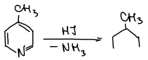
