**Пиррол** — пятичленный гетероцикл с одним атомом азота, связанным с водородом:

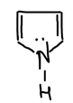

Пиррольные кольца входят в состав гемоглобина, хлорофилла, индиго, алкалоидов и белков. Пиррол извлекают из каменноугольной смолы и из костного масла.

## Получение

Лабораторный способ — из 1,4-дикетона. Дикетон в диенольной форме реагирует с аммиаком, выделяется вода, и цикл замыкается. Это та же схема, что и для [фурана](../furan/) и [тиофена](../tiofen/), только гетероатом в кольцо приносит аммиак.

## Свойства

### Слабое основание

Пиррол присоединяет протон:

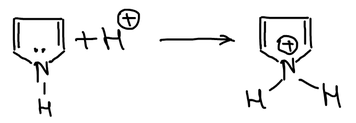

> **К схеме.** Неподелённая пара азота входит в ароматический секстет пиррола. Поэтому основность пиррола очень слабая, а протон присоединяется в основном к атому углерода в положении 2, а не к азоту, как нарисовано на схеме.

### Слабая кислота

Атом водорода при азоте подвижен. С гидроксидом калия пиррол образует соль — пирролкалий. Соль реагирует с углекислым газом, и получается пирролкарбоновая кислота. Это доказывает, что пиррол проявляет кислотные свойства:

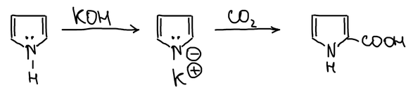

### Пиррилмагнийгалогенид

Реактив Гриньяра RMgX отрывает протон от азота: выделяется углеводород RH, а группа MgX встаёт на место водорода. Получается **пиррилмагнийгалогенид**:

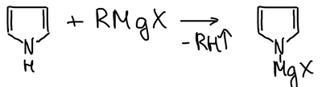

Направление его реакций зависит от температуры. Иодистый метил при нагревании даёт 2-метилпиррол, а при 0 °C — N-метилпиррол:

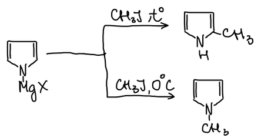

Ацетилхлорид так же при нагревании вступает в положение α, а при 0 °C — в положение 1 (к азоту):

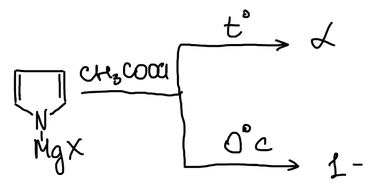

### Электрофильное замещение

Пиррол нитруют ацетилнитратом и сульфируют комплексом пиридина с SO₃. Заместитель вступает в положение α:

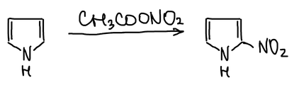

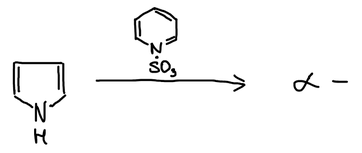

### Пиррол как непредельное соединение

Натрий в этаноле восстанавливает одну двойную связь пиррола, и получается Δ³-**пирролин**. Водород на никеле восстанавливает и вторую, и получается пирролидин:

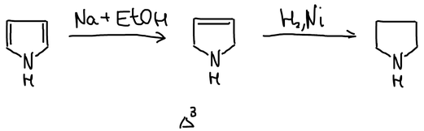

## Индол и его производные

**Индол** (бензпиррол) — пиррол, сконденсированный с бензольным кольцом. Индольное кольцо входит в состав важнейшей аминокислоты — **триптофана**, который содержится в мясе:

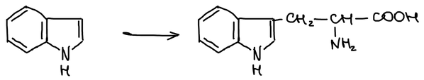

**Скатол** (3-метилиндол) — продукт метаболизма триптофана:

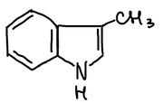

При окислении **индоксила** получается краситель **индиго**:

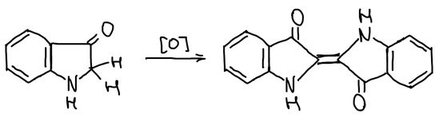

## Синтез индиго

Антраниловую кислоту алкилируют хлоруксусной кислотой в щёлочи, и получается фенилглицинкарбоновая кислота. Щелочной плав замыкает пятичленный цикл:

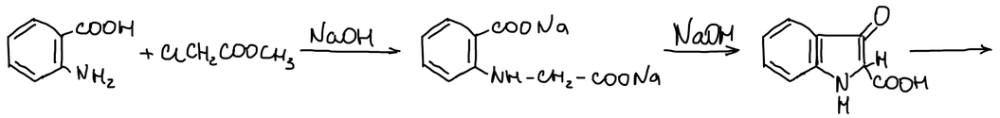

При нагревании получившаяся кислота теряет CO₂ и даёт индоксил. На схеме обведён его фрагмент, который отвечает за индигоидное окрашивание. При окислении в щелочной среде две молекулы индоксила соединяются, отщепляются две молекулы воды, и образуется индиго:

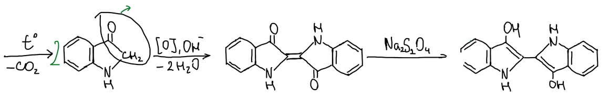

### Крашение индиго

Индиго нерастворимо в воде. При **субстантивном** (прямом) крашении краситель просто наносят на ткань, и он смывается водой.

При **кубовом** крашении индиго восстанавливают дитионитом натрия Na₂S₂O₄. Получается растворимая бесцветная форма — «белое индиго», которой пропитывают ткань. На воздухе и на солнце она окисляется обратно в индиго, и краситель закрепляется в волокне:

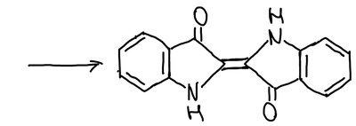
