**Тиофен** — пятичленный гетероцикл с одним атомом серы. Атомы нумеруют от серы; положения 2 и 5 обозначают α и α′, 3 и 4 — β:

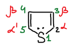

## Получение

**Лабораторный способ** — из 1,4-дикетонов. Дикетон в диенольной форме реагирует с пентасульфидом фосфора P₂S₅, и получается 2,5-замещённый тиофен:

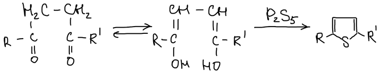

**Промышленный способ** — нагревание бутана с серой. Сера отнимает водород и выделяется в виде сероводорода:

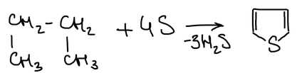

## Химические свойства

### Электрофильное замещение

Тиофен вступает в реакции электрофильного замещения, и заместитель встаёт в положение α. Ацетилнитрат даёт α-нитротиофен, бром — α-бромтиофен. Сульфирование серной кислотой идёт уже при комнатной температуре и даёт тиофен-α-сульфокислоту:

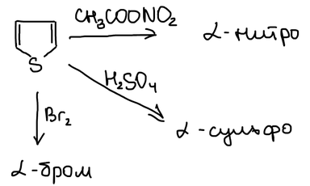

Ацетилхлорид в присутствии SnCl₄ даёт метил-α-тиенилкетон (2-ацетилтиофен):

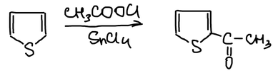

Бромметан в тех же условиях даёт α-метилтиофен:

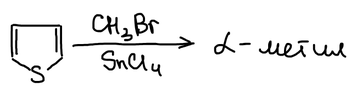

### Непредельные свойства

Водород на катализаторе присоединяется по двойным связям тиофена, и получается **тиофан** (тетрагидротиофен). При нагревании с никелем кольцо раскрывается: сера уходит в виде сероводорода, и остаётся бутан:

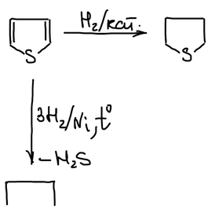

> **К схеме.** Чтобы превратить тиофен C₄H₄S в бутан C₄H₁₀ и сероводород, нужны четыре молекулы водорода: C₄H₄S + 4H₂ → C₄H₁₀ + H₂S. На схеме — «3H₂».

Обессеривание позволяет определить, в каких положениях стояли атомы углерода. Углеродный скелет замещённого тиофена сохраняется в получившемся алкане.

## Бензтиофен и тиоиндиго

Бензтиофен — тиофен, сконденсированный с бензольным кольцом:

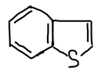

**Тиоиндоксил** — производное бензтиофена с карбонильной группой в положении 3. Это предшественник **тиоиндиго** — кубового красителя красно-фиолетового цвета:

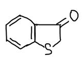

Тиоиндиго получают из антраниловой кислоты. Она легко диазотируется азотистой кислотой, а соль диазония с тиосульфатом натрия даёт тиосалициловую кислоту. Её меркаптогруппу алкилируют хлоруксусной кислотой:

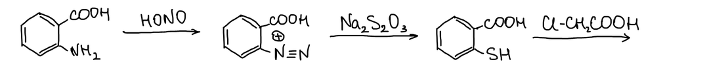

В щёлочи замыкается пятичленный цикл, и отщепляется вода. Получается кислота, которая при нагревании теряет CO₂ и даёт тиоиндоксил:

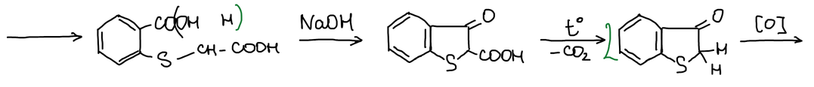

Окисление соединяет две молекулы тиоиндоксила двойной связью, и получается транс-тиоиндиго:

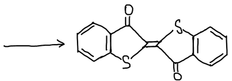
