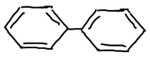
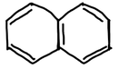
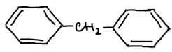
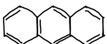
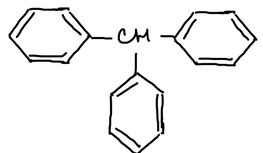
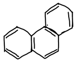

**Полиядерные ароматические соединения** содержат несколько бензольных ядер. Ядра могут быть **изолированными** — соединёнными связью или через атом углерода — или **конденсированными**, то есть иметь общие атомы углерода:

| С изолированными ядрами | С конденсированными ядрами |
|---|---|
|    дифенил |    нафталин |
|    дифенилметан |    антрацен |
|    трифенилметан |    фенантрен |

## Статьи раздела


