**Антрацен** — три линейно сконденсированных бензольных кольца с четырьмя общими атомами углерода. Он менее ароматичен, чем бензол и нафталин, и сильнее проявляет свойства непредельного соединения: для него характерны реакции присоединения. 14 π-электронов антрацена распределены на три кольца, то есть на шесть атомов углерода приходится меньше пяти электронов:

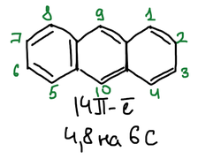

Положения 1, 4, 5 и 8 обозначают α, положения 2, 3, 6 и 7 — β, положения 9 и 10 — **мезо**-положения.

> **К схеме.** Под формулой написано «4,8 на 6 C», а в печатном тексте α-положения перечислены как «1,4,5,9». 14 электронов на три кольца — это около 4,7 электрона на шесть атомов углерода. α-Положения — 1, 4, 5 и 8, а 9 — мезо-положение.

## Получение

Бензол ацилируют фталевым ангидридом в присутствии AlCl₃ и получают о-бензоилбензойную кислоту. Оксид фосфора(V) отнимает воду и замыкает цикл, и получается **антрахинон**. Цинк восстанавливает антрахинон до антрацена:

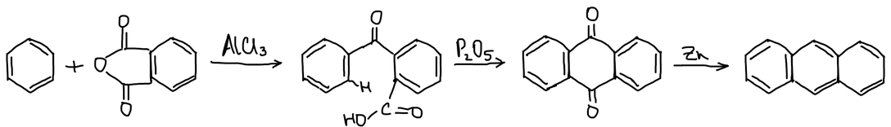

Две молекулы бензилхлорида в присутствии AlCl₃ отщепляют хлороводород и дают 9,10-дигидроантрацен, а его окисление — антрацен:

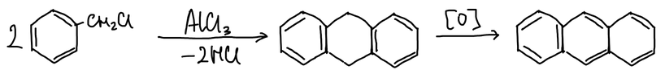

## Свойства

### Присоединение по 9,10

Реакции присоединения идут в мезо-положения 9 и 10. Окисление даёт антрахинон. С малеиновым ангидридом антрацен вступает в диеновый синтез: ангидрид присоединяется по атомам 9 и 10, над средним кольцом:

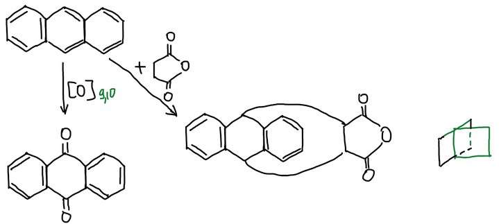

### Замещение

Нитрование идёт в положение 9. Концентрированная серная кислота даёт α-сульфокислоту, разбавленная — β-сульфокислоту. Бром сначала присоединяется по положениям 9 и 10, а затем продукт отщепляет бромоводород и даёт 9-бромантрацен:

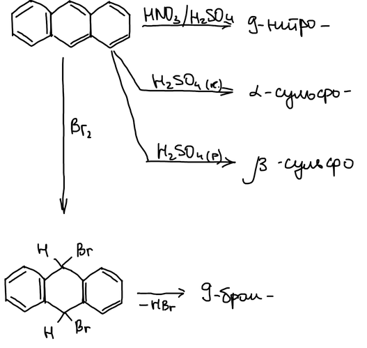

## Антрахинон

Карбонильные группы антрахинона дезактивируют бензольные кольца, и замещение идёт медленнее. С гидроксиламином антрахинон образует монооксим, а сплавление с гидроксидом калия расщепляет его на две молекулы бензоата калия. Бром и азотная кислота вступают в α-положения: получаются 1-бром- и 1,4,5,8-тетрабромантрахинон, 1-нитроантрахинон и смесь 1,5- и 1,8-динитроантрахинонов:

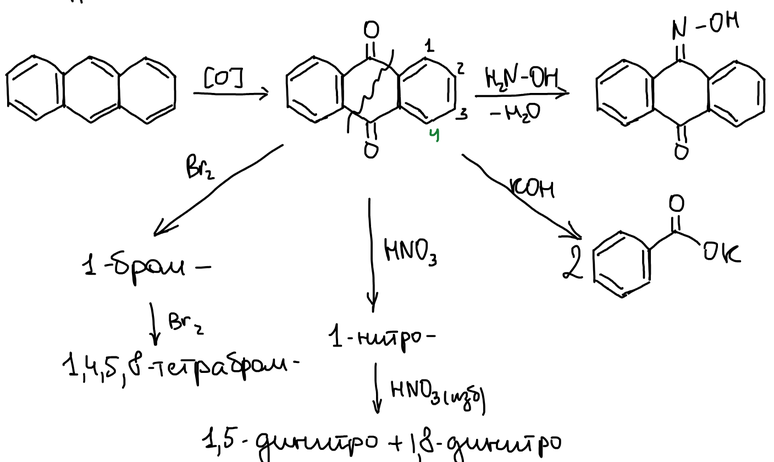

Концентрированная серная кислота сульфирует антрахинон в положение 2, а при избытке кислоты получается дисульфокислота. В присутствии солей ртути(II) сульфогруппы вступают в α-положения, и получается 1,8-дисульфокислота:

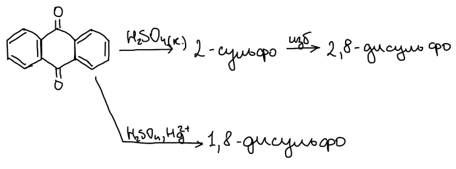

> **К схеме.** При сульфировании без ртути вторая сульфогруппа вступает в другое кольцо, тоже в β-положение: получаются 2,6- и 2,7-дисульфокислоты, а не 2,8-, как на схеме. Положение 8 — α.

Сульфогруппу можно заменить. Сплавление со щёлочью даёт 2-гидроксиантрахинон, аммиак на катализаторе — 2-аминоантрахинон:

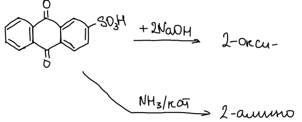

### Ализарин и хинизарин

Фталевый ангидрид с пирокатехином в присутствии AlCl₃ даёт **ализарин** (1,2-дигидроксиантрахинон) — протравной краситель:

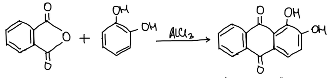

**Хинизарин** (1,4-дигидроксиантрахинон) — краситель другого типа:

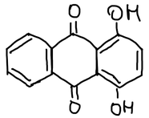

При протравном крашении ткань сначала обрабатывают солью металла — протравой. Ализарин связывается с ионом алюминия через атом кислорода гидроксигруппы и карбонильный кислород, и образуется прочно окрашенный комплекс — лак:

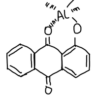
