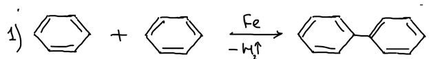
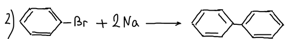
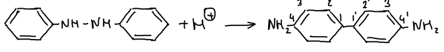
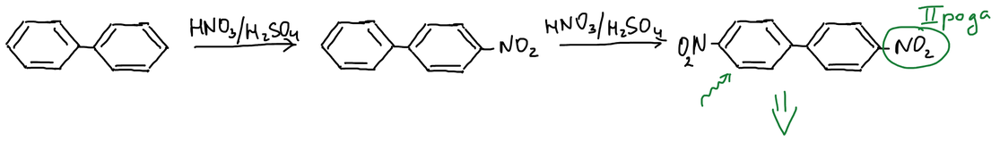
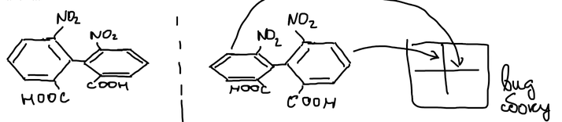

**Дифенил** (бифенил) — два бензольных кольца, соединённые простой связью.

## Получение

Дифенил получают тремя способами. Первый — пропускание паров бензола над раскалённым железом: две молекулы бензола соединяются, выделяется водород.

Второй — реакция Вюрца — Фиттига: бромбензол с натрием.

Третий способ даёт производное дифенила — это **бензидиновая перегруппировка**. Гидразобензол в кислой среде перегруппировывается в бензидин — 4,4′-диаминодифенил. Атомы колец бензидина нумеруют от связи между кольцами; во втором кольце номера отмечают штрихом:

## Свойства

Дифенил вступает в реакции электрофильного замещения. Первая нитрогруппа встаёт в положение 4. Нитрогруппа — заместитель II рода, она дезактивирует своё кольцо, поэтому вторая нитрогруппа вступает в другое кольцо, тоже в пара-положение, и получается 4,4′-динитродифенил:

Отсюда вывод: два бензольных кольца дифенила не являются единой системой и ведут себя как отдельные бензольные ядра.

## Атропоизомерия

**Атропоизомерия** — оптическая изомерия, которая проявляется в отсутствие асимметрического атома углерода. Если в орто-положениях обоих колец дифенила стоят крупные заместители, кольца не могут свободно вращаться вокруг связи между ними и не лежат в одной плоскости. Молекула динитродифеновой кислоты становится хиральной, и её зеркальные изомеры не переходят друг в друга:

