В полифенилметанах бензольные ядра соединены через атом углерода: в **дифенилметане** — через группу CH₂, в **трифенилметане** — через группу CH.

## Получение

Дифенилметан получают алкилированием бензола по Фриделю — Крафтсу: две молекулы бензола с дихлорметаном или бензилхлорид с бензолом в присутствии AlCl₃:

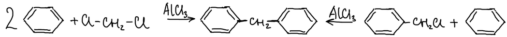

Так же три молекулы бензола с хлороформом дают трифенилметан. Сам трифенилметан интересен меньше, чем его производные, в которых атом водорода центрального углерода заменён на Cl или OH:

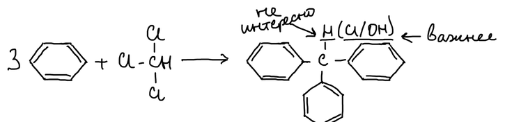

Трифенилкарбинол Ph₃C–OH получают реакцией Гриньяра — из бензофенона и фенилмагнийбромида или из этилбензоата и двух молекул фенилмагнийбромида:

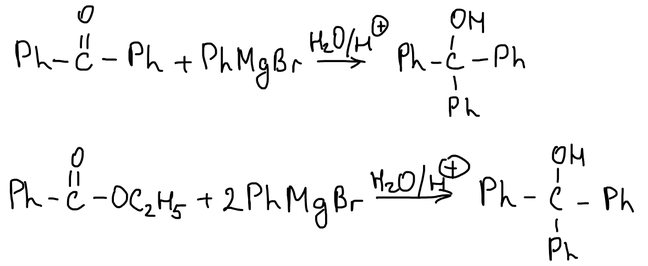

Бензальдегид с двумя молекулами бензола в серной кислоте тоже даёт трифенилметан:

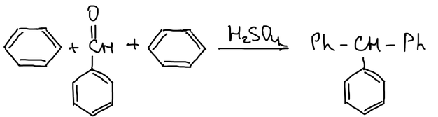

С диметиланилином вместо бензола в присутствии ZnCl₂ получается производное трифенилметана с двумя диметиламиногруппами — основа [трифенилметановых красителей](../trifenilmetanovye-krasiteli/):

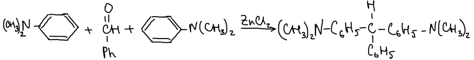

Четыре молекулы бензола с тетрахлорметаном дают только трифенилхлорметан: четвёртый фенил не присоединяется. Чтобы получить тетрафенилметан, на трифенилхлорметан действуют реактивом Гриньяра:

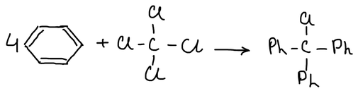

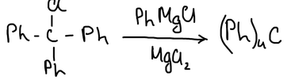

Тетрафенилметан ничем не интересен.

## Химические свойства дифенилметана

Дифенилметан вступает в электрофильное замещение в пара-положение бензольного кольца. Атомы водорода группы CH₂ подвижны: бром замещает один из них, а окислители превращают дифенилметан в бензофенон:

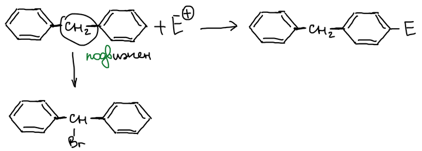

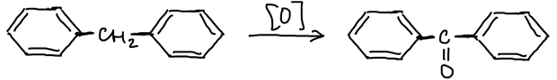

При нагревании дифенилметан теряет водород: связываются орто-положения двух колец, и получается **флуорен**. Водороды группы CH₂ флуорена настолько подвижны, что метилмагнийиодид отрывает протон и выделяется метан:

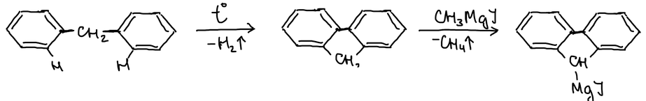

По той же причине флуорен вступает в альдольно-кротоновую конденсацию, например с ацетоном:

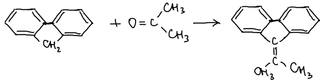

## Трифенилметан

Трифенилметан тоже вступает в электрофильное замещение в пара-положение колец:

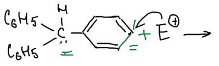

Но главные его реакции идут через образование устойчивых частиц на центральном атоме углерода — карбаниона, карбкатиона или радикала.

### Реакции через образование карбаниона

Метилнатрий отрывает протон от трифенилметана, выделяется метан, и получается трифенилметилнатрий. Вода возвращает трифенилметан, а с CO₂ образуется соль трифенилуксусной кислоты:

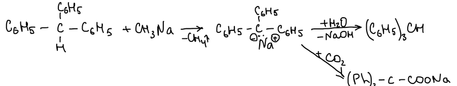

Карбанион устойчив, потому что отрицательный заряд делокализован по бензольным кольцам:

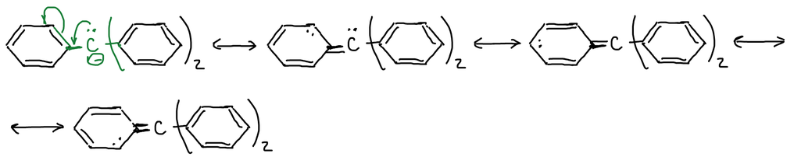

Нитрогруппы в пара-положениях делают карбанион ещё более устойчивым:

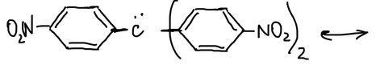

Такая устойчивость важна для практических целей: трис(4-нитрофенил)метан отдаёт протон уже гидроксиду натрия:

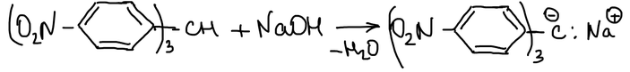

### Реакции через образование карбкатиона

Отщепить от трифенилметана гидрид-ион не удаётся: H⁻ — плохая уходящая группа. Поэтому берут трифенилхлорметан:

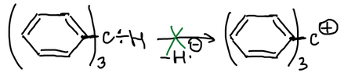

В жидком SO₂ трифенилхлорметан диссоциирует на хлорид-ион и трифенилметильный катион:

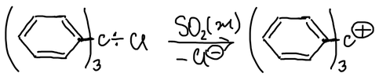

Катион устойчив, потому что положительный заряд гасится тремя фенильными радикалами:

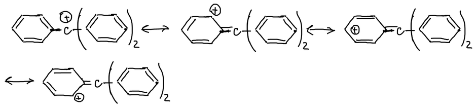

### Радикал Гомберга

Мозес Гомберг действовал металлом на трифенилхлорметан. Образуется гексафенилэтан, связь между центральными атомами углерода в нём слабая, и он распадается на два трифенилметильных радикала:

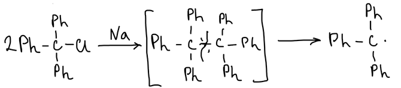

Неспаренный электрон делокализован по кольцам, поэтому радикал устойчив. Ещё устойчивее радикалы с бифенильными группами и с нитрогруппами:

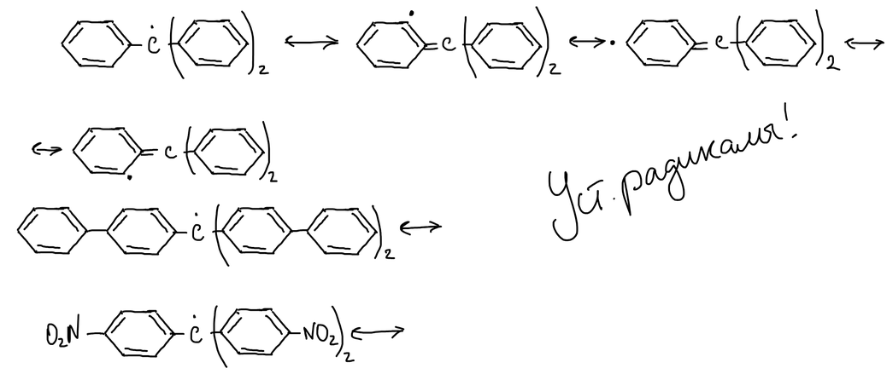
