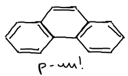
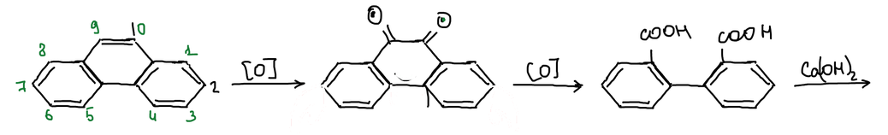
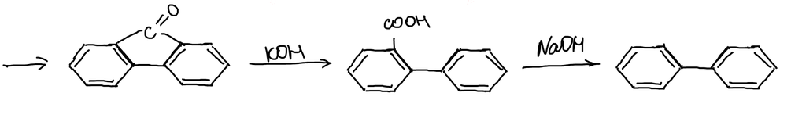
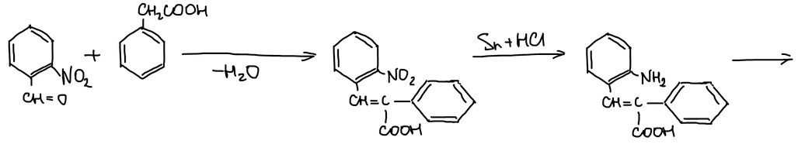
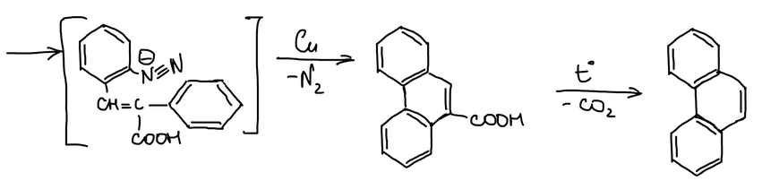
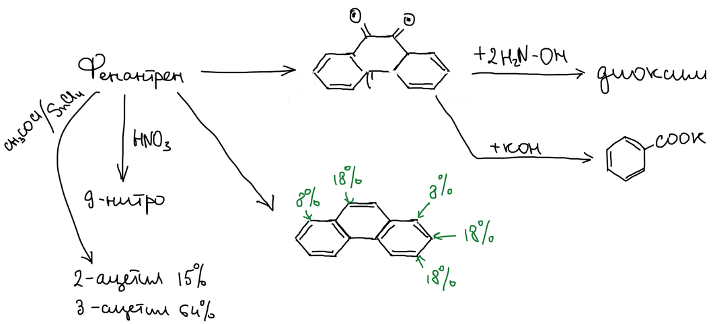
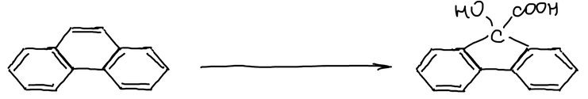

**Фенантрен** — угловой изомер антрацена: три бензольных кольца сконденсированы не в линию, а под углом. Самая реакционноспособная связь — между атомами 9 и 10:

> **К схеме.** В печатном тексте конспекта — «угловой изомер фенантрена». Фенантрен — угловой изомер **антрацена**.

## Доказательство строения

Чтобы доказать структуру фенантрена, его разрушают до дифенила. Окисление по связи 9,10 даёт фенантренхинон, дальнейшее окисление — дифеновую кислоту (дифенил-2,2′-дикарбоновую):

Кальциевая соль дифеновой кислоты при нагревании даёт флуоренон. Гидроксид калия раскрывает пятичленный цикл флуоренона, и получается дифенил-2-карбоновая кислота. Декарбоксилирование щёлочью даёт дифенил:

## Синтез Пшорра

о-Нитробензальдегид конденсируется с фенилуксусной кислотой, и отщепляется вода. Нитрогруппу восстанавливают оловом в соляной кислоте до аминогруппы:

Аминогруппу диазотируют. Медь отщепляет азот от соли диазония, и замыкается средний цикл. Получается 9-фенантренкарбоновая кислота, которая при нагревании теряет CO₂ и даёт фенантрен:

> **К схеме.** Над стрелкой к соли диазония реагент не написан. Аминогруппу диазотируют азотистой кислотой — нитритом натрия в кислой среде.

## Реакции фенантрена

Окисление даёт фенантренхинон. С двумя молекулами гидроксиламина он образует диоксим. Азотная кислота нитрует фенантрен в положение 9. Ацилирование ацетилхлоридом в присутствии SnCl₄ даёт 15 % 2-ацетил- и 64 % 3-ацетилфенантрена. Процентами на отдельной схеме отмечено распределение продуктов замещения по положениям:

**Бензиловая перегруппировка.** В щёлочи фенантренхинон перегруппировывается так же, как бензил: одна связь C–C переходит к соседнему атому, и получается 9-гидроксифлуорен-9-карбоновая кислота:

> **К схемам.** Над стрелкой к схеме с процентами реагент не указан. Стрелка «+KOH» от фенантренхинона ведёт к бензоату калия, а бензиловая перегруппировка нарисована от фенантрена. По смыслу щёлочь действует на фенантренхинон, и продукт — 9-гидроксифлуорен-9-карбоновая кислота.
