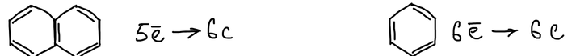
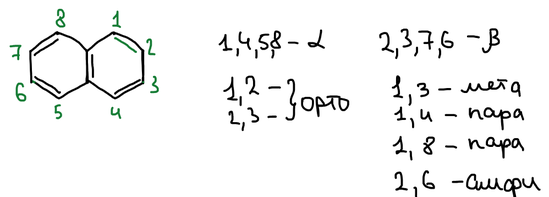
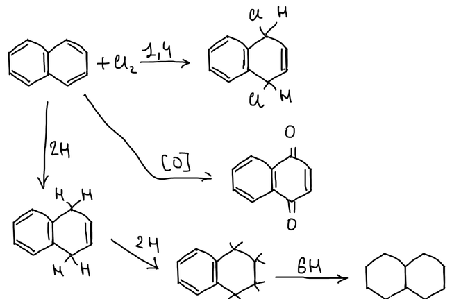
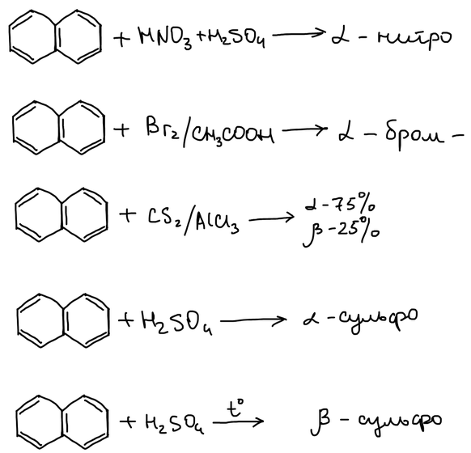
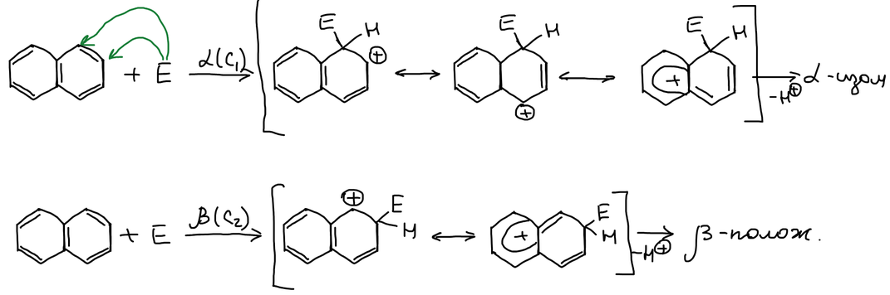
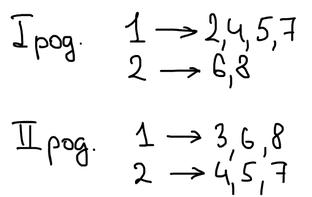
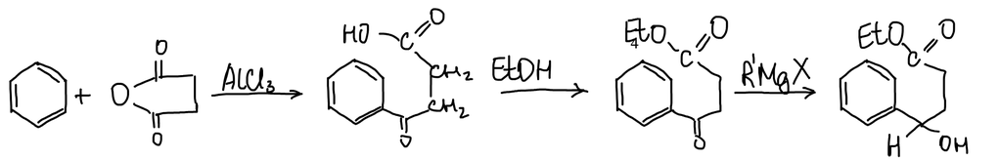
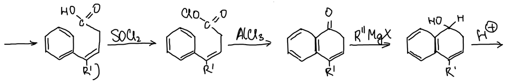
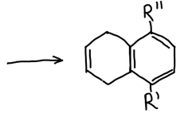

Нафталин, антрацен и фенантрен — полиядерные ароматические соединения с конденсированными ядрами. Первый из них — **нафталин**, два сконденсированных бензольных кольца.

## Ароматичность

Чтобы определить, какое соединение ароматичнее, сравнивают число π-электронов на кольцо. В бензоле на шесть атомов углерода кольца приходится шесть π-электронов. В нафталине десять π-электронов распределены на два кольца, то есть на каждые шесть атомов углерода приходится пять. Поэтому нафталин менее ароматичен, чем бензол:

## Нумерация

Положения 1, 4, 5 и 8 обозначают α, положения 2, 3, 6 и 7 — β. Взаимное расположение двух заместителей называют так: 1,2 и 2,3 — орто, 1,3 — мета, 1,4 — пара, 1,8 — пери, 2,6 — амфи:

> **К схеме.** Положения 1 и 8 на схеме названы «пара». Для них есть своё название — **пери**-положения: заместители в них находятся рядом, по одну сторону молекулы.

## Реакции присоединения и окисления

Нафталин не получают синтетически — его выделяют из каменноугольной смолы.

Как непредельное соединение, нафталин присоединяет хлор в положения 1,4. Окисление даёт 1,4-нафтохинон. Водород присоединяется ступенчато: сначала получается 1,4-дигидронафталин, затем **тетралин** (тетрагидронафталин), и наконец **декалин** (декагидронафталин):

## Электрофильное замещение

Нитрование, бромирование и сульфирование на холоду идут в положение α. При ацилировании в сероуглероде с AlCl₃ получается 75 % α- и 25 % β-изомера. При нагревании серная кислота даёт β-сульфокислоту:

> **К схеме.** В строке с CS₂/AlCl₃ не указан сам ацилирующий реагент — галогенангидрид кислоты. CS₂ здесь растворитель, AlCl₃ — катализатор.

**Механизм.** При атаке в положение α у σ-комплекса больше граничных структур, в которых второе кольцо остаётся ароматическим, чем при атаке в положение β. Поэтому α-замещение идёт легче:

### Правила ориентации

Если в нафталине уже есть заместитель, место нового заместителя зависит от его рода и положения:

> **К схеме.** Правила в конспекте расходятся с учебными. Обычно пишут так. Заместитель I рода активирует своё кольцо: из положения 1 он направляет новый заместитель в положения 4 и 2, из положения 2 — в положение 1. Заместитель II рода дезактивирует своё кольцо, и новый заместитель уходит в другое кольцо, в положения 5 и 8.

## Каменноугольная смола

Основные источники ароматических углеводородов — нефть и уголь; раньше им был китовый жир. Уголь при нагревании без доступа воздуха превращается в кокс. Из каменноугольного газа выделяют бензол и толуол, а каменноугольную смолу разгоняют на фракции:

| Фракция | Температура, °C | Что содержит |
|---|---|---|
| Лёгкое масло | 80–170 | бензол, толуол, ксилолы |
| Среднее масло | 170–240 | нафталин, фенолы |
| Тяжёлое масло | 240–270 | дифенил |
| Антраценовая фракция | | антрацен |
| Пек | | остаток |

## Синтез замещённых нафталинов

Бензол ацилируют янтарным ангидридом в присутствии AlCl₃ и получают 3-бензоилпропановую кислоту. Карбоксильную группу защищают, этерифицируя её этанолом. Затем кетонная группа реагирует с реактивом Гриньяра R′MgX, и получается третичный спирт:

Спирт отщепляет воду, и в цепи появляется двойная связь; заместитель R′ может быть любым. Кислоту переводят тионилхлоридом в хлорангидрид, и AlCl₃ замыкает второе кольцо. Кетонная группа нового кольца реагирует со вторым реактивом Гриньяра R″MgX, и кислота отщепляет воду:

Получается нафталиновое производное с заместителями R′ и R″:

> **К схеме.** На схеме у спирта после первого реактива Гриньяра нарисованы H и OH; должны быть R′ и OH. У хлорангидрида написано «ClO–C=O», должно быть Cl–C=O.
