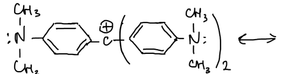
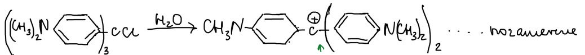
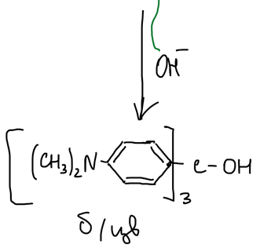
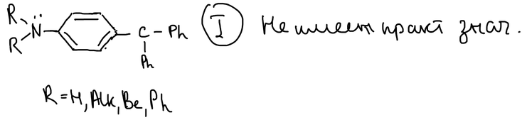
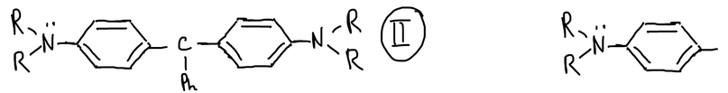
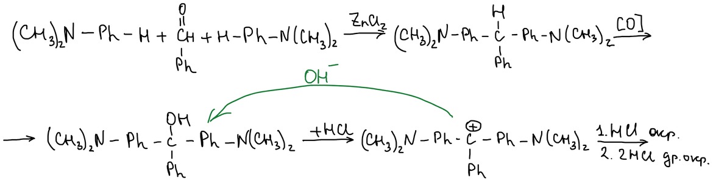
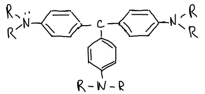
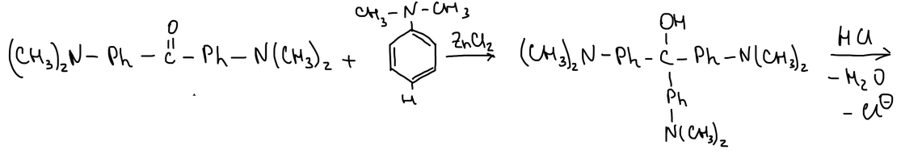
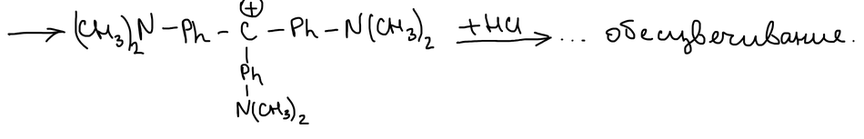

Красители делят на классы: азокрасители, фталеиновые красители и красители трифенилметанового ряда. Последние — производные [трифенилметильного катиона](../difenilmetan-i-trifenilmetan/#реакции-через-образование-карбкатиона) с аминогруппами в пара-положениях колец.

## Откуда берётся окраска

Если в пара-положениях колец стоят диметиламиногруппы, положительный заряд катиона делокализован не только по кольцам, но и на атомы азота:

Такой катион поглощает видимый свет. Хлорид трис(4-диметиламинофенил)метила в воде диссоциирует, и получается краситель **кристаллический фиолетовый**:

> **К схеме.** У первого кольца катиона на схеме написано «CH₃N». Должна быть диметиламиногруппа (CH₃)₂N, как у остальных колец.

Гидроксид-ион присоединяется к центральному атому углерода, и получается карбинол. Сопряжение по всей молекуле нарушается, и карбинол бесцветен:

## Типы трифенилметановых красителей

Красители различаются числом аминогрупп. Соединения с одной аминогруппой (R = H, алкил, бензил, фенил) практического значения не имеют:

С двумя аминогруппами получаются зелёные красители:

| R | Краситель |
|---|---|
| CH₃ | малахитовый зелёный |
| C₂H₅ | бриллиантовый зелёный |
| H | фиолетовый Дёбнера |

### Синтез малахитового зелёного

Две молекулы диметиланилина конденсируются с бензальдегидом в присутствии ZnCl₂, и получается бесцветное лейкосоединение. Окисление даёт карбинол. С соляной кислотой карбинол отщепляет воду, и образуется окрашенный катион красителя. Гидроксид-ион превращает его обратно в карбинол. При избытке кислоты окраска меняется: с одной молекулой HCl краситель окрашен, с двумя — окрашен иначе:

### Красители с тремя аминогруппами

| Заместители | Краситель |
|---|---|
| R = H | парафуксин |
| R = H, в одном кольце орто-CH₃ | фуксин |
| R = CH₃ | кристаллический фиолетовый |

Кристаллический фиолетовый получают из **кетона Михлера**. Кетон конденсируется с диметиланилином в присутствии ZnCl₂, и получается карбинол. Соляная кислота отщепляет воду и хлорид-ион, и образуется катион красителя. Избыток кислоты его обесцвечивает:

