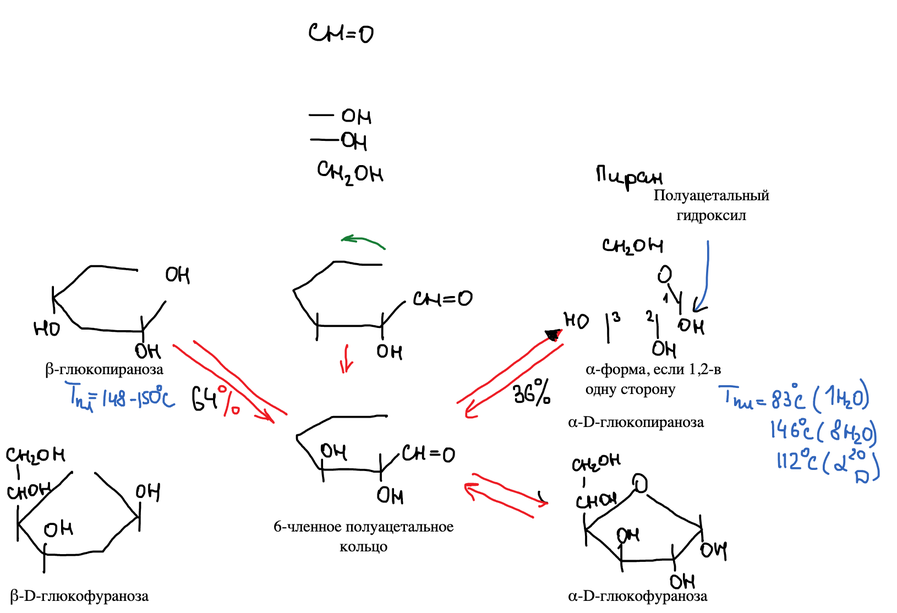
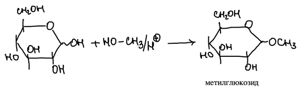
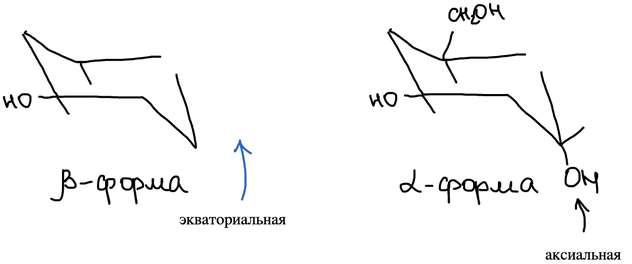
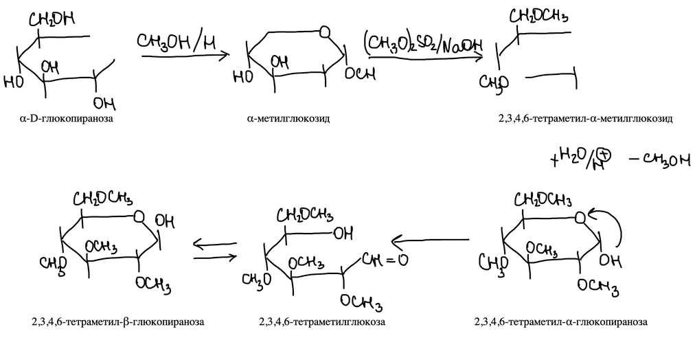
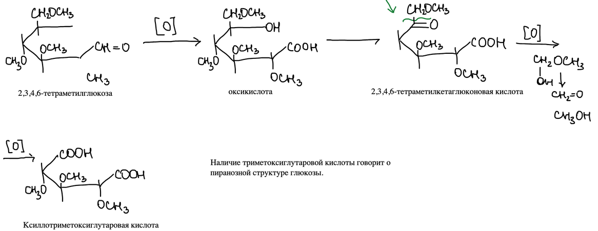
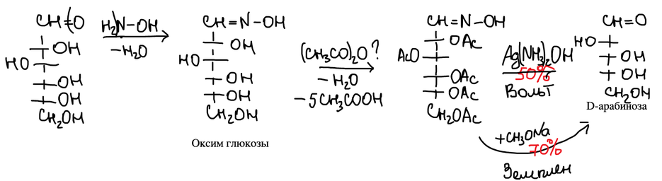
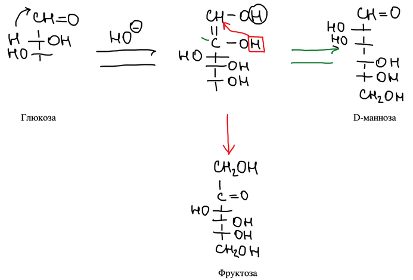

## Четыре экспериментальных факта

Открытая формула глюкозы, которую предложил Эмиль Фишер, не объясняет четыре факта:

1. Глюкоза даёт реакцию серебряного зеркала при нагревании — качественную реакцию на альдегидную группу, — а с фуксинсернистой кислотой качественной реакции не даёт.
2. По формуле в глюкозе пять спиртовых гидроксильных групп, а на самом деле четыре одинаковые, а одна отличается — она не спиртовая.
3. Для альдогексоз по формуле 16 пространственных изомеров, а на самом деле их 32.
4. **Мутаротация** — изменение оптической активности раствора во времени.

## Структура Хеуорса

В 1923 году Хеуорс предложил объяснение: атом углерода альдегидной группы находится не в открытой альдегидной форме, а в форме **полуацеталя**. Гидроксил при C-5 присоединяется к альдегидной группе, и образуется шестичленное полуацетальное кольцо — пиранозное (по названию гетероцикла **пиран**). Бывший альдегидный атом C-1 становится новым асимметрическим центром, а его гидроксил — **полуацетальным**. Если гидроксилы при C-1 и C-2 направлены в одну сторону, это **α-форма**, если в разные — **β-форма**:

В растворе α-D-глюкопираноза (36 %, т. пл. 146 °C, удельное вращение +112°) и β-D-глюкопираноза (64 %, т. пл. 148–150 °C) переходят друг в друга через открытую форму — отсюда мутаротация. Если замыкается гидроксил при C-4, получается пятичленное фуранозное кольцо.

## Гликозиды

Полуацетальный гидроксил отличается от остальных: с метанолом в кислой среде только он замещается на группу OCH₃, и получается **метилглюкозид**:

## Конформации

β-Форма устойчивее α-формы: в кресловидной конформации β-формы все гидроксильные группы находятся в экваториальных положениях, а в α-форме одна гидроксильная группа — аксиальная:

## Доказательство пиранозной структуры

**1. Закрепление полуацетального кольца.** α-D-Глюкопиранозу превращают в α-метилглюкозид — кольцо больше не раскрывается. Диметилсульфат в щёлочи метилирует остальные четыре гидроксила. Кислотный гидролиз снимает только гликозидную метильную группу, и получается 2,3,4,6-тетраметилглюкоза в открытой и в двух циклических формах:

**2. Доказательство.** В тетраметилглюкозе свободен только гидроксил при C-5 — тот, что участвовал в образовании кольца. Окисление даёт оксикислоту, затем 2,3,4,6-тетраметилкетоглюконовую кислоту (по правилу Попова цепь рвётся у карбонильной группы). Дальнейшее окисление даёт **ксилотриметоксиглутаровую кислоту**. Её образование говорит о пиранозной структуре глюкозы: кольцо замыкалось через атом C-5:

## Укорочение цепи (Воль — Земплен)

Глюкоза с гидроксиламином образует оксим. Уксусный ангидрид ацетилирует гидроксилы и отщепляет воду от оксима, давая нитрил. Отщепление HCN даёт альдозу на один атом углерода короче — D-арабинозу. По Волю (аммиачный раствор оксида серебра) выход около 30 %, по Земплену (метилат натрия) — около 70 %:

## Альдозы — кетозы — альдозы

В щелочной среде глюкоза переходит в ендиольную форму. Из неё может образоваться обратно глюкоза, её эпимер D-манноза или кетоза D-фруктоза:

