**Сахароподобные полисахариды** построены из небольшого числа остатков моноз. Простейшие из них — дисахариды: два остатка моноз, соединённые гликозидной связью.

## Трегалоза и мальтоза

Две молекулы α-D-глюкопиранозы могут соединиться разными атомами. Если связь образуют оба полуацетальных гидроксила (1–1), получается **трегалоза** (грибной сахар) — α-глюкопиранозил-α-глюкопиранозид. У неё не осталось свободного полуацетального гидроксила, поэтому она **не редуцирующая** (не восстанавливающая):

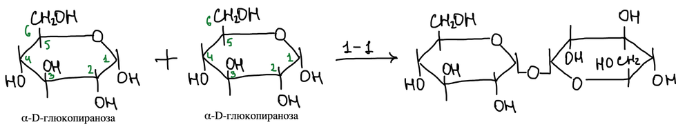

Связь может быть и 1–2, 1–3, 1–4, 1–6. При связи 1–4 получается **мальтоза** — α-глюкопиранозил-α-глюкопираноза. Полуацетальный гидроксил второго остатка у неё свободен:

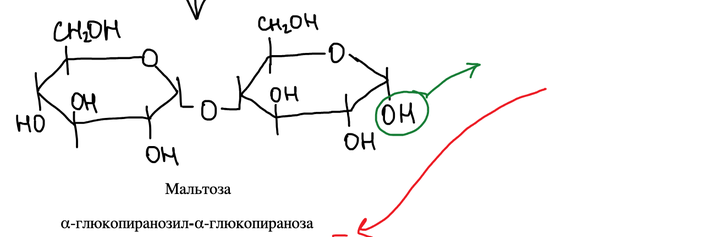

Поэтому второе кольцо мальтозы может раскрываться: через открытую альдегидную форму α-форма переходит в β-форму (α-глюкопиранозил-β-глюкопиранозу). Мальтоза — редуцирующий дисахарид:

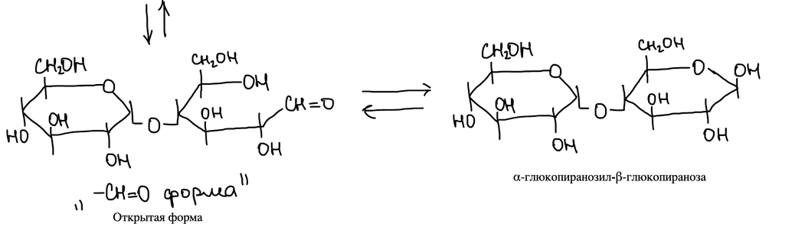

## Строение сахарозы

Сахароза — нередуцирующий дисахарид из глюкозы и фруктозы. Фермент α-глюкозидаза расщепляет её на глюкозу и фруктозу — значит, между ними α-гликозидная связь.

Фруктоза замыкается в кольцо полукетальным гидроксилом при C-2 (у кетоз — полукеталь). Гидроксил при C-5 атакует карбонильную группу, и получаются α- и β-фруктофуранозы:

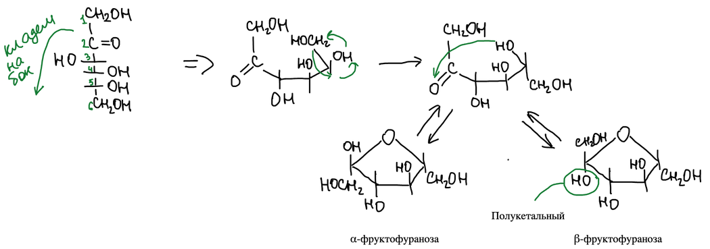

Сахароза — α-глюкопиранозил-β-фруктофуранозид. Связь α для глюкозы и β для фруктозы:

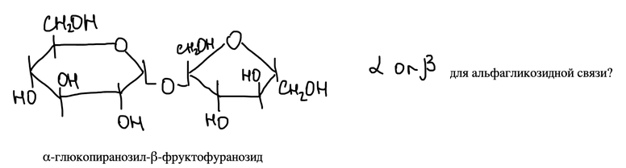

**Доказательство.** Сахарозу исчерпывающе метилируют (восемь групп OH) диметилсульфатом в щёлочи и гидролизуют:

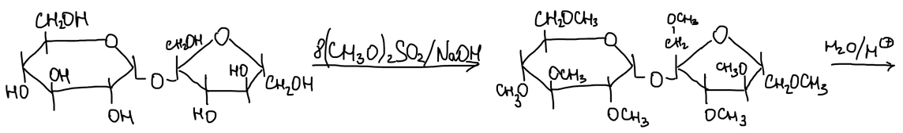

Глюкозная часть даёт 2,3,4,6-тетраметилглюкозу — у неё свободен полуацетальный гидроксил, и она существует в α-, β- и открытой форме:

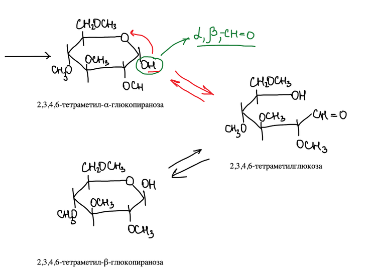

Окисление тетраметилглюкозы, как и в случае [глюкозы](../ciklicheskie-formy/#доказательство-пиранозной-структуры), даёт ксилотриметоксиглутаровую кислоту — глюкоза в составе сахарозы находится в пиранозной форме:

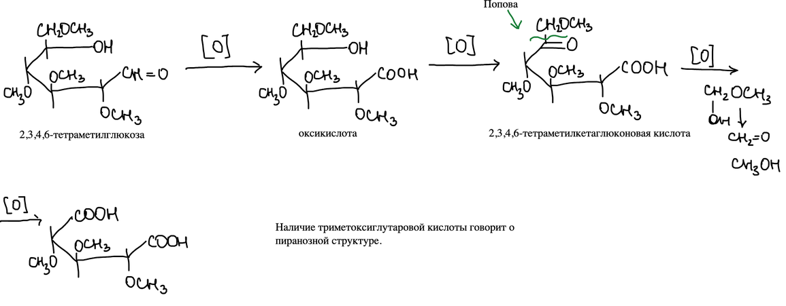

Фруктозная часть даёт тетраметилфруктозу. Её окисление приводит к **треодиметоксиянтарной кислоте** — значит, фруктоза в составе сахарозы находится в виде фуранозного кольца:

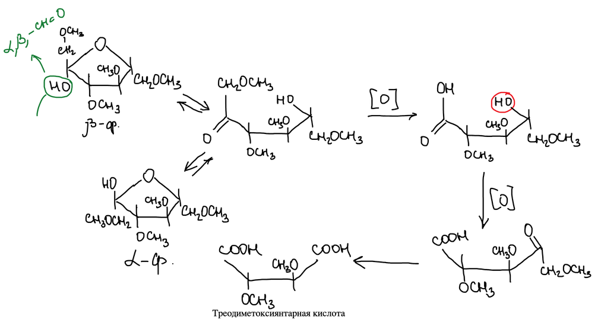

## Строение лактозы

**Лактоза** (молочный сахар) — β-галактопиранозил-α-глюкопираноза. Она редуцирующая: второе кольцо раскрывается, и альдегидная группа окисляется в **лактобионовую кислоту**:

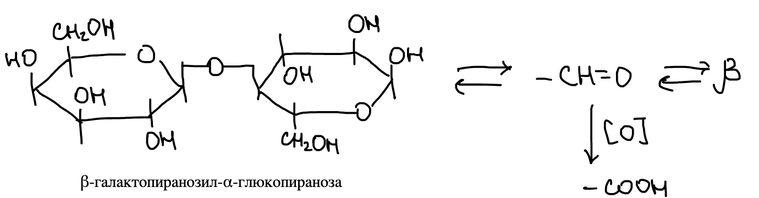

Гидролиз лактобионовой кислоты даёт галактозу и глюконовую кислоту:

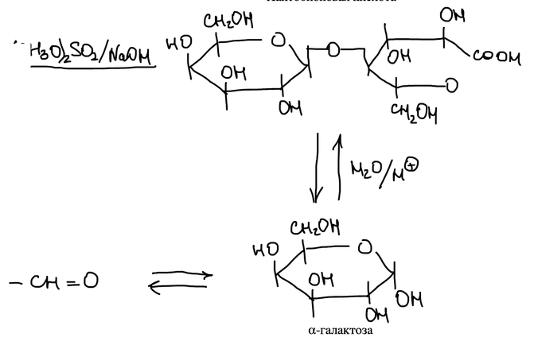

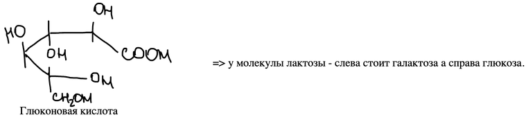

Значит, в молекуле лактозы слева стоит галактоза, а справа (с открывающимся кольцом) — глюкоза.

Метилирование лактобионовой кислоты даёт метиловый эфир октаметиллактобионовой кислоты. Его гидролиз даёт тетраметилгалактозу, окисление которой приводит к триметоксиглутаровой кислоте — галактоза находится в пиранозной форме:

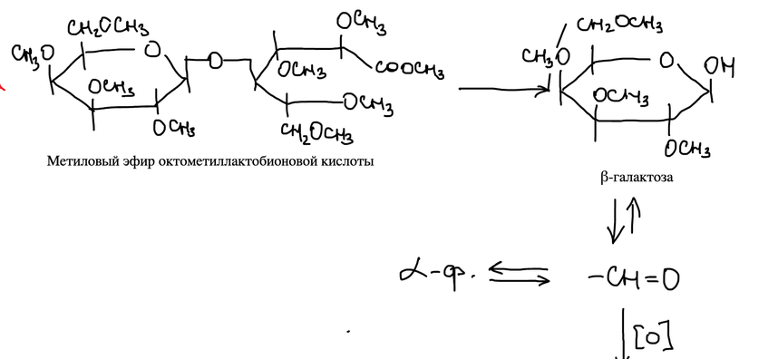

Вторая часть — 2,3,5,6-тетраметилглюконовая кислота — окисляется до треодиметоксиянтарной кислоты. У глюконовой кислоты свободен гидроксил при C-4 — именно через него глюкоза связана с галактозой:

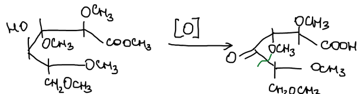

> **К тексту.** В конспекте рядом: «Арадоглутаровая кислота» и «Карбонильных гидроксилов 4». По смыслу — арабоглутаровая (триметоксиглутаровая) кислота и «гидроксил при C-4».
