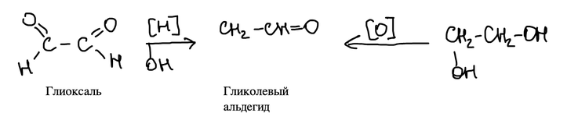
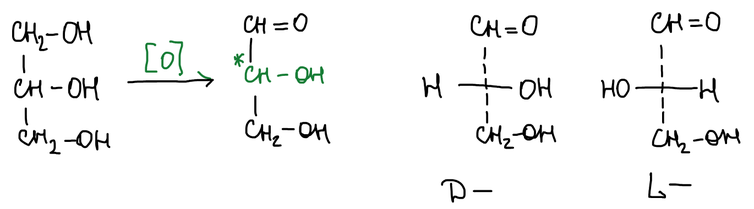
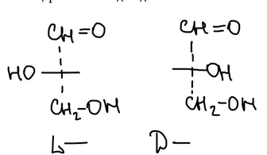
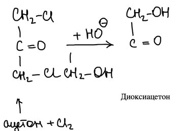
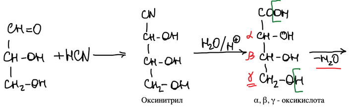
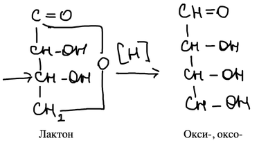
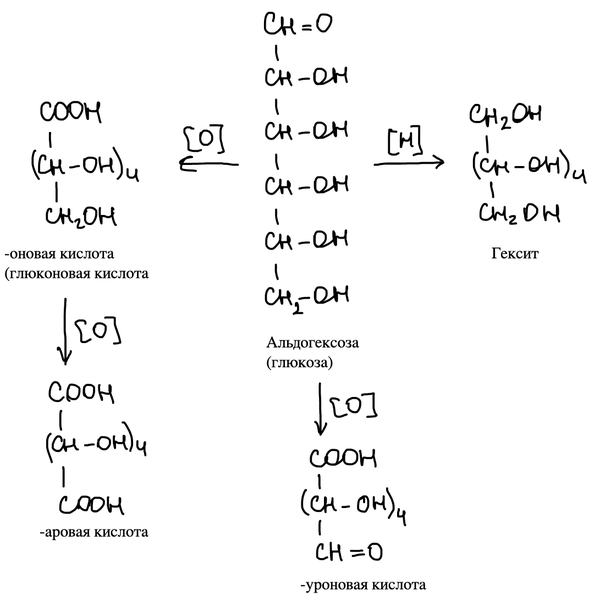
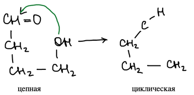
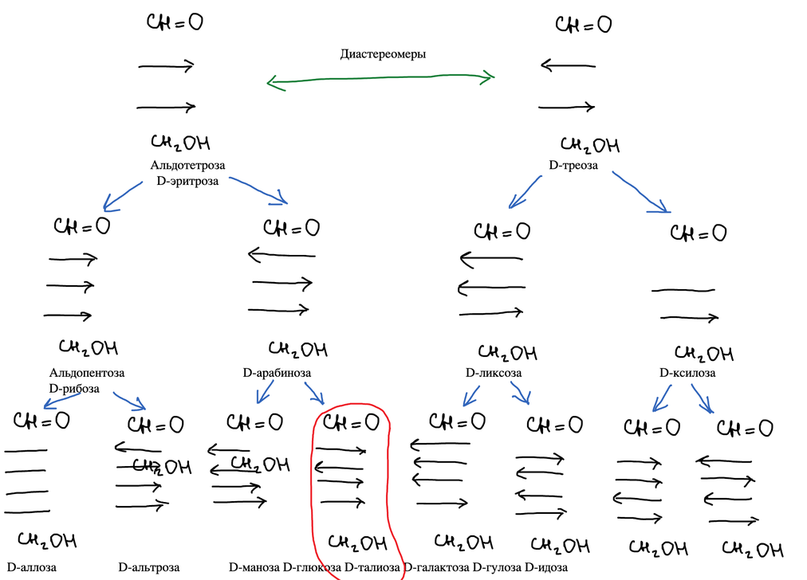
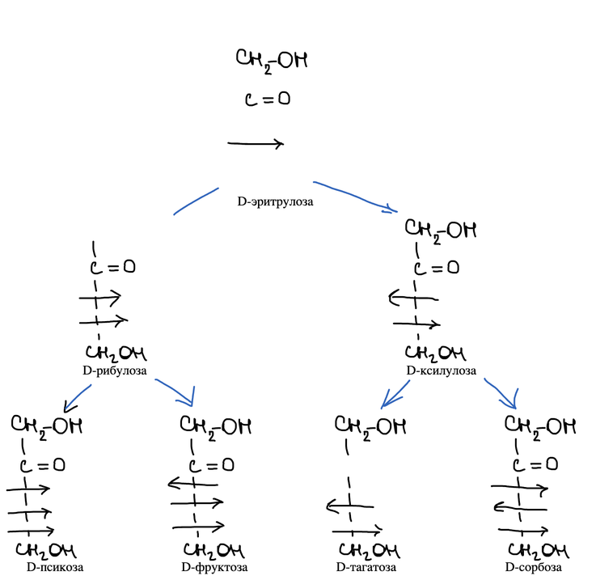

Углеводы — **окси-оксосоединения**: в молекуле есть и гидроксильные группы –OH, и карбонильная группа >C=O. Поэтому у них есть свойства и по карбонильной, и по гидроксильной группе.

## Простейшие окси-оксосоединения

**Гликолевый альдегид** получают восстановлением глиоксаля или окислением этиленгликоля:

Окисление глицерина даёт **глицериновый альдегид**. В нём есть асимметрический атом углерода (отмечен звёздочкой), поэтому альдегид существует в двух зеркальных формах — D и L:

В проекции Фишера у D-глицеринового альдегида гидроксил при асимметрическом атоме смотрит вправо, у L — влево. По этому атому (самому нижнему асимметрическому) относят к D- или L-ряду и все остальные монозы:

**Диоксиацетон** — простейшая кетоза — получают из 1,3-дихлорацетона (продукт хлорирования ацетона) гидролизом щёлочью:

## Циангидринный синтез Килиани — Фишера

Это реакция **надстройки углеродного скелета** окси-оксосоединений. Альдоза присоединяет HCN, получается оксинитрил. Гидролиз даёт α,β,γ-оксикислоту, которая отщепляет воду и замыкается в γ-лактон. Восстановление лактона даёт альдозу, на один атом углерода длиннее исходной:

## Окисление и восстановление альдоз

Альдогексоза (например, глюкоза) при окислении альдегидной группы даёт **-оновую** кислоту (глюконовую). При окислении обеих концевых групп получается дикарбоновая **-аровая** кислота. Если окислить только группу CH₂OH, а альдегидную сохранить, получается **-уроновая** кислота. Восстановление альдегидной группы даёт шестиатомный спирт — **гексит**:

## Кольчатая изомерия

Если гидроксильная группа находится в положении 4 или 5 относительно карбонильной, она присоединяется к карбонилу внутримолекулярно, и цепная форма переходит в циклическую:

Подробнее — в статье [«Циклические формы моноз»](../ciklicheskie-formy/).

## Генетические ряды альдоз

Если надстраивать D-глицериновый альдегид синтезом Килиани — Фишера, каждый раз получается пара изомеров, которые различаются конфигурацией только нового атома C-2. Так получают тетрозы (D-эритроза, D-треоза), пентозы (D-рибоза, D-арабиноза, D-ликсоза, D-ксилоза) и восемь D-гексоз. Стрелкой вправо на схемах обозначен гидроксил справа, влево — слева:

D-Эритроза и D-треоза — **диастереомеры**. Восемь D-гексоз: D-аллоза, D-альтроза, D-манноза, D-глюкоза, D-гулоза, D-идоза, D-галактоза, D-талоза.

Каждая пентоза даёт две гексозы: рибоза — аллозу и альтрозу, арабиноза — маннозу и глюкозу (обведена), ликсоза — талозу и галактозу, ксилоза — гулозу и идозу.

## Генетический ряд кетоз

Кетозы строят так же, начиная с D-эритрулозы: D-рибулоза и D-ксилулоза, а из них — D-псикоза, D-фруктоза, D-тагатоза и D-сорбоза:

