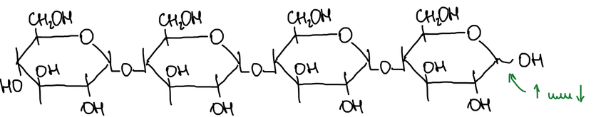
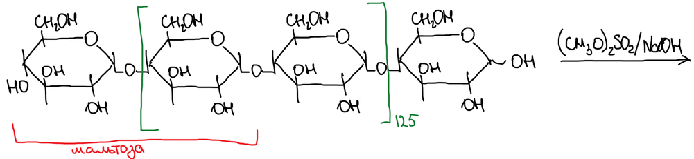
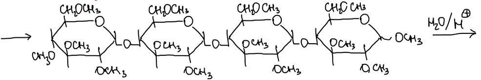
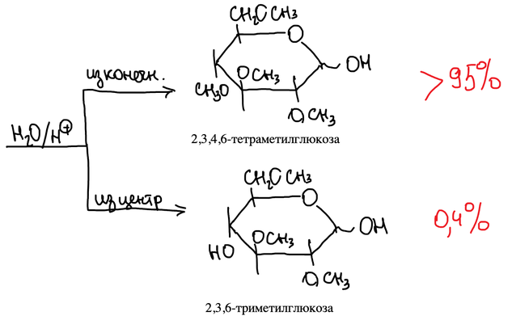
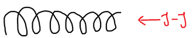
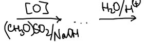
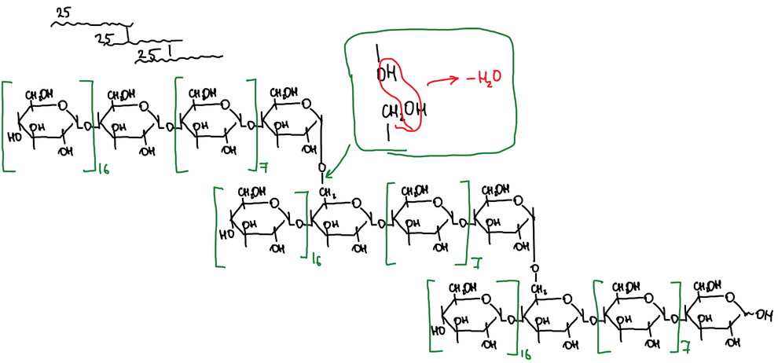

**Несахароподобные полисахариды** содержат больше шести остатков моноз. Их функции:

1. **Резервные питательные вещества**: в растениях — крахмал, у животных — гликоген.
2. **Опорные вещества** — целлюлоза. Это строительный материал всего растительного мира, от травинки до дерева.

Крупный и мелкий рогатый скот может переваривать ветки и траву, потому что в его желудке есть ферменты, расщепляющие β-гликозидную связь целлюлозы.

## Крахмал

Растительный крахмал — не индивидуальный полисахарид, а смесь двух: **крахмал = амилоза + амилопектин**. Амилоза образует коллоидные растворы (из неё можно готовить кисель). Фермент **амилаза** расщепляет амилозу.

### Строение амилозы

Факты:

1. Кислотный гидролиз амилозы даёт α-глюкозу.
2. Амилаза расщепляет амилозу до мальтозы.

Значит, амилоза — цепь остатков α-глюкопиранозы, соединённых связями 1–4:

Но остатков в цепи не четыре, а больше. Чтобы установить их число, амилозу метилируют диметилсульфатом в щёлочи:

При гидролизе концевой остаток цепи даёт 2,3,4,6-тетраметилглюкозу, а остатки из середины цепи — 2,3,6-триметилглюкозу:

Тетраметилглюкозы получается 0,4 % на 100 частей триметилглюкозы, то есть один концевой остаток приходится на 250 остатков в цепи.

> **К схеме.** На схеме проценты подписаны наоборот: у тетраметилглюкозы «> 95 %», у триметилглюкозы «0,4 %». По расчёту в тексте конспекта («0,4 — 100; 1 — 250») тетраметилглюкозы 0,4 %, а триметилглюкозы — основная часть. Число «125» у скобки на схеме с этим расчётом тоже не совпадает.

### Крахмал и иод

Крахмал — качественный реактив на иод. При комнатной температуре молекулы иода входят внутрь спирали амилозы, и крахмал окрашивается в синий цвет. При нагревании иод выходит из спирали, и окрашивание пропадает:

### Амилопектин

Строение амилопектина установил Хеуорс методом метилирования. Факты:

1. Кислотный гидролиз даёт только α-глюкозу.
2. Ферменты расщепляют амилопектин только на 60 %.

После метилирования и гидролиза получаются три продукта:

| Продукт | Доля | Откуда |
|---|---|---|
| 2,3,4,6-тетраметилглюкоза | 4 % | концевые остатки |
| 2,3-диметилглюкоза | 4 % | точки ветвления (связи 1–4 и 1–6) |
| 2,3,6-триметилглюкоза | 80 % | остатки в середине цепи |

На 0,4 части тетраметилглюкозы приходится 100 частей триметилглюкозы, то есть на один концевой остаток — 25 остатков в цепи. Цепочка амилопектина состоит из 25 колец, но молярная масса несоразмерно высока (около миллиона). Значит, **амилопектин разветвлённый**: цепи по 25 остатков соединены связями 1–6. Такая связь образуется, когда гидроксил при C-1 одной цепи и группа CH₂OH другой отщепляют воду:

> **К тексту.** В конспекте для амилопектина записано и «0,4 остатка (тетраМГ) — 100 (триМГ)», и 4 % / 80 %. Эти данные не согласуются между собой (4 : 80 даёт 1 : 20), расчёт 1 : 25 перенесён как в конспекте.
