Чтобы определить химическое строение моноз, нужно:

1. доказать наличие гидроксильных групп и их количество;
2. доказать, что углеродная цепь неразветвлённая;
3. доказать конфигурацию альдоз и кетоз.

## Карбонильная группа и число гидроксилов

Глюкоза C₆H₁₂O₆ даёт реакцию серебряного зеркала с аммиачным раствором оксида серебра и окисляется до кислоты C₅H₁₁O₅COOH. Серебро выпадает в осадок — «бесплатное приложение» к реакции. Это доказывает наличие альдегидной группы:

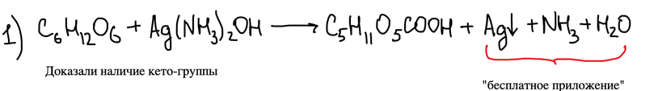

> **К схеме.** Под реакцией подписано «Доказали наличие кето-группы». Реакция серебряного зеркала доказывает **альдегидную** группу.

С избытком уксусного ангидрида глюкоза образует пентаацетат, а гидролиз даёт пять молекул уксусной кислоты — значит, в молекуле пять гидроксильных групп:

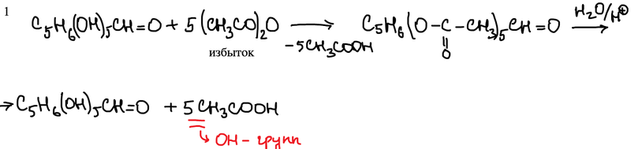

## Неразветвлённая цепь

Иодоводород при 140 °C с фосфором восстанавливает глюкозу до 2-иодгексана. Через гексанол его сравнивают с 2-гексанолом, полученным реакцией Гриньяра из бутилмагнийиодида и ацетальдегида. Совпадение доказывает неразветвлённую цепь:

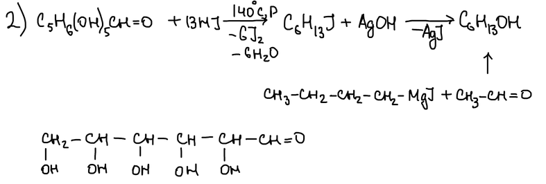

## Конфигурация пентоз

У альдопентоз три асимметрических атома, и возможны четыре D-формы. При восстановлении альдегидной группы получаются пентиты. Пентит, у которого есть плоскость симметрии, оптически неактивен (**i** — inactive, мезоформа); остальные оптически активны (**ОА**):

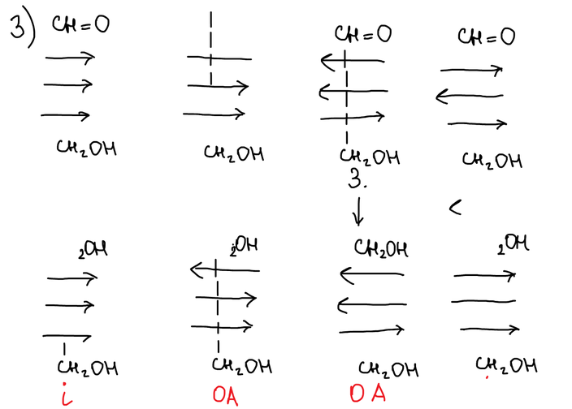

Рибоза и ксилоза дают оптически неактивные пентиты — значит, у них конфигурации 1 или 4. Ликсоза и арабиноза дают активные пентиты — конфигурации 2 или 3:

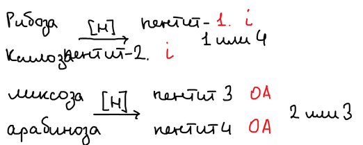

Синтез Килиани — Фишера различает варианты. Рибоза (1 или 4) даёт аллозу и альтрозу, которые восстанавливаются в гекситы — неактивный и активный. Ксилоза даёт гулозу и идозу, у которых оба гексита активны:

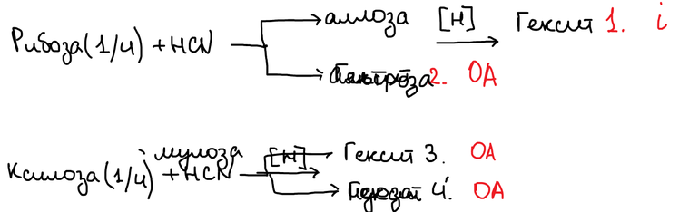

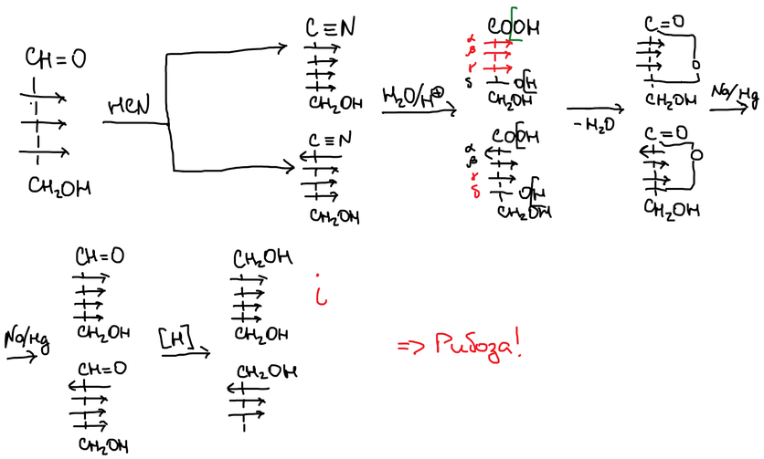

Так же арабиноза даёт глюкозу и маннозу, а ликсоза — талозу и галактозу:

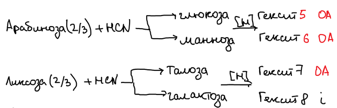

## Озазоны

С фенилгидразином альдоза сначала образует **фенилгидразон**. Вторая молекула фенилгидразина окисляет соседнюю группу CH–OH в карбонильную, выделяя аммиак и анилин, а третья даёт **озазон**. Рибоза и арабиноза дают один и тот же озазон — значит, они отличаются конфигурацией только при одном атоме углерода (C-2): это диастереомеры:

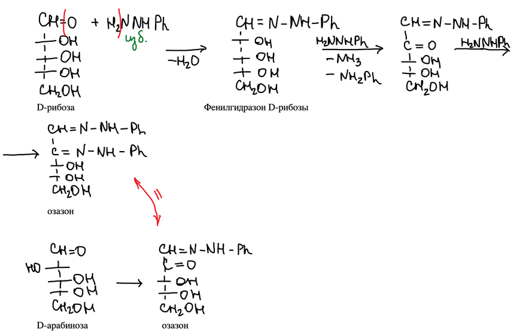

## Конфигурация глюкозы

Арабиноза в синтезе Килиани — Фишера даёт две альдогексозы. Надстраивая их снова, получают альдогептозы и по оптической активности гептитов определяют, куда смотрит гидроксил при C-2. Отсюда новая –OH группа глюкозы должна смотреть вправо:

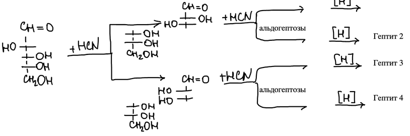

Зная конфигурацию рибозы, можно узнать конфигурации аллозы и альтрозы.

Что манноза и глюкоза — диастереомеры по C-2, подтверждает реакция с фенилгидразином: D-глюкоза, D-манноза и D-фруктоза дают один и тот же озазон. Значит, конфигурация трёх нижних атомов углерода у них одинакова:

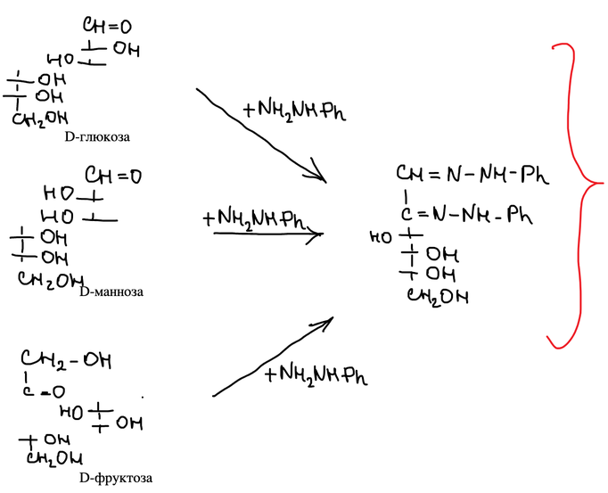

> **К тексту.** В конспекте: «можно узнать конформации аллозы и альтрозы». Речь идёт о **конфигурации**.
