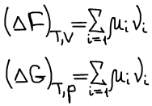

# Характеристические функции

**Характеристическая функция** — такая термодинамическая функция, по изменению которой в определенных условиях можно судить о направленности самопроизвольного процесса и о достижении состояния равновесия, а производные различного порядка которых дают нам явно и наиболее просто другие термодинамические функции и параметры системы.

Изоэнтропийно-изохорические условия:

Рассмотрим только обратимые процессы.

**1. Докажем, что внутренняя энергия является характеристической функцией.**

Термодинамический вид уравнения полного дифференциала внутренней энергии:

Термодинамическая система находится в состоянии истинного термодинамического равновесия при всех изменениях, совместимых с данными закрепленными значениями S и V, когда внутренняя энергия не уменьшается (либо остается постоянной, либо возрастает).

**Первое уравнение Максвелла**:

Таким образом, из приведенных выше рассуждений следует, что внутренняя энергия является характеристической функцией.

**2. Докажем, что энтальпия является характеристической функцией.**

Термодинамический вид полного дифференциала энтальпии:

Термодинамическая система находитя в состоянии истинного термодинамического равновесия при всех изменениях совместимых с данными закрепленными значениями S и p, когда энтальпия системы не уменьшается (либо H=const, либо энтальпия возрастает). Возрастание возможно в результате флуктуаций, где флуктуация — это такое изменение, которое не является термодинамическим процессом.

**Второе уравнение Максвелла**:

Энтальпия является характеристической функцией.

**3. Докажем, что функция Гельмгольца является характеристической.**

То что функция Гельгольца удовлетворяет первой части определения характеристической функции мы уже показали в 1 параграфе. Рассмотри только обратимые процессы.

Термодинамический вид уравнения полного дифференциала для функции Гельмгольца:

**Третье уравнение Максвелла**:

Термодинамическая система, находится в состоянии истинного термодинамического равновесия при всех изменениях, совместимых с данными закрепленными значениями T и V, когда функция Гельмгольца не уменьшается (либо остается постоянной, либо возрастает).

**4. Докажем, что функция Гиббса является характеристической**

То, что функция Гиббса удовлетворяет первой части определения характеристической функции мы показали в 1 параграфе.

Термодинамический вид уравнения полного дифференциала для функции Гиббса:

**Четвертое уравнение Максвелла**:

Термодинамическая система, находится в состоянии истинного термодинамического равновесия при всех изменениях, совместимых с данными закрепленными значениями T и p, когда функция Гиббса не уменьшается (либо остается постоянной, либо возрастает).

## Cлучай открытой системы

Не рассматриваем протекание химических реакций, т.е. состав может изменяться только механически: за счет обмена с окружающей средой.

**Фундаментальные уравнения термодинамики:**

**μi** — **химический потенциал i-го компонента** — это изменение характеристической функции при внесении в систему бесконечно большого размера 1 моль i-го компонента в условиях закрепления её естественных переменных и постоянства состава.

**Химический потенциал i-го компонента** — работа по обратимому внесению 1 моль i-го компонента в бесконечно большую систему в условиях либо изобарно-изотермических, либо изохорно-изотермических.

Если функция φ некоторая термодинамическая функция, то

μi — парциально мольное значение функции Гиббса по i-му компоненту (справедливо только для функции Гиббса).

## Cлучай закрытой системы, в которой изменение состава происходит за счет протекания химической реакции

Одно из основных соотношений неравновесной термодинамики:

 

