# Химическое равновесие

**Химическое равновесие** — состояние системы, соответствующее минимуму значения энергии Гиббса. В состоянии равновесия изменение энергии Гиббса химической реакции равно нулю (ΔG = 0).

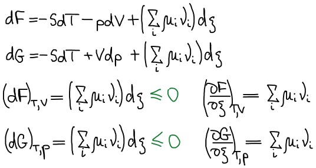

**Условия химического равновесия**

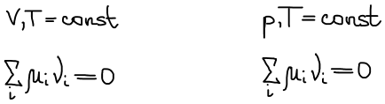

Вывод уравнения изотермы Вант-Гоффа

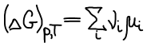

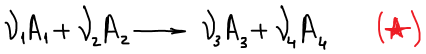

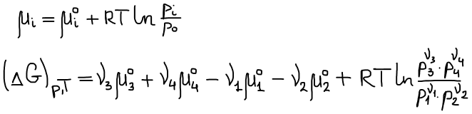

Уравнение изотермы Вант-Гоффа для реакции (★)

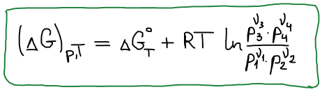

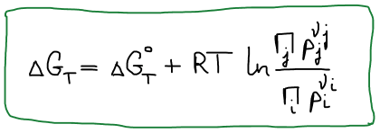

В состоянии равновесия ΔGT = 0

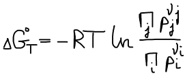

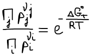

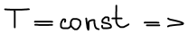

Правая часть постоянна, значит левая часть тоже постоянна. Эта постоянная называется **константой равновесия**.

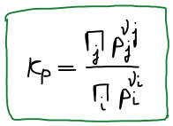

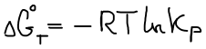

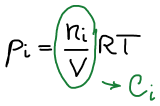

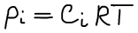

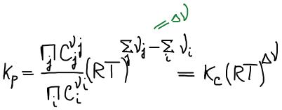

Связь Kp и Kc

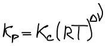

Закон Дальтона:

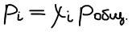

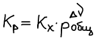

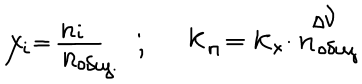

**Влияние температуры на положение равновесия**

Уравнение Гиббса-Гельмгольца:

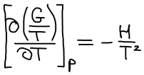

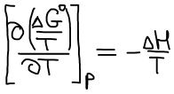

**Уравнение изобары Ван-Гоффа**

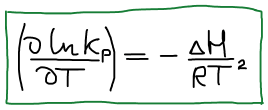

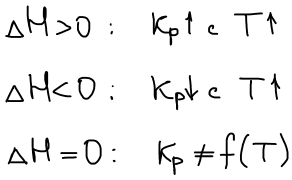

Уравнение изобары Ван-Гоффа будем использовать, чтобы рассчитать КT2 если известна KT1

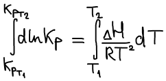

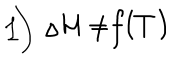

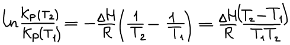

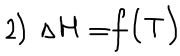

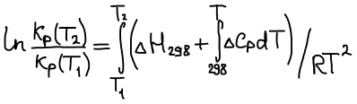

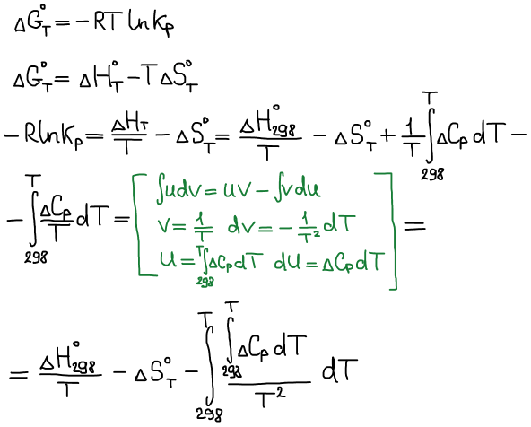

Графическое изображение зависимости Кр от Т:

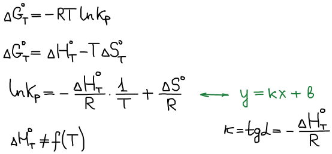

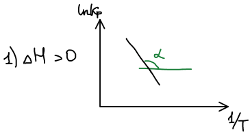

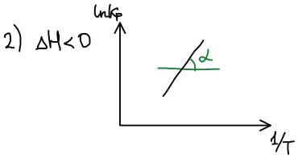

Влияние давления на положение равновесия:

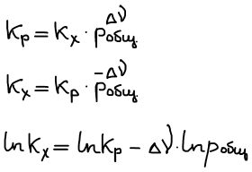

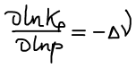

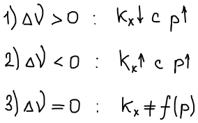

Влияние добавок инертного газа:

 

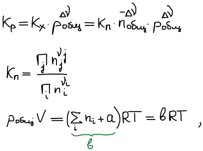

где а — число моль добавленного инертного газа.

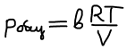

1) инертный газ добавляется в систему при постоянстве V, T

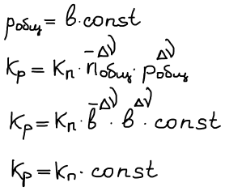

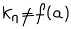

Не является функцией добавок инертного газа, положение равновесия безразлично к добавке инертного газа.

2) инертный газ добавляется в систему при постоянстве p, T

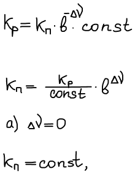

т.к. Кр не зависит от добавки

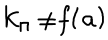

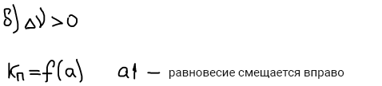

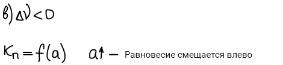

**Химическое равновесие в гетерогенных реакциях с участием газообразных веществ**

Гетерогенные реакции — это такие реакции, в которых участники принадлежат различным фазам

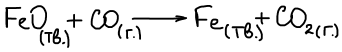

Химический потенциал твердой фазы не зависит от давления, а зависит только от температуры, следовательно уравнение изменения функции Гиббса для реакции, протекающей на 1 шаг запишется в следующем виде:

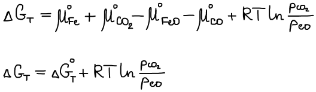

В состоянии равновесия ΔG T = 0

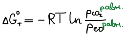

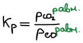

