# Изменение энтропии

Рассмотрим процессы, идущие с участием идеального газа.

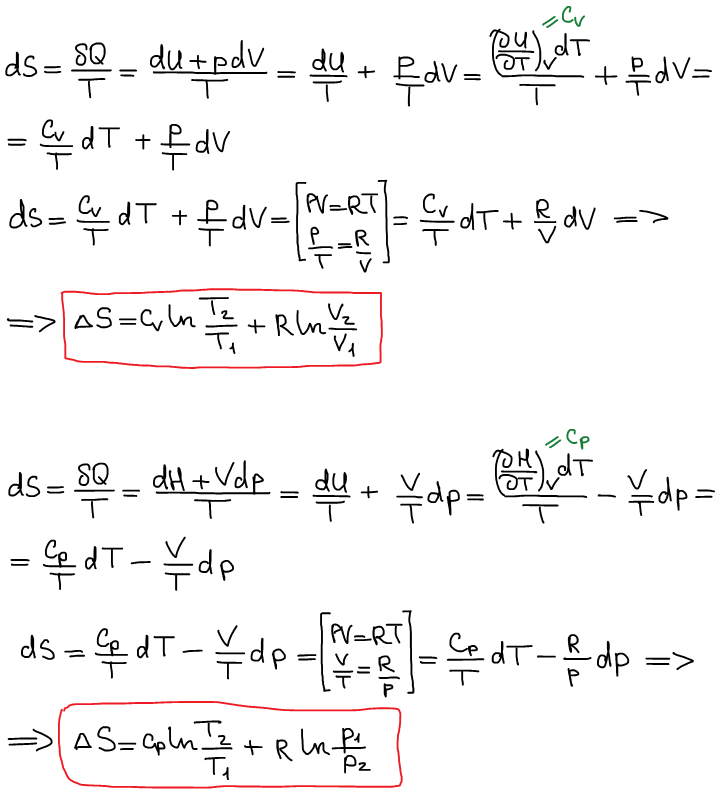

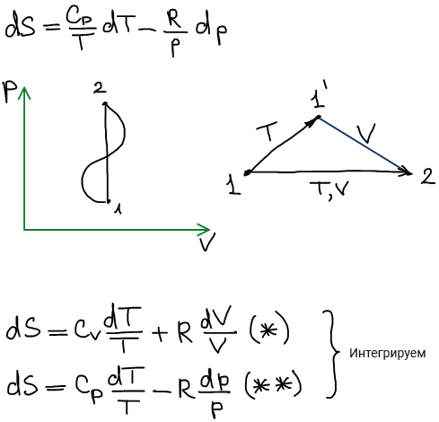

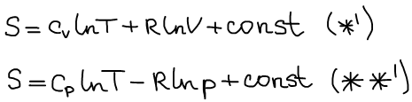

🙏 Если вам нравится сайт, подпишитесь на наш <a href="https://t.me/+JfpTv9CJlwQ0MThi">🔗 Телеграм-канал</a>.

## Графическое представление зависимости энтропии.

D координатах p-V (не информативно)^

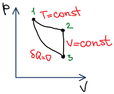

Для информативности данные зависимости представляются в логарифмических координатах:

**1) в координатах S - ln(T)**

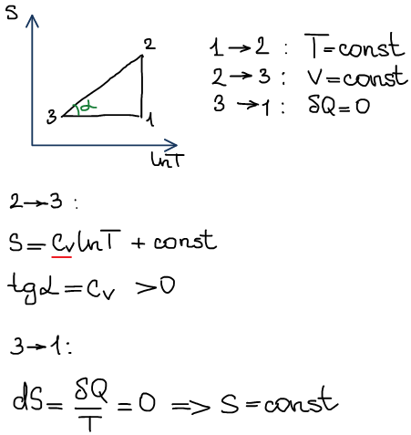

**2) в координатах S - ln(V)**

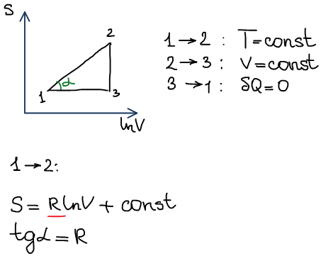

**3) в координатах S-ln(p)**

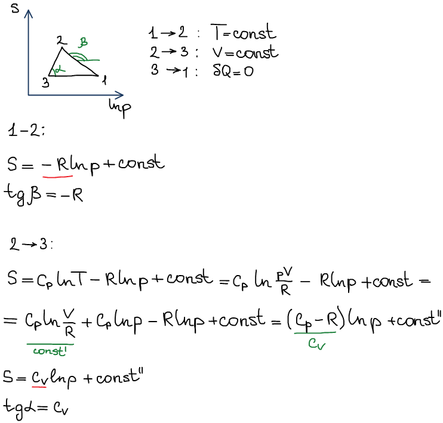

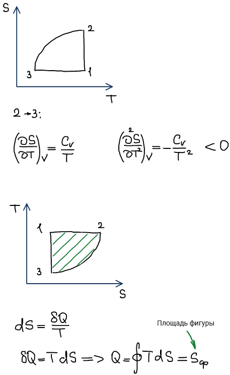

## Изменение энтропии в частных процессах с участием реальных газов

Уравнение Ван дер Ваальса:

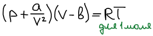

Рассчитать изменение энтропии при изотермическом расширении газа Ван дер Ваальса от объема V1 до объема V2.

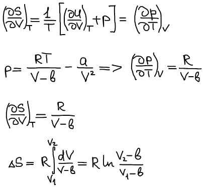

## Изменение энтропии при нагревании и фазовых переходах индивидуальных веществ

**При нагревании:**

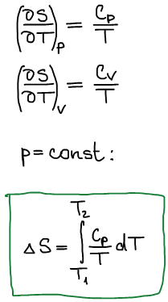

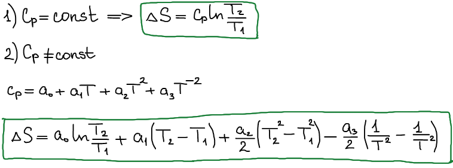

**При фазовых переходах:**

Понятие "фаза" ввел Джозайя Уиллард Гиббс в 1875 г. в работе "О равновесии в гетерогенных веществах".

**Фаза** — гомогенная часть гетерогенной системы, отделенная от других частей физической границей раздела и имеющая либо неизменный состав и свойства, либо монотонно изменяющиеся.

При постоянстве внешнего давления все обратимые фазовые переходы осуществляются при постоянстве температуры.

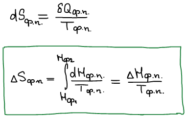

## Изменение энтропии при смешении идеального газа

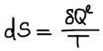

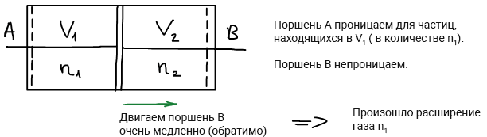

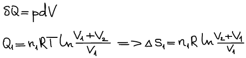

Двигаем поршень A

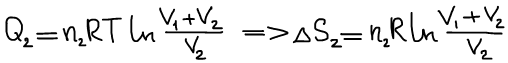

Произошло смешение:

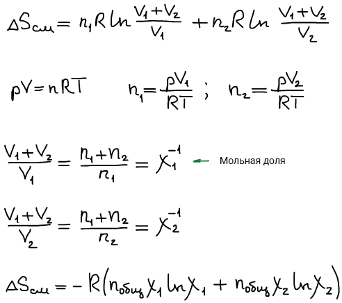

Формула изменения энтропии при идеальном смешении:

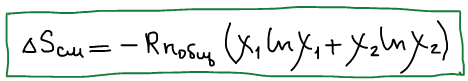

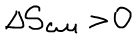

## Изменение энтропии при протекании химической реакции

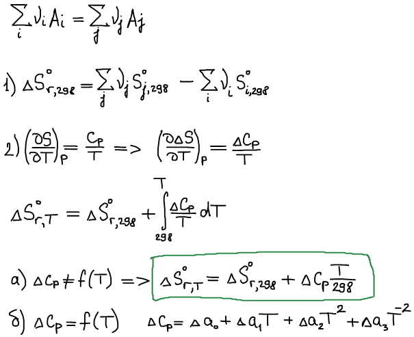

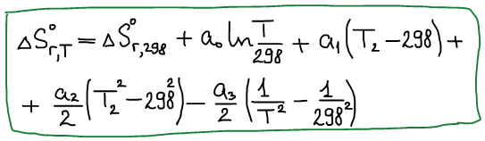

