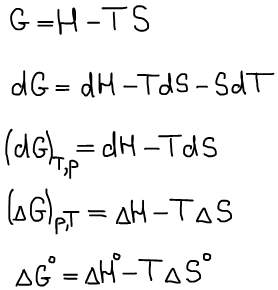
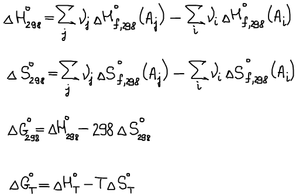
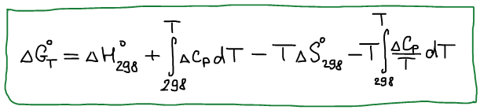
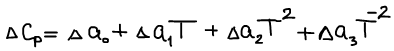
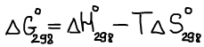
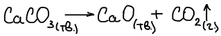
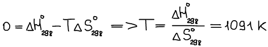
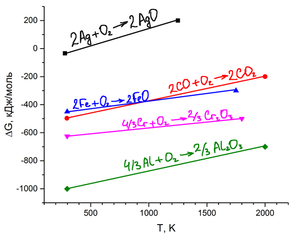
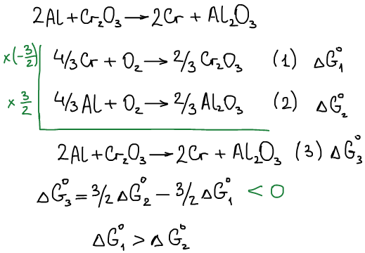

# Изменение функции Гиббса

Расчет изменения функции Гиббса для химических реакций при её протекании на 1 шаг:

Представим упрощенный случай: ΔСp не зависит от температуры, или зависит слабо, что этой зависимостью можно пренебречь.

**Пример**:

Оценим температуру, при которой эта реакция самопроизвольно протекает \(определим термодинамическую температуру начала разложения карбоната кальция\).

Решаем по упрощенной схеме:

Если считать не по упрощенной формуле, то Т = 1125 К. Погрешность не велика.

 

Построим диаграмму Эллингема

1. Алюмотермия

Из диаграммы видно, что алюмотермия возможна.

 

2. В каком температурном интервале возможна реакция восстановления Fe из FeO с помощью CO?

Это условие выполняется в интервале 298 ⩽ Т, К ⩽ 1000 согласно диаграмме.

