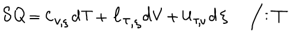
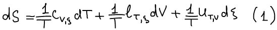
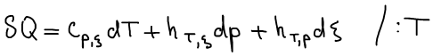
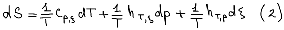
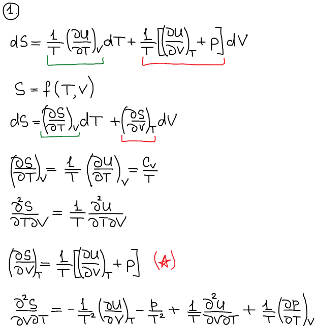
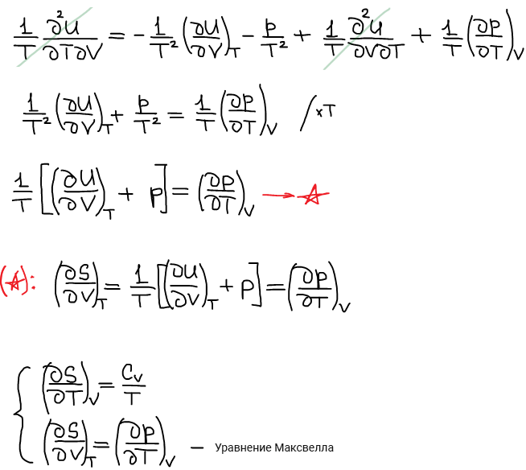
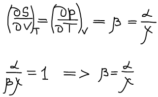
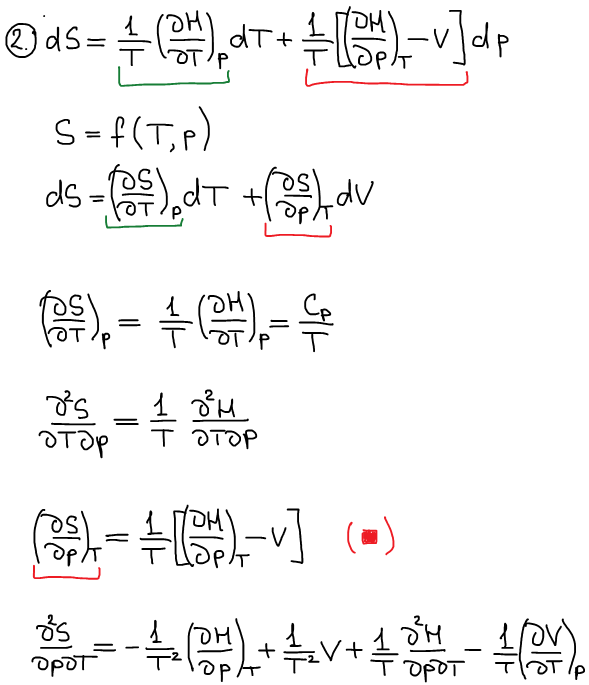
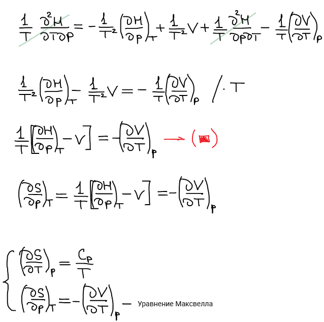
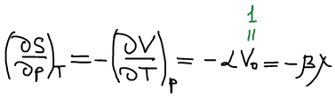

# Калорические выражения второго начала термодинамики

Первое калорическое выражение **первого начала термодинамики**:

Первое калорическое выражение **второго начала термодинамики**:

Второе калорическое выражение **первого начала термодинамики**:

Второе калорическое выражение **второго начала термодинамики**:

Для простоты рассуждений исключаем дзета.

Приравниваем смешанные производные, т. к. энтропия — функция состояния.

Приравниваем смешанные производные:

