# Критерии направленности

Критерии направленности и глубины протекания самопроизвольных процессов в неизолированных системах

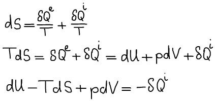

**1. Пусть T, V = const**

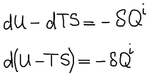

Функция Гельмгольца \(свободная энергия Гельмгольца\):

<!--  -->

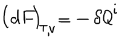

Для обратимого процесса:

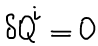

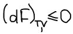

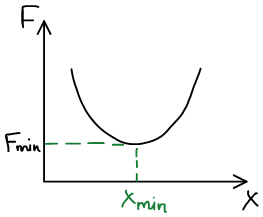

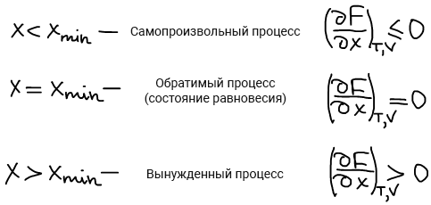

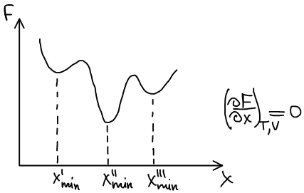

Вводится понятие "*условный экстремум*". Различают **условный абсолютный минимум** и **условный относительный минимум**.

**Абсолютному минимуму** соответствует наименьшее из всех возможных значений функций Гельмгольца, совместимых с данными закрепленными значениями T и V.

**Условный абсолютный минимум** функции Гельмгольца соответствует истинному \(стабильному\) состоянию равновесия.

**Условный относительный минимум** функции Гельмгольца соответствует так называемому метастабильному состоянию равновесия. Особенностью метастабильного состояния является то, что в нем система может находиться сколь угодно долго.

**2. Пусть p, T = const**

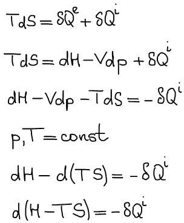

Функция Гиббса \(свободная энтальпия Гиббса\):

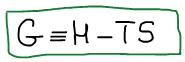

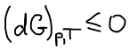

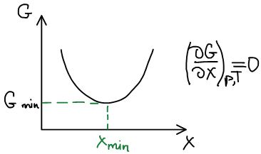

Также имеются условный абсолютный минимум и условный относительный минимум, но в условиях постоянства давления и температуры.

