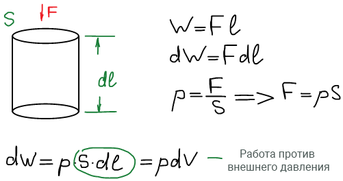
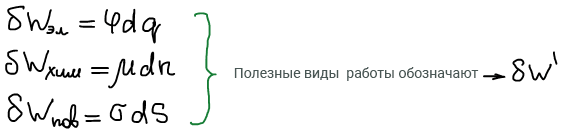

# Основные определения физической химии

**Предметом физической химии** является установление основных закономерностей и принципов, которым подчиняются физические и химические процессы с участием вещества.

**Физическим процессом** называют такие процессы, которые протекают без изменения внешних (валентных) электронных оболочек атома вещества. А химические процессы — с изменением.

Также **предметом физической химии** является установление взаимосвязей между изменением энергии и протеканием физических и химических процессов.

**Задачи, решаемые физической химией**:

* установление направления, в котором протекают все процессы (определение критериев направленности процессов);
* установление того, на какую глубину протекают все процессы (определение критериев достижения предельной глубины протекания процессов);
* установление скорости и механизма протекания процессов;
* установление фундаментальной взаимосвязи в цепочке: состав - структура - свойства вещества.

**Методы физической химии**:

* феноменологический (термодинамический);
* статистический;
* квантово-механический.

В результате применения различных методов для решения задач физическая химия разделилась на несколько дисциплин:

1. Химическая термодинамика;
2. Кинетика и катализ;
3. Электрохимия;
4. Кристаллохимия;
5. Коллоидная химия;
6. Физическая химия ВМС;
7. Квантовая химия и строение вещества;
8. Статистическая термодинамика.

**Термодинамическая система** — совокупность материальных тел, находящихся внутри заданной границы раздела. Границы могут быть реальными (физическими), а могут быть воображаемыми.

Термодинамическая система состоит из огромного числа частиц. Все что находится за пределами границы — окружающая среда.

**Виды систем:**

1. **Изолированная**. Не обменивается с окружающей средой ни веществом, ни энергией. Границы абсолютно непроницаемы.
2. **Открытая**. Обменивается с окружающей средой как веществом, так и энергией.
3. **Закрытая**. Не обменивается с окружающей средой веществом, но обменивается энергией.

Закрытые системы разделяют на:

* **адиабатические** - не обмениваются с окружающей средой веществом, теплотой, а обмениваются только работой;
* **замкнутые** - не обмениваются с окружающей средой веществом, работой, а обмениваются только теплотой.

**Энергия** — это количественная мера различных форм движения.

**Полная энергия системы** — сумма кинетической и потенциальной энергий взаимодействия различных частиц системы.

**Формы изменения энергии:**

1. Упорядоченная (работа);
2. Неупорядоченная (теплота).

В учебниках работа обозначается по-разному: А (немец. arbeit), W (англ. work). **Мы будем обозначать работу буквой W**.

**Температура** — количественная мера степени нагретости вещества.

* 1597 г. Галилео Галилей изобрел термоскоп. Температура измерялась не количественно, т.к. не было единиц измерений.
* 1701 г. Исаак Ньютон: шкала в 12 делений (от температуры замерзания воды до температуры "здорового мужчины".
* 1715 г. Даниель Габриель Фаренгейт предложил свою единицу измерений: 0 °F — температура таяния смеси снега и поваренной соли, 32 °F — температура таяния льда, 96 °F — температура "здорового мужчины".
* Затем Андерс Цельсий предложил шкалу, в которой температура плавления льда принималась за 100 °С, а температура кипения воды за 0 °. В 1745 г. Шкала была перевернута Карлом Линеем и в таком виде используется до нашего времени.
* 1848 г. Уильям Томсон (лорд Кельвин) пишет в своей работе «Об абсолютной термометрической шкале» о необходимости шкалы, нулевая точка которой будет соответствовать предельной степени холода (абсолютному нулю), а ценой деления будет градус Цельсия.
* 1954 — международная шкала температур Цельсия.

1939 г. Фаулер сформулировал **принцип транзитивности** (перенесение) химического равновесия (иногда его называют нулевым началом термодинамики): Если два тела А и B независимо друг от друга находятся в термическом равновесии с третьим телом C, то они находятся в термическом равновесии друг с другом.

**Параметр системы** — это физическое свойство системы, заданное количественно.

1813г. Гегель "Наука логики"

Эстенсивное свойство определяется через само себя.

**Экстенсивное свойство** — такое свойство системы, которое характеризует систему в целом и обладает принципом аддитивности. Экстенсивное свойство системы складывается из значений этого свойства для отдельных подсистем, на которое эта система раскладывается.

**Интенсивное свойство** — такое свойство, которое не обладает принципом аддитивности и определяется в окрестностях некоторой точки, выбранной внутри системы.

Состояние системы определено, если задан набор параметров с известными значениями.

**Термодинамический процесс** — любое изменение значений параметров в заданном наборе. Процесс всегда приводит систему с начального состояния в сопряженное с ним конечное

Если процесс переводит систему из начального состояния в конечное так, что начальное состояние совпадает с конечным, то говорят о **циклическом процессе**.

Состояние равновесия системы определяется тогда, когда значение всех параметров не изменяется во времени и это постоянство параметров не обусловлено протеканием компенсирующих процессов либо в самой системе, либо в окружающей среде.

**Истинное состояние равновесия системы** имеет необходимое и достаточное условие:

* **необходимым условием** является условие стационарности. т.е. неизменности значений параметров во времени;
* **достаточным условием** является достижимость равновесия с нескольких сторон.

**Обратимым процессом** называется такой процесс, который развивается через последовательность состояний равновесия бесконечно близко примыкающих друг к другу.

