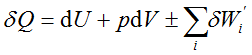
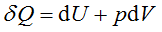
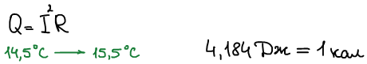
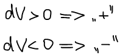
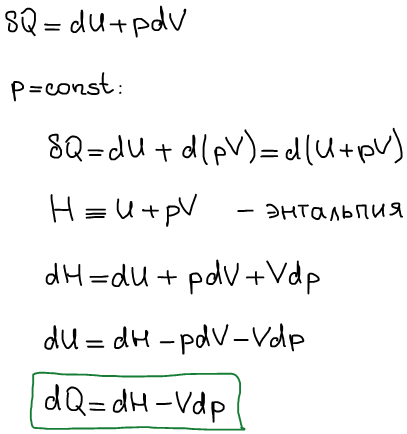

# Первое начало (закон) термодинамики

Основные формулировки первого начала термодинамики:

* "Подводимая к системе теплота расходуется на повышение ее внутренней энергии и совершение работы", — Джеймс П. Джоуль, Юлиус Р. Майер.
* "Вечный двигатель первого рода невозможен", — Макс Планк.
* "Внутренняя энергия изолированной системы постоянна".
* "Энергия вселенной постоянна", — Рудольф Юлиус Клаузиус (Готтлиб).

Уравнение, описывающее закон:

<!-- где  — количество теплоты,  — внутренняя энергия,  — давление,  — объем,  — любая работа, кроме работы расширения. -->

В дальнейшем мы будем учитывать только работу расширения и не будем учитывать другие виды работы.

## История открытия первого начала термодинамики

1. Герон изобрел "ветряной шар" в первом веке. Ветряной шар иллюстрирует первое начало термодинамики.
2. 1698 г. Томас Севери — изобрел первый тепловой насос.
3. 1763 г. Джеймс Ватт — тепловая машина (КПД был мал).
4. 1843 г. Опыт Джеймса П. Джоуля в возрасте 25 лет. Установил единицу измерения количества теплоты — калория. 1 калория — такое количество теплоты, которое тратится для нагрева 1 грамм воды с 14,5°С до 15.5°С.

    

5. 1847 г. Майер. Публикация

## Правило знаков в термодинамике

Для механической работы: положительной работой считается такая работа, которая связана с увеличением объема.

Для остальных видов работ действует "эгоистический принцип": взаимодействие считается положительным, если его результатом является увеличение внутренней энергии.

Для остальных видов работ действует "эгоистический принцип": взаимодействие считается положительным, если его результатом является увеличение внутренней энергии.

Два уравнения первого начала термодинамики являются зависимыми друг от друга.

