# Применение первого начала термодинамики

## 1. Изотермический процесс (T = const)

Допущения:

1) газ идеальный;

2) простая закрытая система (т.е. в системе осуществляется только работа расширения).

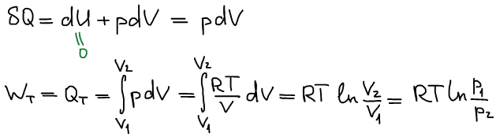

Графическое представление

Координаты p-V предложил Клапейрон, чтобы изобразить цикл Карно

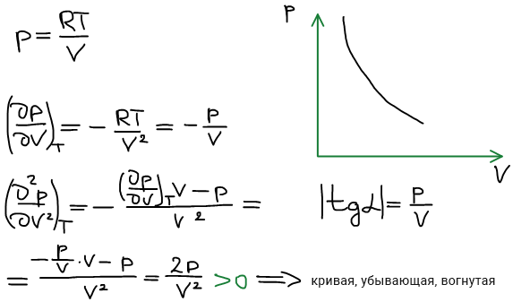

## 2. Изобарный процесс (p = const)

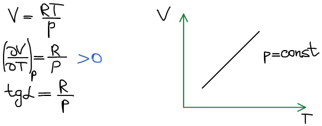

## 3. Изохорный процесс (V = const)

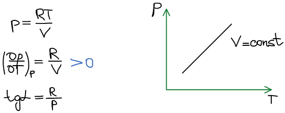

## 4. Адиабатический процесс (δQ = 0)

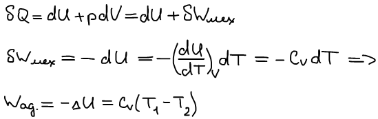

Вывод уравнения адиабаты:

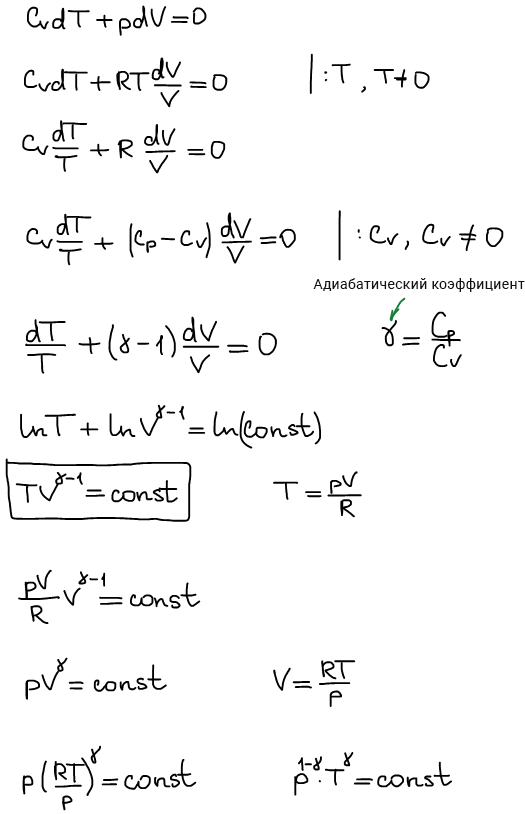

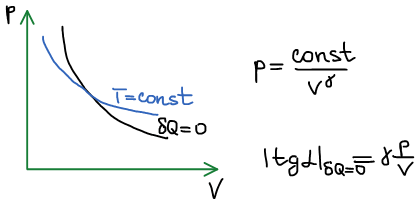

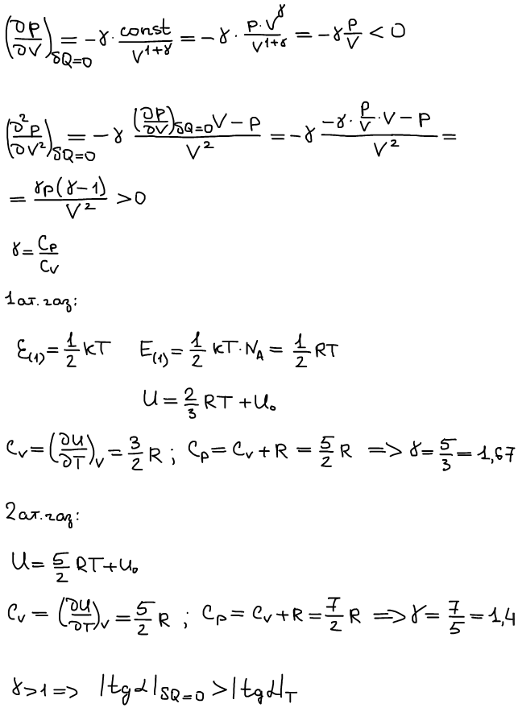

## Применение первого начала термодинамики к анализу тепловых эффектов химических реакций

1840 г. Г. И. Гесс "О постоянстве суммы теплот химических реакций" Тепловой эффект химических реакций не зависит от того, осуществляется эта реакция за один шаг или за несколько шагов".

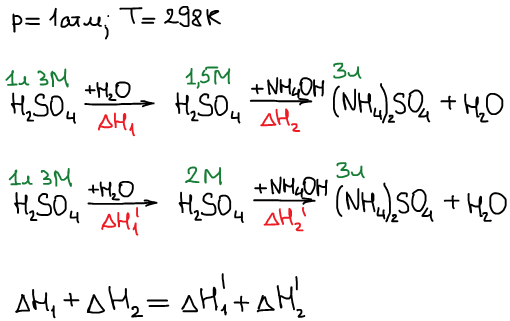

**Тепловой эффект химической реакции** — количество теплоты, которое выделяется (поглощается) при протекании этой реакции до конца согласно ее уравнению в условиях либо V,T=const, либо p,T=const.

**Современная формулировка закона Гесса (основной закон термохимии):** тепловой эффект химической реакции не зависит от способа ее проведения, а определяется только состоянием (природой, количеством) исходных веществ и продуктов реакции.

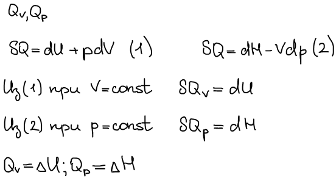

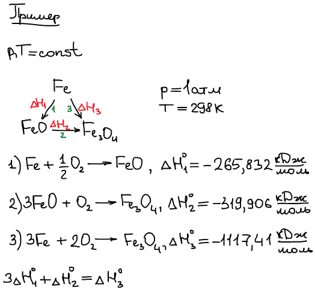

За ноль т/х шкалы выбраны энтальпии образования простых веществ, находящихся в стабильном состоянии в стандартных условиях.

Стандартные условия:

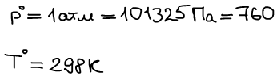

Стабильной формой является термодинамически наиболее устойчивое состояние.

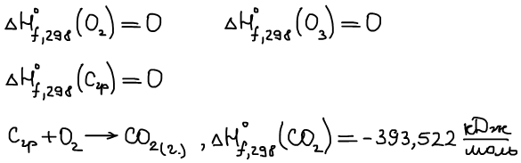

**Теплота образования** (**стандартная энтальпия образования**) данного вещества из простых веществ называется тепловой эффект реакции образования 1 моль этого вещества из простых веществ в стандартных условиях.

**Теплота сгорания** (**стандартная энтальпия сгорания**) — тепловой эффект полного сгорания (до образования высших оксидов) 1 моль этого вещества в стандартных условиях (исключение для N: N2).

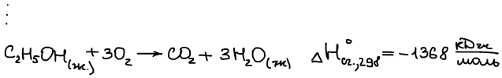

**1 следствие из закона Гесса**

Тепловой эффект производной реакции равен сумме теплот образования продуктов реакции с учетом стехиометрических коэффициентов за вычетом суммы теплот образования исходных веществ с учетом их стехиометрических коэффициентов.

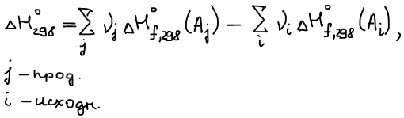

**2 следствие из закона Гесса**

Тепловой эффект произвольной реакции равен сумме теплот сгорания исходных веществ с учетом стехиометрических коэффициентов за вычетом теплот сгорания продуктов реакции с учетом их стехиометрических коэффициентов.

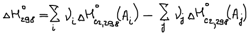

