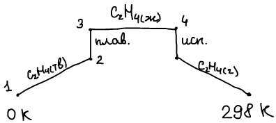
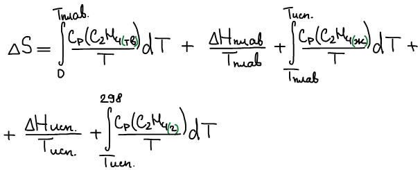
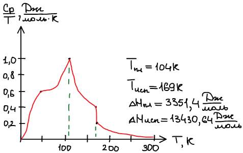
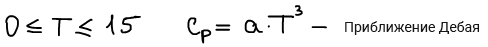
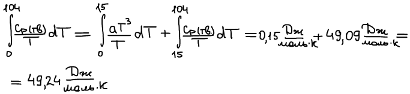
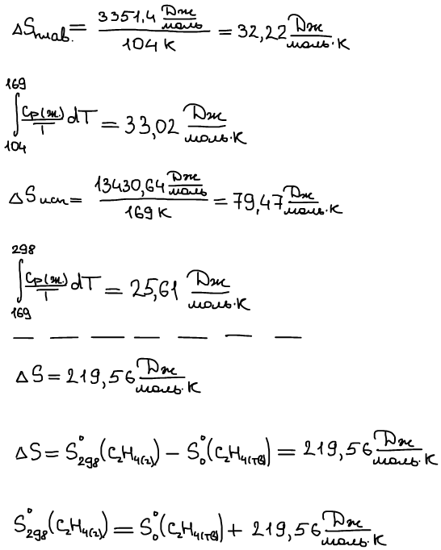
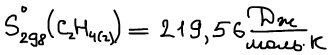
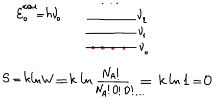

# Проблема определения абсолютного значения энтропии

Вычислить абсолютное значение энтропии этилена при p = 1 атм, T = 298 К (нагревание от 0 К до 298 К).

1906 г. У. Нернст: **тепловая теорема Нернста**

Вблизи 0 К все процессы с участием твердых правильно построенных индивидуальных веществ протекают без изменения энтропии.

1911 г. Макс Планк: **постулат Планка**

Абсолютное значение энтропии правильно построенного твердого индивидуального вещества при 0 К равно нулю.

"Правильно построенное вещество" означает, что каждая частица находится в узле и единственный вид взаимодействия — колебания с одинаковой частотой.

