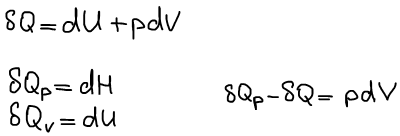
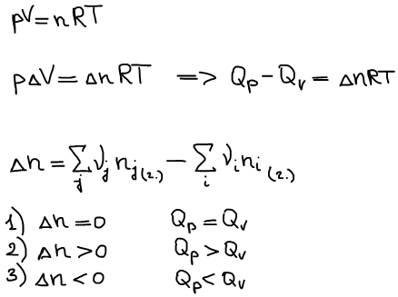

# Соотношения тепловых эффектов

Соотношение тепловых эффектов при постоянстве давления и объема

Если реакция протекает в конденсированном состоянии (жидкость или твердое вещество), то δQp = δQV.

