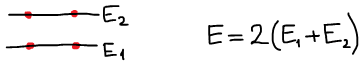
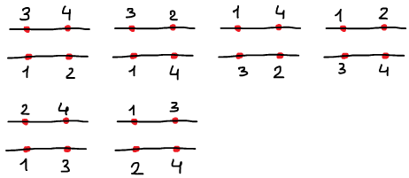
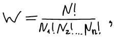
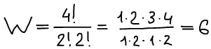
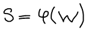
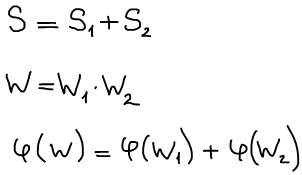
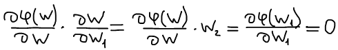
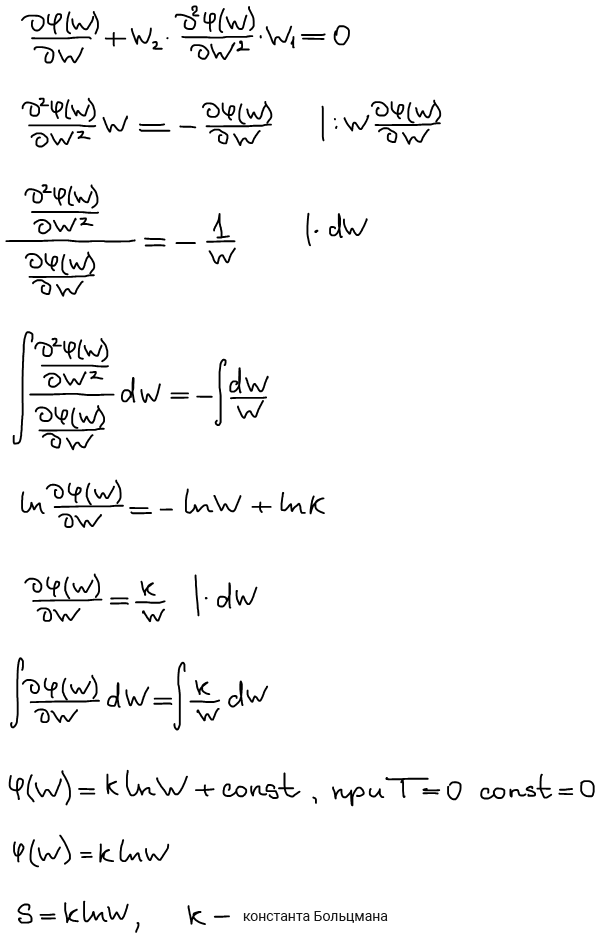
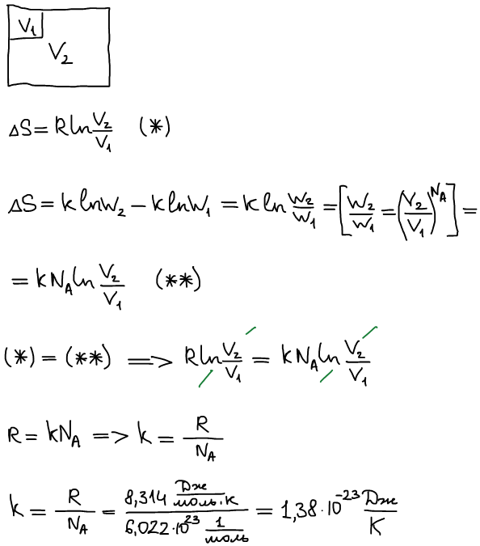

# Статистический смысл энтропии

1877 г. Людвиг Больцман публикует работу "Основы молекул статистики" и дает обоснование понятия энтропии. В основе лежат микро- и макросостояния.

**Под микросостоянием системы понимают** данный способ распределения всех молекул по всем имеющимся уровням энергии **с учетом** различимости молекул.

**Под макросостоянием системы понимают** данный способ распределения всех молекул по всем имеющимся уровням энергии **без учета** различимости молекул.

Модельная система: 2 уровня энергии (E1 и E2), на каждом уровне может находиться только 2 частицы.

Для того чтобы ввести микросостояния нужно различить частицы.

**Термодинамическая вероятность W** — число микросостояний удовлетворяющих данному микросостоянию.

где N — число частиц в системе, n — число уровней энергии.

**Равнораспределение** — такое распределение энергии, когда на каждом уровне находится одинаковое число частиц. Равное распределение имеет наибольшую термодинамическую вероятность.

**Статистическая гипотеза Больцмана**

Термодинамическая вероятность в изолированной системе всегда увеличивается при протекании самопроизвольного процесса. При этом она достигает своего максимума в состоянии равновесия.

Изолированная система всегда эволюционирует в сторону возрастания своей термодинамической вероятности.

Разобьем искомую систему на 2 части. Как определить S, если известны энтропии частиц S1 и S2.

S — экстенсивная функция;

1) дифференцируем по W1, когда W2 = const

2) Дифференцируем по W2, когда W1 = const

