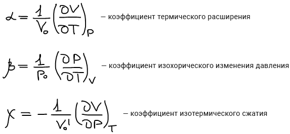
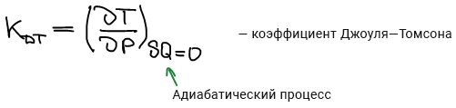
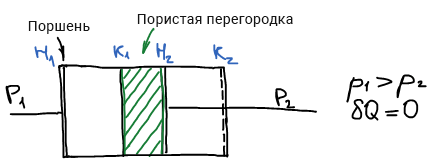
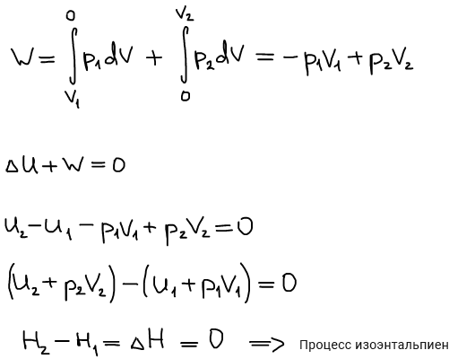
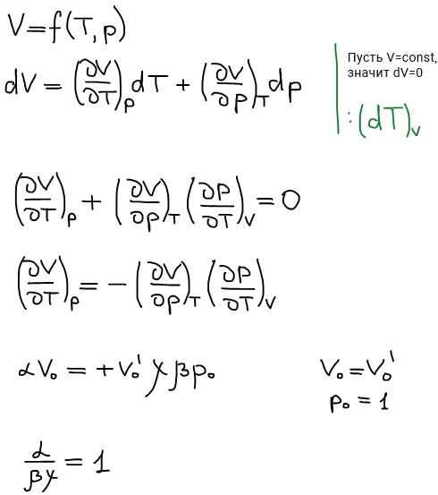
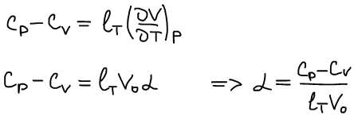

# Термические коэффициенты

Под симбатной связью понимают положительную связь \(т.е. производная \> 0\), а под антибатной — отрицательную связь.

Термические коэффициенты позволяют вычислить соответсвующие производные из экспериментальных данных. Коэффициент Д-Т является коэффициентом изоэнтальпии.

**Связь термических коэффициентов друг с другом**

**Связь термических и калорических коэффициентов**

