# Термические уравнения состояния

**Уравнение состояние системы** — математическая связь между параметрами системы, когда система находится в состоянии равновесия.

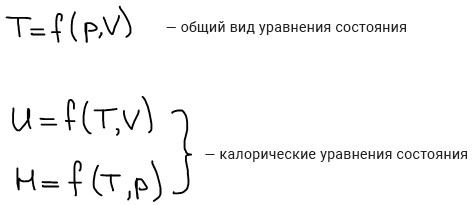

Калорические уравнения позволяют рассчитать такие свойства, которые выражаются в калориях.

1662 г. Роберт Бойль:

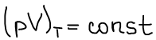

1676 г. Эдмунд Мариотт

1786 г. Жак Александр Сезар Шарль, Жозев Луи Гей-Люссак

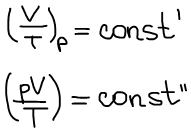

1856 г. Эмиль Клапейрон:

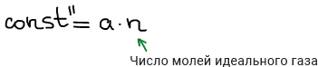

Дмитрий Иванович Менделеев:

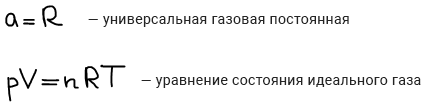

**Критическая температура газа** — температура, выше которой газ не может быть сконденсирован в жидкость, каким бы значительным не было давление.

1873 г. Ван дер Ваальс:

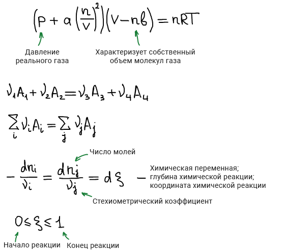

Величину ζ ввел Теофил де Донде в 1922г.

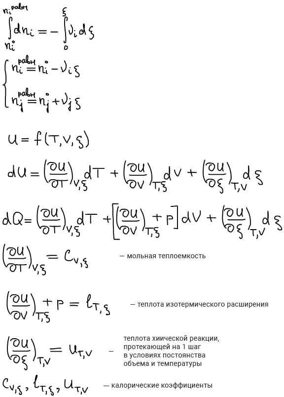

Первое калорическое выражение первого начала термодинамики:

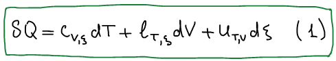

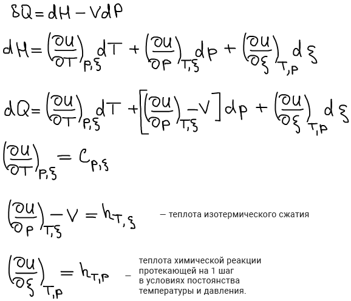

Второе калорическое выражение первого начала термодинамики:

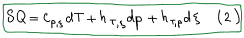

**Связь калорических коэффициентов**из 2-х калорических выражений 1 начала термодинамики друг с другом:

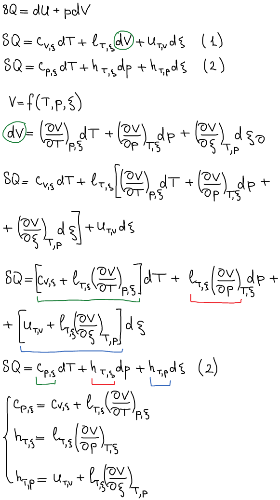

Применение связи между калорическими коэффициентами в термодинамике (допускаем отсутствие химической реакции для простоты):

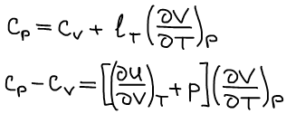

Закон Джоуля

Внутренняя энергия идеального газа зависит только от температуры (т.е. не зависит от давления и объема)

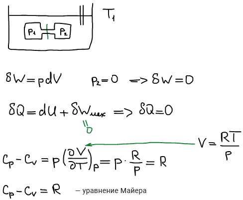

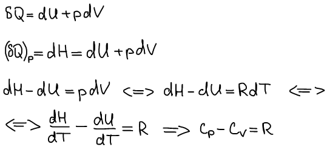

