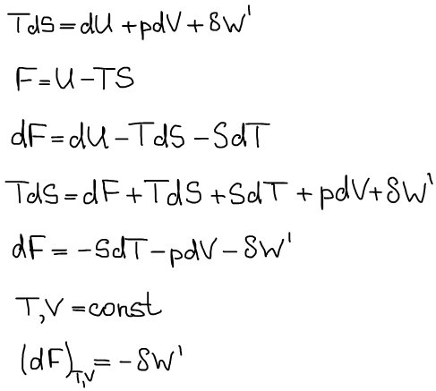
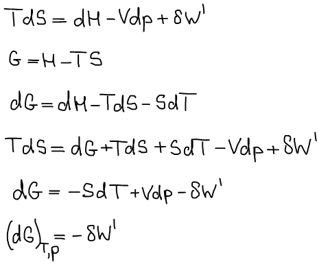

# Термодинамические потенциалы

Потенциал — способность совершать работу.

Условия: 1) далее снимается ограничение на простую систему, значит могут совершаться полезные виды работ; 2) обратимый процесс.

Убыль функции Гельмгольца в обратимом изохорно-изотермическом процессе равна максимальной полезной работе, следовательно, функция Гельмгольца является изохорно-изотермическим термодинамическим потенциалом.

Убыль функции Гиббса в обратимом изобарно-изотермическом процессе равна максимальной полезной работе, следовательно, функция Гиббса является изобарно-изотермическим потенциалом.

