# Второне начало (закон) термодинамики

История открытия второго начала термидинамики:

* 1796 г. Родился Лазаль Карно (Никола Сади Карно). 1824 г. Книга "Размышления о движущей силе огня и о машинах, эту силу развивающих" осталась невостребованной.
* 1833 г. Эмиль Клапейрон. ? ?

**Суть тепловой теоремы Карно**: КПД тепловой машины, работающей в обратимом цикле не зависит ни от физической, ни от химической природы этой машины, а определяется только температурами нагревателя и холодильника.

Физическая природа — процессы из которы состоит цикл по которому машина работает.

Химическая природа — природа рабочего тела (газа, участвующего в обратимом цикле).

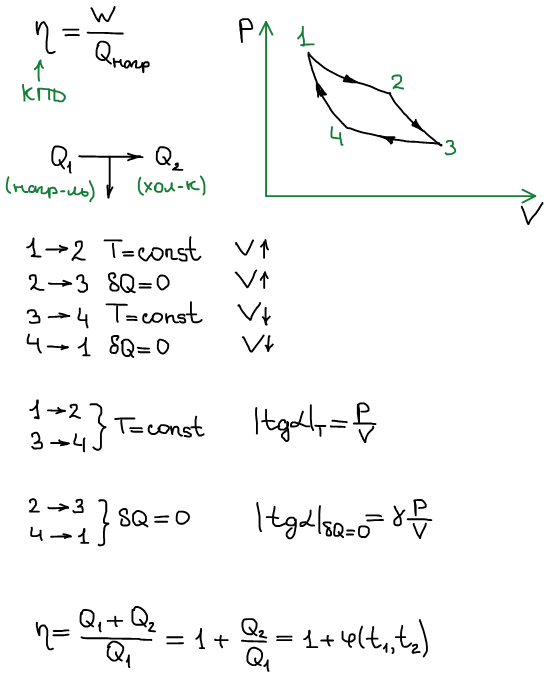

Дальнейшие рассуждения принадлежат Уильяму Томсону (лорд Кельвин):

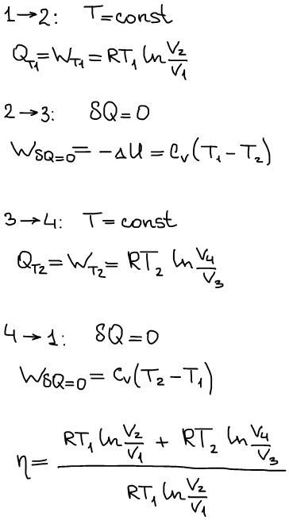

Как V2/V1 связано с V4/V3?

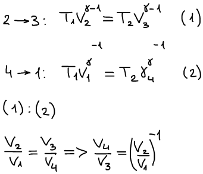

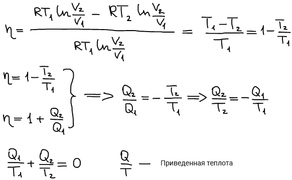

Сумма приведенных теплот в цикле Карно равна нулю.

Дальнейшие рассуждения Р. Клаузиуса

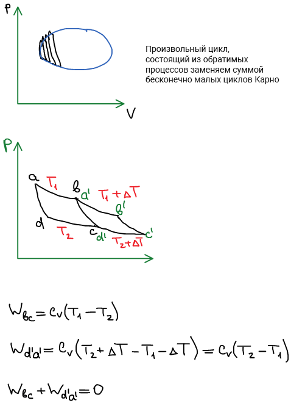

**Теорема Клаузиуса:** работы адиабат, по которым происходит сопряжение двух циклов Карно, компенсируют друг друга (циклы превращаются в один сдвоенный).

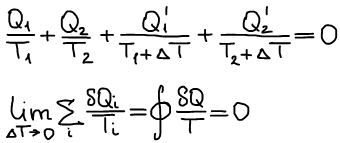

**Математическое отступление:** Если интеграл по замкнутому контуру равен нулю, то существует функция от переменной итегрирования полный дифференциал которок равен подинтегральной величине.

Аналитическое выражение второго начала термодинамики для обратимых циклов:

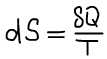

S — **энтропия** (от греч. "превращение").

1865 г. Клаузиус публикует работу "О некоторых удобных формах уравнения механической теории теплоты".

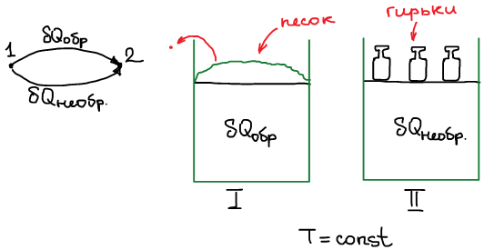

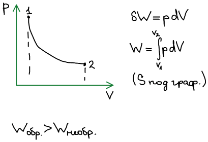

Работа обратимого процесса максимальна.

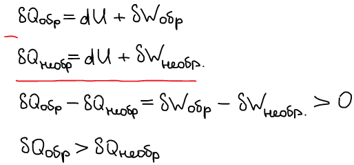

**Обобщенное аналитическое выражение творого начала термодинамики** (для обратимых и необратимых процессов). Равенство-неравенство Клаузиуса (1865 г.):

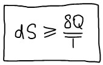

Рассмотрим изолированную систему:

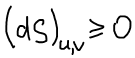

**Частная формулировка второго начала термодинамики для изолированной системы:** самопроизвольные процессы в изолированной системе всегда протекают в сторону возрастания её энтропии, пока энтропия не достигнет максимума, который соответствует достижению состояния равновесия (**принцип возрастания энтропии**).

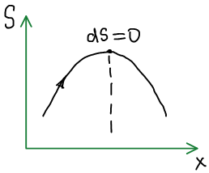

**Вечный двигатель второго рода невозможен.**

**Вечный двигатель второго рода** — обратимо и периодически работающая машина, единственным результатом функционирования которой является превращение теплоты в работу.

1878 г. Клаузиус вводит понятие некомпенсированной теплоты.

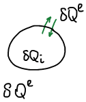

δQe — (exterior) обычный теплообмен — внешний, теплота которой система обменивается с окружающей средой.

В результате протекания самопроизвольного процесса в системе происходит нескоменсированное превращение (нескомпенсированный теплообмен). В результате внутри системы возникает внутренняя нескомпенсированная теплота.

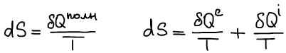

Для обратимого процесса:

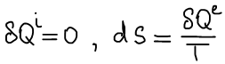

Для самопроизвольного процесса:

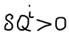

