# Зависимость химического потенциала

1) *μ = f(p)* при *T*=const

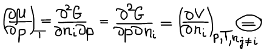

В случае рассмотрения: 1) идеальной газовой смеси; 2) индивидуального чистого вещества (однокомпонентной системы):

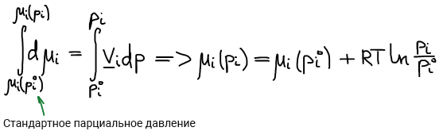

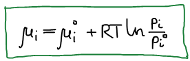

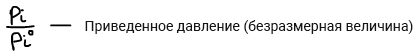

Индивидуальное твердое тело:

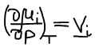

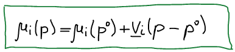

Если p не превышает 20 000 атм, то изменение давления не приводит к изменению объема конденсированной фазы.

**Пример**: определить давление, при котором алмаз и графит находятся в состоянии равновесия друг с другом при температуре 298К.

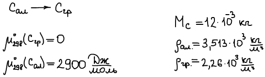

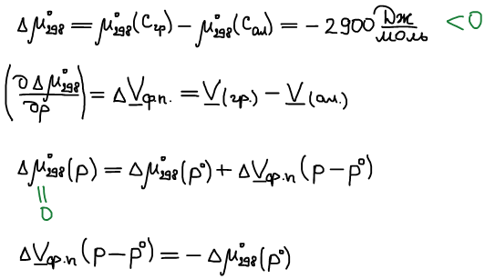

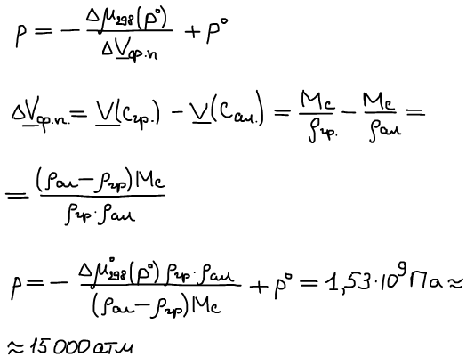

2) *μ = f(T)* при *p=const*

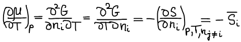

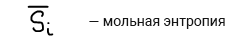

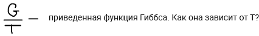

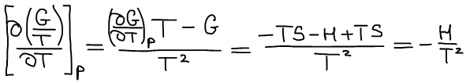

Уравнение Гиббса-Гельмгольца:

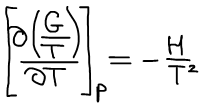

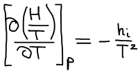

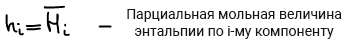

