# Адсорбция

1.  [Отличие физической адсорбции от хемосорбции](#olichie)
2.  [Методы определения адсорбции](#metodi)
3.  [Термодинамика адсорбции](#termodinamika)

Адсорбция — яление межмолекулярного взаимодействия твердого тела с газом, приводящее к росту концентрации газа на поверхноси (**абсорбция** — в объеме). Эти два понятия часто объединяют в одно — **сорбция** (т.к. часто не можем определить какое именное).

Хемосорбция — явление химического взаимодействия твердого тела с газом на поверхности, (в объеме — гетерогенная химическая реакция).

Впервые явление адсорбции было обнаружено Карлом Шееле в 1783г. (описал поглощение углерода газообразных веществ).

Для количественной оценки адсорбции используется следующее понятие: адсорбция (а) — это количество вещества адсорбированного на поверхности твердого тела отнесенное к единице массы твердого тела.

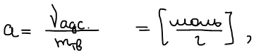

В знаменателе стоит масса, а не площадь, т. к. для твердого тела трудно определить площадь поверхности.

**Адсорбент** (*абсорбент*) — твердое тело, **на поверхности** (*в объеме*) которой происходит процесс адсорбции (абсорбции). В общем случае это твердое тело называется **сорбентом**.

**Адсорбат** (*абсорбат*) — газ, который **адсорбируется** (*абсорбируется*) на поверхности (в объеме). В общем случае — **сорбат**.

Энергия взаимодействия твердого тела с газом определяется суммой энергий Ван-дер-Ваальсового взаимодействия и водородных связей.

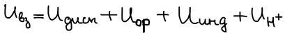

, где Uдисп — энергия дисперсионного взаимодействия, Uор — ориентационного взаимодействия, Uдисп — индукционного взаимодействия, UH+ — энергия водородных связей

Виды взаимодействия зависят от природы поверхности и газа.

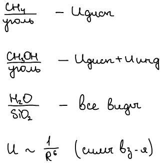

Адсорбционные силы более дальнодействующие.

## Отличие физической адсорбции от хемосорбции

1.  Отличие в величине теплоты адсорбции и хемосорбции

    Адсорбция — экзотермический процесс (ΔH<0).

    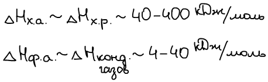

    Экспериментально определяют величину ΔH используя калориметр.

2.  **Селективность**

    Если процесс селективен, то это хемосорбция. Физическая адсорбция универсальна.

3.  **Обратимость**

    Если процесс обратим, то это физическая адсорбция. Обратный процесс называется десорбцией. Хемосорбция не всегда обратима.

4.  **Влияние температуры**

    Физическая адсорбция с ростом температуры уменьшается, влияние не очень велико.

    Хемосорбция с ростом температуры возрастает, влияние большое.

## Методы определения адсорбции

1.  Весовой

    Метод основан на определении адсорбции по изменению массы сорбента до и после сорбции. Система требует высокого вакуума.

    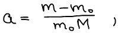

    Где m0 — масса до адсорбции; М — молекулярная масса адсорбата; m-m0 — привес.

2.  Объемный

    Метод основан на определении адсорбции по увеличению адсорбата, заключенного в определенный объем.

    Объем известен. Измеряют давление пара до и после процесса адсорбции. Газ считают идеальным. 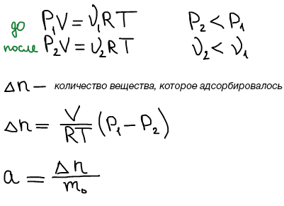

    Если T=const, то получают **изотерму адсорбции**

    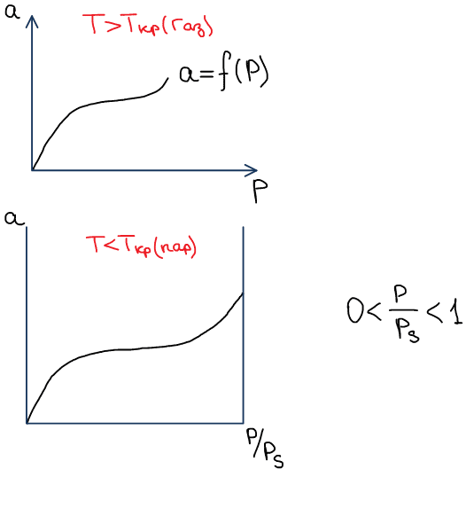

    Ps — давление насыщенного пара; P — текущее давление пара над системой адс/пар.

    Если P=const, то получают **избару адсорбции**:

    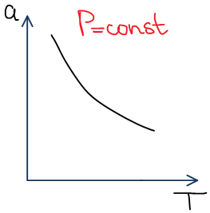

    Если С=const, то получают **изопикну адсорбции**.

    Если a=const, то получают **изостеру**:

    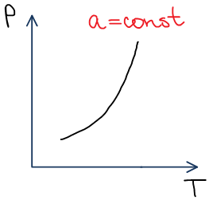

    Изостера важна для определения теплоты адсорбции.

    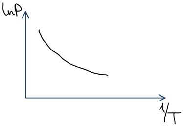 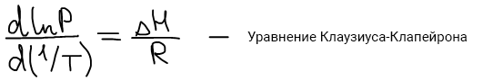

## Термодинамика адсорбции

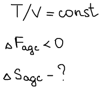

Измеряют характеристики газовой фазы (тв. считают неизменным)

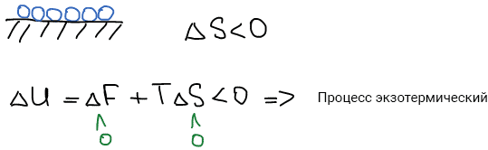

